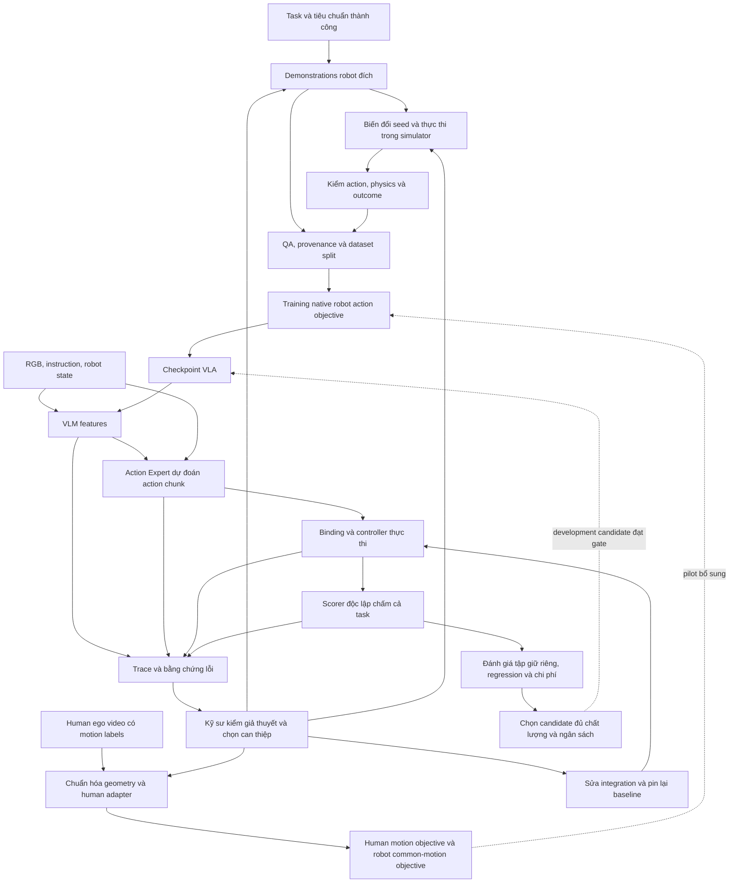

# Humanoid Skill Learning

## Data flywheel: tổ chức và dùng dữ liệu để cải thiện kỹ năng robot với tổng công có thể kiểm chứng

**Bản gửi đánh giá idea — 07/10/2026.** Tài liệu này trình bày đề xuất hiện tại, cơ sở nghiên cứu, cách hệ thống dự kiến chạy và phép kiểm cần thực hiện. Số liệu bên ngoài được dẫn nguồn tại chỗ; mục tiêu triển khai là đề xuất của nhóm.

## Mốc ưu tiên: PoC 30 ngày trước vòng thuyết trình

**13/10–11/11/2026:** dùng dataset public đúng task để train/update/reload và eval ngay khi chờ robot BTC; hướng tới checkpoint học được task chạy closed-loop trên robot thật, cùng một vòng data flywheel có so sánh trước/sau. Một robot, một task, miền điều kiện giới hạn. GPU đã xác nhận: RTX 3060 12GB và RTX 5090; robot/camera/collector và lịch truy cập chưa chốt.

[Lịch chính thức 2026](https://densohackathon.vn/): nộp ý tưởng 12/10, xét online 13–19/10, thuyết trình 16/11, chung kết 02/12. Làm PoC trong lúc chờ xét ý tưởng, buffer 12–15/11. Demo vật lý phụ thuộc hardware gate, không coi sim là hoàn thành mục tiêu ngoài đời. [Kế hoạch bốn pipeline/bốn tuần](idea-v3-2026-10-05/08-ke-hoach-trien-khai.md) là ưu tiên triển khai mới; thiết kế GR1/A1 đa nguồn bên dưới là nghiên cứu mở rộng khi đủ gates.

## 1. Idea trong một phút

Khi vật, vị trí, ánh sáng hoặc tiếp xúc thay đổi, đội robot learning có thể phải lặp lại thu mẫu, reset, QA, training và evaluation. Có thêm video/variants chưa chắc có supervision phù hợp hoặc mở đúng coverage; chưa có số liệu hiện trạng một công đoạn DENSO đã khảo sát.

Chúng tôi đề xuất **Data Core flywheel**: chạy và ghi evidence → kiểm giả thuyết → chọn data/can thiệp → QA release → train có phạm vi + replay → đo outcome/cost và quyết định vòng sau. PoC kế thừa pretrained VLA, bắt đầu bằng public robot demonstrations đúng task rồi adaptation lên robot BTC tương thích; human motion/action-free video là pilots có gate riêng. Synthetic là cách tạo, latent là representation; loader dựa supervision thực có.

Khi robot thực hiện sai, hệ thống ghi lại bằng chứng xuyên suốt từ đầu vào, đặc trưng VLM, action dự đoán đến command thực thi và phản hồi robot. Kỹ sư dùng bằng chứng và phép thử có kiểm soát để chọn sửa hệ thống, bổ sung dữ liệu hoặc cập nhật mô hình. Sau mỗi thay đổi, robot được đánh giá lại cả task và các điều kiện trước đó đã làm tốt.

**Giá trị hướng tới:** đạt cùng quality và coverage cần với ít robot roots hoặc tổng công thấp hơn đối chứng phù hợp. Đây là giả thuyết, chưa savings. Data organization/use là trọng tâm; method/architecture/controller/latency vẫn có thể là bottleneck. [Bản problem → dataset/training → eval/inference → flywheel và chi phí](idea-v3-2026-10-05/01-idea-va-pitch.md) là bản mở đầu đã rà; [form draft](deliverables/DENSO-Noi-dung-form-y-tuong.md) trả lời từng field.

## 2. Vấn đề và bằng chứng cho cơ hội này

Một kỹ năng robot cần nhiều hơn video cho thấy “làm như thế nào”. Dữ liệu phải phù hợp camera, trạng thái, action space và bộ điều khiển của robot. Thu demonstrations còn cần operator, reset môi trường, hiệu chuẩn, kiểm nhãn và thử lại sau mỗi thay đổi.

Hai khó khăn đi cùng nhau: **mở rộng lượng kinh nghiệm với chi phí hợp lý**, và **biết bổ sung kinh nghiệm nào sau khi robot thất bại**. Một lần gắp thành công hoặc một video demo đẹp chưa cho biết robot có hoàn thành cả công việc trong điều kiện mới hay không.

| Bằng chứng bên ngoài | Số liệu và điều kiện | Ý nghĩa đối với idea |
|---|---|---|
| [AgiBot World Colosseo, paper v4, §III](https://arxiv.org/html/2503.06669v4) | **1.001.552 trajectories, 2.976,4 giờ, 217 tasks**; có quy trình teleoperation và QA. | Robot learning cần dữ liệu có cấu trúc và quy trình thu/kiểm. Số trajectories không tương đương số video người. |
| [Figure Helix 2.5, 17/09/2026](https://www.figure.ai/news/helix-2-5-zero-shot-30-home-generalization) | Index human pretraining nâng whole-task success **9% → 56%**, ba việc nhà tại **30 nhà chưa thấy**, giữ downstream robot data và cấu hình cố định. | Human experience có tiềm năng giúp generalization. Đây là công bố của Figure; vẫn có robot task training ở nơi khác. |
| [NVIDIA EgoScale, 19/02/2026](https://research.nvidia.com/labs/gear/egoscale/) | Pretraining trên **20.854 giờ egocentric human video có action labels**, sau đó aligned human–robot mid-training và downstream post-training. | Có tiền lệ kỹ thuật cho human motor transfer. Quy mô này khác prototype nhỏ; không lấy kết quả đó làm cam kết cho dữ liệu ít của nhóm. |
| [World Labs R2S2R, 28/07/2026](https://www.worldlabs.ai/blog/real-to-sim-to-real) | Một số policy học trong simulation chạy robot thật **một giờ không can thiệp**. Cube-handover kiểm mỗi checkpoint với **2.000 sim trials và 100 real trials**. | Simulation có thể cung cấp kinh nghiệm và đánh giá ở quy mô lớn. Vẫn cần thông tin/tương tác thật để dựng và kiểm sim; công nghệ công bố là proprietary. |
| [Stanford AI Index 2026, tr.117, hình 2.7.2](https://hai.stanford.edu/assets/files/ai_index_report_2026.pdf#page=117) | BEHAVIOR Challenge 2025: đội đầu đạt **12,40% whole-task success**, **25,99% Q-score** trên held-out test trong mô phỏng. | Cần phân biệt tiến độ từng bước và hoàn thành cả task. Hai chỉ số trả lời hai câu hỏi khác nhau. |

Các kết quả trên cho thấy hướng nghiên cứu đáng thử. Chúng không cùng robot/task/protocol, nên không ghép thành leaderboard hoặc suy ra project sẽ đạt những tỷ lệ tương tự. Hiện chưa có số liệu về chi phí hay điểm nghẽn cụ thể của một công đoạn DENSO được khảo sát.

## 3. Người dùng, bài toán đầu tiên và đầu ra

Người dùng đầu tiên là **kỹ sư robot learning** cần đưa một skill mới hoặc thay đổi điều kiện thao tác lên robot đã có pretrained policy. Operator hỗ trợ demonstrations và reset; người phụ trách công việc chốt tiêu chuẩn thành công, thời gian và điều kiện vận hành.

MVP chọn một ví dụ xuyên suốt:

> **“Lấy đúng linh kiện vàng, đặt vào ô A1 của khay, nhả và rút tay.”**

Task gồm tiếp cận → gắp → nâng/chuyển → đặt → nhả/rút. Đây là proxy cho thao tác công nghiệp, chưa phải công đoạn DENSO đã được xác nhận. Trước triển khai cần thống nhất lý do dùng humanoid cho công việc này so với robot arm hoặc giải pháp tự động hóa hiện có.

Proxy nghiên cứu A1 là rigid pick-and-place thô trong mô phỏng trên một robot/model đã khóa. PoC 30 ngày bắt đầu từ task đúng nhãn public, ưu tiên PnPBottleToCabinetClose; task vật lý chốt theo robot BTC, không đổi public labels thành A1. Kích thước, lực, tolerance, cycle time và ngưỡng chấp nhận được chốt sau feasibility pilot. Lắp ghép chính xác, đồ mềm, di chuyển toàn thân và production deployment là các bước mở rộng.

Đầu ra dự kiến gồm:

- Policy checkpoint kèm cấu hình camera, state, normalization và controller để chạy lại.
- Dataset releases có QA, nguồn gốc, quan hệ seed/variant và train/test split.
- Episode traces cùng báo cáo lỗi, phép kiểm và quyết định cải thiện.
- Demo thực thi cả task và báo cáo chất lượng/chi phí so với robot-data-only baseline.

## 4. Kiến trúc và ba luồng của hệ thống

**Solution gồm Data Core và Model Engine Core.** Chọn FluxVLA cho Model Engine Core vì framework hỗ trợ toàn luồng training → evaluation → inference trên robot thật; GR00T N1.5 là policy nền được đề xuất bên trong. [Chi tiết engine](idea-v3-2026-10-05/17-model-engine-core-fluxvla.md) phân biệt tính năng upstream và A1 integration của đội.

**Model AI trong engine:** Data Core chọn/QA/phát hành dữ liệu; Model AI kế thừa GR00T N1.5 qua FluxVLA, gồm Eagle VLM mã hóa ảnh/text và DiT Action Expert tạo action chunks từ features/state/noise. Robot adaptation cập nhật weights theo loss/modules manifest; human shared-trunk và action-free future branches là custom candidates riêng. Runtime/eval trả evidence để quyết định data hoặc model intervention vòng sau. [Model AI blueprint](idea-v3-2026-10-05/16-model-ai-va-data-flywheel.md) tách rõ upstream pretraining, A1 adaptation và inference.

Sơ đồ mô tả thiết kế đề xuất. Human motion branch phục vụ training; khi robot chạy, nó nhận observations/instruction/state của robot và xuất native robot actions. Policy không nhận privileged object state từ scorer để quyết định action.

| Luồng | Công việc chính | Kết quả cần có |
|---|---|---|
| **Dữ liệu** | Thu/kiểm robot anchors; xử lý human motion; sinh và thực thi synthetic variants. | Mẫu có nhãn phù hợp objective, masks, clocks và nguồn gốc rõ. |
| **Học và thực thi** | Adapt pretrained VLA; reload checkpoint; chạy qua controller đúng profile. | Learned policy thực sự điều khiển robot; action dự đoán và execution đối chiếu được. |
| **Cải thiện** | Chấm outcome, xem trace, kiểm nguyên nhân, chọn data hoặc sửa integration, đo lại. | Can thiệp có lý do và kết quả trên cả task; giữ được các điều kiện đang tốt. |

Đường native dự kiến dùng FluxVLA / GR00T N1.5 / GR1 sau kiểm tra compatibility. Nhóm tận dụng model/framework hiện có và xây phần task binding, dữ liệu, training extension, evidence và đánh giá theo task; không train foundation model từ đầu.

## 5. Human, synthetic và robot data được dùng thế nào?

### 5.1. Robot demonstrations: học điều khiển robot đích

Trong thiết kế nghiên cứu A1 bên dưới, R là demonstrations trên robot đích **trong mô phỏng**, chưa là hardware recordings. PoC 30 ngày dùng public task trước, hướng tới hardware BTC với real release/profile riêng; success sim không là bằng chứng sim-to-real.

Mỗi episode cần camera frames, instruction, proprio/state, action targets đúng profile, timestamps và outcome. Controller mapping, units, action order, normalization và timebase phải được kiểm trước khi train.

Dữ liệu này tạo baseline và giữ vai trò hiệu chỉnh robot-specific control. Việc dùng robot data trong MVP là lựa chọn thiết kế nhằm kiểm chứng rõ transfer; không phải khẳng định mọi nghiên cứu human-to-robot đều bắt buộc cùng lượng teleoperation.

### 5.2. Human ego video: học kinh nghiệm thao tác qua bridge có kiểm chứng

Chọn một motor pilot có RGB, wrist/hand tracking, camera geometry, timestamps và validity masks. RGB-only data chưa được đưa vào cùng action loss nếu không có target hợp lệ.

Candidate hiện tại dùng **human-specific state adapter, common wrist-motion representation và shared Action Expert trunk**, đồng thời giữ native robot action decoder. Human wrist motion và robot wrist motion dùng cùng quy ước biểu diễn trong camera frame tại thời điểm input, units và horizon; camera của hai nguồn vẫn khác nhau. Robot wrist targets lấy từ measured robot state qua calibrated kinematics; human targets lấy từ tracking đã kiểm. Common representation chưa bảo đảm visual/action distributions đã align hoặc transfer có ích.

Một objective chung về wrist motion tạo điểm nối giữa hai embodiment. Robot native action objective vẫn học lệnh của robot. Human wrist pose không được giả thành robot joint/torque targets; dữ liệu không đo contact thì không gán contact labels.

Pilot freeze VLM ở cả hai nhánh đối chứng để kiểm riêng tác dụng của human supervision lên Action Expert. So **robot common-motion training** với **cùng recipe cộng human data**; chỉ human volume thay đổi, các thành phần còn lại được kiểm soát. Cần kiểm gradient, checkpoint/reload và robot outcome. Đây là custom extension cần implement, chưa là cấu hình native đã chạy.

Freeze giữ trọng số VLM, không giữ features giống nhau cho mọi ảnh. [GR00T N1.5](https://research.nvidia.com/labs/gear/gr00t-n1_5/) báo frozen VLM và human-video learning với FLARE; đây là tiền lệ về tính khả thi, không chứng minh wrist-motion pilot của nhóm. No-gain chỉ kết luận trong frozen recipe. Selected visual/interface unfreeze là thử nghiệm bổ sung khi có representation-bottleneck evidence; không mặc định bắt buộc. Extra training được ghi và có compute-matched control khi cần attribution.

[EgoScale của NVIDIA](https://research.nvidia.com/labs/gear/egoscale/) là tiền lệ cho common wrist representation và embodiment adapters. Recipe trên là proposal thu hẹp cho project, không replication hoặc bảo đảm đạt kết quả EgoScale. Lợi ích của human data có thể phụ thuộc mạnh vào quy mô và chất lượng; prototype nhỏ cần báo đúng phạm vi.

### 5.3. Synthetic data: sinh trajectories có action từ execution

Từ robot seed hợp lệ, hệ thống thay vị trí vật/đích và một số điều kiện trong miền đã khóa; chuyển các đoạn thao tác theo object/target frame rồi chạy qua controller và simulator. Ghi lại observations, actions/commands, measured response, contact và outcome.

Positive demonstrations chỉ được phát hành sau QA. Failed trajectories được giữ để phân tích hoặc dùng trong recipe recovery riêng, có nhãn thích hợp. Mọi attempts/rejects đều tính vào generation cost.

QA phải đối chiếu contact pairs, penetration/collision, tracking error, controller limits, giữ vật và final outcome; contact-force plot là một tín hiệu, chưa đủ chứng minh physics hợp lệ. Recovery cần expert actions từ trạng thái lỗi đến hoàn thành, không biến failed actions thành positive targets. Khi task cho retry, báo first-attempt và eventual success, số retries, cycle time và interventions.

[MimicGen TaskSpec](https://mimicgen.github.io/docs/modules/task_spec.html) cung cấp tiền lệ object-centric subtasks, segmentation signals và interpolation. Task/controller của project vẫn cần port và kiểm riêng.

**Synthetic có thể tạo robot action labels khi có robot embodiment, controller và execution đáng tin cậy.** Sinh video đẹp đơn thuần chưa cung cấp điều đó. Nhiều variants từ cùng seed cũng không được đếm thành nhiều independent robot demonstrations; parent và descendants phải ở cùng split để tránh leakage.

### 5.4. Dataset, cách tạo và training view phải tách rõ

Synthetic là cách tạo dữ liệu: appearance augmentation, sim-executed trajectory generation hoặc neural video generation. Nó không là modality mới bên cạnh ảnh/text/action. Latent là representation từ encoder đã pin; visual features, future embeddings, VAE latents và latent actions cần adapters và semantics riêng.

Files dự kiến: RGB MP4/PNG/JPG; instructions JSONL/Parquet; robot state/actions/commands/readback Parquet; human tracking CSV/Parquet + calibration JSON; lineage/splits/QA JSON/JSONL. Loader route theo capabilities. Action missing không được biến thành action zero. [Blueprint đầy đủ](idea-v3-2026-10-05/15-dataset-training-blueprint.md) nối file → tensor → conditioning/target → loss → modules → evaluation/inference.

Khảo sát training gồm OpenVLA, π0, GR00T N1.5, FOCA, DreamGen, DreamZero và DreamerV3. Robot action loss có thể cập nhật backbone khi recipe mở; frozen VLM là một lựa chọn có tiền lệ, không quy luật chung. MVP tận dụng checkpoint đã pretrained, không train VLM foundation từ đầu.

[FOCA](https://arxiv.org/html/2606.20867v1) bổ sung action-free future conditioning cho few-shot. Video-only samples học auxiliary future loss, robot adaptation vẫn có action supervision. Đây là candidate riêng với wrist-motion pilot; code/interface/compute phải kiểm trước port. World Model generation là optional acquisition; joint WAM hoặc dynamics/RL là architecture alternatives có runtime/evaluation riêng.

## 6. Bằng chứng VLM, Action Expert và latent space

Với model/module được chọn, hệ thống cần hook đúng outputs thực có. Một VLA dùng features/latents không nhất thiết sinh câu mô tả ý định để chúng ta đọc.

| Ranh giới | Cần ghi gì? | Kết luận có thể kiểm |
|---|---|---|
| Input | Raw/processed frames, prompt/tokens, state, calibration, timestamps. | Model có nhận đúng dữ liệu và đúng thời điểm không? |
| VLM/interface | Actual feature tensors hoặc selected slices, layer/hook version, shape, masks và validity; explicit outputs nếu model có. | Features/interface có lỗi rõ ràng hay thay đổi theo điều kiện không? |
| Action Expert | Conditioning, noise/seed nếu có, action chunk cuối, horizon, normalization. | Action dự đoán thực tế là gì, có hợp lệ theo profile không? |
| Execution | Action sau mapping/clipping, command đã gửi, queue/timing, measured state/response. | Robot có thực hiện như dự đoán không? |
| Outcome | Object/contact observations, task predicates, stage entry/pass/fail/unknown, intervention. | Robot sai ở đâu, đã tới bước nào và có hoàn thành công việc không? |

Traces phải nối bằng cùng episode/checkpoint IDs. Lưu selected hooks có giới hạn dung lượng và đo overhead; không mặc định ghi mọi layer mọi frame.

Probes latent là công cụ hỗ trợ kiểm giả thuyết. Một semantic probe đoán đúng object hoặc một attention map chưa chứng minh VLM/Action Expert gây lỗi. Quy trách nhiệm cần đối chiếu execution và can thiệp có kiểm soát, chẳng hạn thay riêng observation, sửa binding hoặc so matched entry states.

Kỹ sư quyết định sửa integration, cập nhật VLM, Action Expert hay phối hợp modules theo evidence và ablation. Hệ thống không dùng failure count làm quy tắc tự động chọn module để train.

### 6.1. Data Core như một data flywheel

**Policy chạy → trace và outcome → kỹ sư kiểm giả thuyết → chọn can thiệp/data → QA và dataset release → train với prior replay → full-task/regression/cost gate → policy cho vòng tiếp theo.** R/H/S là tên các can thiệp trong study, không modalities bắt buộc. Chọn tín hiệu cần học trước, rồi chọn recording/augmentation/sim generation/video generation phù hợp.

Integration fault đi sang repair và re-pin baseline. Thiếu coverage có thể dùng reuse, robot correction hoặc synthetic execution; human pilot chỉ mở khi đủ labels/geometry và phù hợp giả thuyết. Dữ liệu tích lũy gồm cả rejected attempts và can thiệp no-gain có provenance. Không mặc định model tự chẩn đoán hoặc tự update sau mỗi lỗi.

Vòng development dùng scenarios riêng; khi kết thúc study mới freeze và final độc lập. Final không quay vào tuning; round sau cần fresh final nếu dữ liệu đó được chuyển sang development. Đo flywheel bằng chất lượng/regression, total cost tới acceptance và reuse qua skill tiếp theo. Source ablations giữ recipe riêng; adaptive acquisition cần đối chứng workflow riêng. Native flywheel chưa chạy.

Giới hạn human pilot: wrist-motion supervision chưa bao gồm finger/contact. [EgoScale v1, §3.6](https://arxiv.org/html/2602.16710v1#S3.SS6) báo wrist-only yếu ở các dexterous tasks của tác giả; chưa suy ra rigid pick-and-place này thất bại. Đo riêng approach/transport và grasp/retention để xác định lợi ích thực.

## 7. Example chạy toàn bộ hệ thống

**Đây là walkthrough đề xuất để kiểm logic; chưa là rollout native đã đo.** Không gắn số success giả cho các lượt dưới đây.

| Bước | Hệ thống thực hiện | Đầu ra và cách kiểm |
|---|---|---|
| 1. Khóa task | Chốt đúng vật, ô A1, điều kiện nhả/rút, timeout và tiêu chuẩn ổn định. | TaskSpec và scorer; expert replay xác nhận task khả thi. |
| 2. Lập baseline | Thu robot demonstrations, khóa splits, train native robot-data-only policy. | Dataset release, training/gradient receipts, checkpoint reload và closed-loop baseline. |
| 3. Quan sát thất bại | Robot gắp/nâng được nhưng vật rơi khi chuyển. | Trace nối input → VLM features → action → command → response → full-task fail. Các bước chưa tới là not-attempted. |
| 4. Kiểm integration | So predicted/sent/readback; kiểm normalization, frame mapping và timing. | Nếu mapping sai: sửa, pin lại configuration và lập baseline lại trước khi so nguồn data. |
| 5. Kiểm lỗi upstream | So chuyển từ grip chuẩn với grip policy tự tạo, trong điều kiện matched. | Nếu grip chuẩn tốt hơn: ưu tiên kiểm gắp/transition. Nếu cả hai yếu: kiểm transport/contact và coverage; chưa kết luận chỉ từ nơi vật rơi. |
| 6. Tạo dữ liệu cải thiện | Thu expert correction có context gắp → nâng → chuyển; hoặc tạo sim variants với entry states phù hợp. | Executed trajectories có QA; failed commands không được gán thành positive actions. |
| 7. Cập nhật candidate | Train trên dữ liệu hợp lệ và giữ replay các điều kiện cũ. | Loss/config/module-update manifests; reload và thực thi được. |
| 8. Đánh giá lại | Chấm từ natural starts trên cả task, điều kiện mới và regression. | Development report; candidate chỉ được chọn khi có chất lượng phù hợp, rồi freeze trước final. |
| 9. Kiểm human pilot | Dùng hai recipe cùng common-motion architecture, một nhánh có thêm human supervision. | Kiểm transfer bằng robot outcomes; human motion loss giảm một mình chưa đủ. |
| 10. Bàn giao | So candidates đủ điều kiện với baseline về quality, robot-data usage và total cost. | Skill bundle, all-trial report và kết luận gain/no-gain. Nếu chưa đạt, giữ outcome và đề xuất vòng tiếp theo. |

Mỗi source pilot trả lời câu hỏi riêng. R vs R+S kiểm synthetic benefit; R_common vs R_common+H kiểm human benefit. Nhánh phối hợp H+S mở sau khi từng nguồn có cơ sở, không cộng cơ học gain hoặc ép mọi dataset vào một mixture.

## 8. Nếu toàn task luôn thất bại thì sao?

| Tình huống | Cách xử lý |
|---|---|
| Full-task success bằng 0 nhưng có bước thành công | Phân tích điều kiện vào bước và first divergence; bổ sung correction ở bottleneck cùng context upstream. Kiểm lại chuỗi từ đầu. |
| Không có kỹ năng cơ bản hữu ích | Kiểm task feasibility, camera/state/action binding và scorer. Nếu hệ thống đúng, cần expert bootstrap hoặc curriculum; failure logs chưa tự tạo hành động đúng. |
| Robot hoàn thành bước nhưng scorer không thấy được | Giữ trạng thái unknown, bổ sung sensing/scorer hoặc thay phép kiểm. Không biến thiếu quan sát thành pass hoặc lỗi policy. |
| Lỗi hệ thống xuất hiện xuyên suốt | Sửa calibration/schema/normalization/controller trước. Training thêm dữ liệu không khắc phục được mọi integration fault. |
| Data/model hiện tại không cải thiện trong ngân sách | Báo no-gain, thu hẹp domain hoặc đổi phương án ở vòng thử riêng; không đổi test set để giữ kết luận thành công. |

## 9. Giá trị và điểm khác biệt cần chứng minh

Điểm đề xuất của nhóm là **một quy trình từ dữ liệu tới skill có thể kiểm tra lại**: chọn nguồn theo tín hiệu thật có, kiểm action bằng execution, ghi bằng chứng xuyên các ranh giới model/runtime và đo cải thiện ở cùng chất lượng.

Human transfer, simulation generation và pretrained VLA đều có tiền lệ. Nhóm không nhận sở hữu các thuật toán nền đó. Giá trị thêm cần chứng minh bằng việc tích hợp thành workflow hữu ích cho kỹ sư: ít thu lại mẫu không cần thiết, ít vòng debug/training sai hướng, và gói kỹ năng có cấu hình/bằng chứng rõ để đánh giá hoặc tiếp tục phát triển.

Có hai câu hỏi khác nhau: **nguồn dữ liệu có giúp policy không**, và **evidence workflow có giúp kỹ sư ra quyết định tốt hơn không**. Câu hỏi thứ hai cần so với workflow kỹ sư thông thường sau khi có native failures; source ablation không tự chứng minh lợi ích debugging.

## 10. Cách kiểm chứng hiệu quả trong prototype

| Câu hỏi | Phép so và chỉ số |
|---|---|
| Synthetic có giúp không? | R vs R+S: cùng parent model, robot-data budget, task/profile và development rules; tính thêm generation/compute. |
| Human có giúp Action Expert không? | R_common vs R_common+H: cùng architecture/objectives cho robot, VLM freeze giống nhau; thêm compute-matched control nếu muốn tách source benefit khỏi extra training. |
| Có giảm lượng robot data cần dùng không? | So data-budget curves ở mức chất lượng chấp nhận; một phép thử tại một budget chỉ cho quality gain tại budget đó. |
| Skill có dùng được không? | Whole-task success, từng bước/transition, intervention, timeout, cycle time, ID/OOD và regression trên tập giữ riêng. |
| Có giảm chi phí không? | Tính setup, thu/reset, source processing, generation/rejects, QA, training/retries, probes/correction và evaluation. Báo riêng giờ operator, engineer, robot và GPU. |

**Mục tiêu pilot đề xuất:** hướng tới 90% whole-task success trong domain MVP được khóa. Đây là target phát triển, chưa phải kết quả hoặc chuẩn sản xuất. Sampling, uncertainty, cycle và acceptance conditions phải chốt trước final; tỷ lệ quan sát đạt 90% một mình chưa đủ khẳng định true success ≥90%.

Chỉ báo tiết kiệm ở chất lượng được thống nhất. Nếu candidate giảm demonstrations nhưng tăng tổng công hoặc không đạt chất lượng, báo trade-off/no-saving. Chi phí xây pipeline lần đầu và công cho các skill tiếp theo được tách để đánh giá khả năng tái sử dụng.

## 11. Kế hoạch triển khai và trạng thái hiện tại

Kế hoạch **12 tuần dưới đây là draft**, phụ thuộc GPU, checkpoint, simulator integration và người chốt task.

| Giai đoạn | Trọng tâm | Điều kiện đi tiếp |
|---|---|---|
| Tuần 1–3 | Khóa task/profile, native compatibility, expert replay, scorer và baseline. | VLA train/reload/closed-loop có thật; task và action mapping hợp lệ. |
| Tuần 4–6 | Synthetic execution/QA và R vs R+S pilot. | Labels đúng, không leakage; có evidence về gain/no-gain và chi phí. |
| Tuần 7–9 | Audit human source; implement common-motion branch và human transfer pilot. | Geometry/loss/gradient/reload pass; đo downstream robot outcomes. |
| Tuần 10–12 | Freeze candidate, final/regression, quality-cost report và demo bàn giao. | Cả task đạt tiêu chuẩn đã chốt; mọi claim có phạm vi và số liệu. |

Nếu một stage không đạt feasibility, báo rõ nhánh chưa tích hợp và điều chỉnh lịch/phạm vi trước vòng thử tiếp; không mặc định native, synthetic và human đều hoàn tất đúng hạn.

**Trạng thái thực tế:** đã có reference pipeline nhỏ trong MuJoCo với dữ liệu, training/reload, execution, traces và evaluation. Reference dùng idealized state, scripted sequencer và grasp đơn giản; chỉ kiểm luồng engineering. Chưa có native FluxVLA/GR00T–GR1 integration/rollouts, human transfer hoặc số tiết kiệm của nhóm. Website và hình minh họa là công cụ trình bày; bằng chứng native cần được tạo trong prototype.

Mở rộng ưu tiên sang một task thứ hai trên cùng robot, đo phần dùng lại và công phải làm mới. Robot thật hoặc embodiment khác cần binding, data và acceptance riêng.

## 12. Các câu hỏi muốn người đánh giá phản biện

1. Với một task/đội kỹ sư cụ thể, việc thu data hay debug là điểm nghẽn lớn nhất? Workflow hiện tại đã giải quyết phần nào?
2. Phạm vi pick-and-place này có phù hợp để chứng minh giá trị cho humanoid, hay nên thử trên embodiment/task khác trước?
3. Human motion bridge có target/representation đủ phù hợp không? Pilot nhỏ kiểm được phần nào, cần data scale và alignment đến mức nào?
4. Synthetic simulator có tái hiện contact và vùng failure cần cải thiện không? Chi phí dựng/kiểm có thể lớn hơn collection trong trường hợp nào?
5. Traces và controlled probes đã đủ hỗ trợ quyết định chưa? Còn confounds hoặc ranh giới thiếu quan sát nào?
6. Những đối chứng nào tối thiểu để phân biệt data benefit, extra compute và lợi ích của chính workflow?
7. Đầu ra prototype và kế hoạch nguồn lực có đủ để đánh giá idea trong 12 tuần không?

**Thông điệp đề xuất:** tận dụng kinh nghiệm người và mô phỏng để giảm công phát triển kỹ năng robot, đồng thời dùng bằng chứng từ execution để cải thiện đúng chỗ và đánh giá cả công việc. Nghiên cứu bên ngoài tạo cơ sở cho hướng đi; prototype của nhóm sẽ kiểm khả năng transfer, hiệu quả và giới hạn trong một phạm vi cụ thể.

### Yêu cầu demo theo thể thức BTC

[Trang thể thức](https://densohackathon.vn/challenges), đọc trực tiếp 07/10/2026: vòng 2 yêu cầu video demo tối đa 15 phút và pitch, thể hiện input/output, environment, thiết bị, data/resource và quy trình xử lý. Vòng 3 ghi mentoring/phát triển 20/10–02/12, hạn nộp trước 23:59:59 ngày 30/11 và demo trực tiếp 02/12. Giai đoạn phát triển hiển thị chồng với vòng 2, không phải ba tháng nối tiếp. Nộp slide PPTX hoặc Canva công khai ở vòng 3. Chưa thấy yêu cầu mọi video vòng 2 bắt buộc phải là robot thật; đây là mục tiêu mạnh hơn do nhóm đề xuất, phụ thuộc BTC cấp thiết bị.
