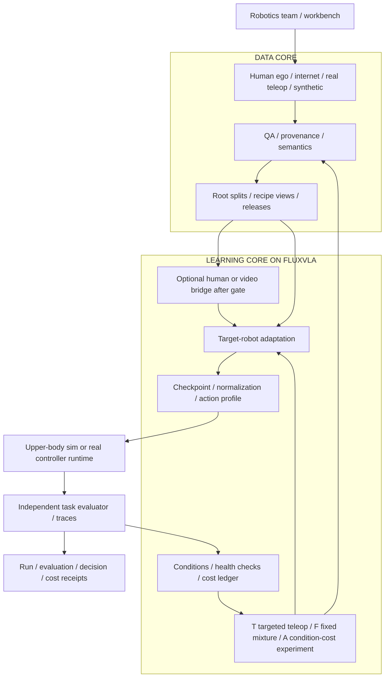
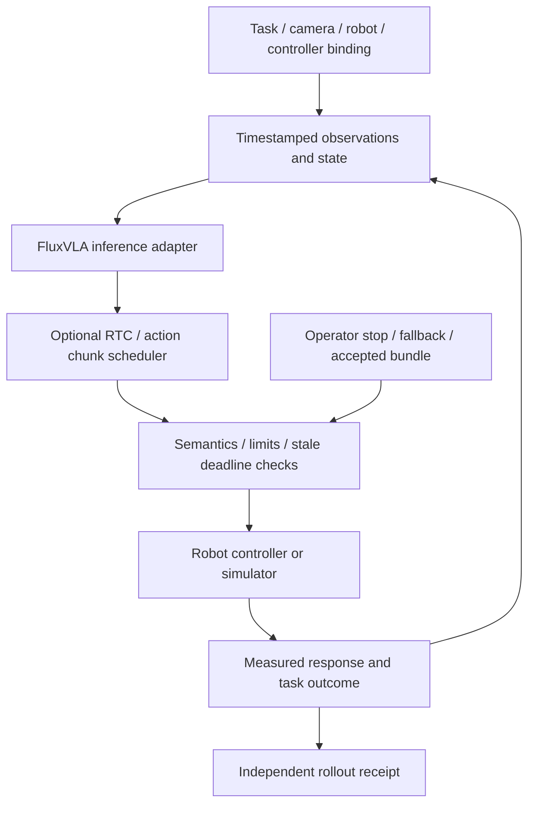

# 02 · Kiến trúc và Technical Design

_Thiết kế đề xuất, chưa có backend/training adapter/controller integration của đội đã chạy._

## Hai core và ownership

| Thành phần | Trách nhiệm |
|---|---|
| Data Core | Sources, QA/semantics, lineage, splits, recipe views/releases |
| Learning Core | Human learning, robot adaptation trên FluxVLA, checkpoints, evaluation và inference bundles |
| Shared runtime/evaluator | Observations, controller execution, task outcome/traces |
| Platform services | Metadata/storage/jobs/cost ledger; workspace/audit ở production |

## Stack và frontend/backend

FluxVLA là engine bắt buộc theo người dùng. Main: GR00T N1.5/GR1 trong RoboCasa/MuJoCo, robot-action baseline trước auxiliary bridge theo gate. Pin code/weights/loader/config/adapter. EgoVLA-style là tham khảo, chưa port. SmolVLA fallback phải reset đối chứng, không tương đương objective EgoVLA.

PyTorch theo upstream; Python workers; CLI/tracker/report trước; React/TypeScript + FastAPI sau pilot gate, chưa cài. SQLite/filesystem cho một workspace pilot, PostgreSQL/object storage khi scale. Dùng tracker/queue library có sẵn, không viết distributed trainer mới.

Workbench: Task & binding, Data review, Recipe & runs, Evaluation, Improvement. Worker stages: validate → preprocess → optional eligible human/video learning → robot adaptation → eval → package. Persist job state; checkpoint giữa stages; concurrency=1 mặc định để tránh tranh VRAM. Stage không chạy và metric chưa đo hiển thị rõ. Website hiện có là pitch, không frontend sản phẩm hoạt động.

Simulator chính: RoboCasa GR1; task khay custom hoặc upstream pick-and-place fallback chốt trước final split. [Benchmark EgoVLA](https://github.com/quincy-u/Ego_Humanoid_Manipulation_Benchmark) là tham khảo khác domain, không thay humanoid acceptance hoặc chứng minh sim-to-real.

## Database và API đề xuất

Tables: workspaces, sources, episodes, releases, recipes, experiments, jobs, checkpoints, evaluations, interventions, cost_entries. File/video ở storage ngoài DB. Các records có id/schema_version/workspace_id/immutable_hash/created_at và refs theo [contracts](05-contracts.md). Không sửa release tại chỗ sau khi train.

| Endpoint đề xuất | Công việc |
|---|---|
| POST /sources, /episodes/import | Đăng ký nguồn/schema và validate |
| POST /releases | Chốt splits/views/QA receipt |
| POST /experiments, /jobs | Chốt comparator và tạo run |
| GET /jobs/{id}, POST /jobs/{id}/cancel | Status, log refs và cancellation |
| POST /evaluations | Eval checkpoint theo protocol |
| GET /reports/{id} | Transfer/capability/cost và uncertainty |
| POST /interventions | Ghi controlled change/review |
| POST /inference-bundles | Đóng gói checkpoint/config/binding |

API chưa triển khai. Idempotency keys, stable error codes và workspace authorization là yêu cầu.

## Runtime và AI boundaries

AI học representation/actions theo recipe. Rules xử lý QA/format/bounds/cost. Không cần LLM agent hoặc RAG trong critical path. Observation-only có thể phục vụ representation; action learning cần nhãn phù hợp. Inferred labels giữ confidence/provenance, rollout là phép kiểm downstream.

RTC chỉ cho action-chunk paths có integration phù hợp, không thay IK/servo/controller. Đo inference p50/p95, stale observations, continuity và task success. Quá deadline dùng fallback theo controller đã thử. WM/WAM mở sau khi có objective/use case/compute; predicted future không là task outcome.

## Deployment, reliability và security

Pilot local/private với pinned environment, config/data/evaluator hashes. Thuê GPU cần quyền dữ liệu và secret handling. Code/data/weights license kiểm riêng. Production: auth/SSO, role/workspace isolation, audit/export controls, retention/delete, encrypted backups và access tests. Chưa có controls đã triển khai.

Monitor stage duration/status, OOM/peak VRAM, NaN/loader failures, dropped frames, deadlines, success và person/GPU-hours. Retry transient có giới hạn; semantic error không retry vô hạn. Backup metadata/manifests/checkpoints hằng ngày; target đề xuất RPO≤24h/RTO≤4h, phải restore-drill mới xác nhận.

Release: candidate → validation → locked final test → owner acceptance → bundle. Rollback về last accepted bundle với matching normalization/controller. Real inference cần hardware/calibration/operator và trial acceptance riêng. Performance/scaling: bounded queue, incremental cache theo content hash, partition workspace/task, không train multi-GPU ở MVP nếu không cần.

[Data Core](03-data-core.md) · [Learning Core](04-learning-core.md) · [Roadmap](06-validation-and-roadmap.md).

## Đường đa nguồn và compatibility gate

Đường MVP chọn FluxVLA/GR00T N1.5/GR1, robot-action head upstream; custom auxiliary human/video heads có eligibility/cost gate theo [Learning Core](04-learning-core.md). CLI/report tối thiểu có health checks, condition report, intervention catalog, T/F/A plans và decision/cost receipts. Repair calibration/controller → baseline lại là stage riêng; E4 data arms giữ binding/scorer cố định. Experiment runner khóa parent/cost cap/train protocol; final evaluator không feedback vào selection. UI nhiều workspace sau pilot.

BudgetScope gồm R&D-sim, skill-repeat và production-real; cost_entry có scope/activity/role/unit/rate/status=estimated|measured|unknown, source ref và allocation group. Một activity không ghi hai lần trong cùng scope; shared overhead khai phân bổ. Unknown không biến thành 0 measured. Selection module chỉ lọc quyền/signals/health/cap và hiển thị measured utility cùng scope; không auto causal diagnosis hoặc tự dự đoán gain cho gói chưa thử. Có stop/defer/no-change receipts.

Internet/RGB-only dùng representation hoặc latent-action objective, không gắn robot-action loss khi chưa có mapping. Structured human dùng wrist/hand/geometry masks. Physics synthetic có action/outcome thực thi; appearance kế thừa labels sau QA; generated video với pseudo-actions là inferred, không measured. Recipe views quyết định eligibility cho từng objective. Một backbone có human/internet priors vẫn là initialization của cả hai nhóm E1/E2.

Teleop views: train adaptation; calibration trên train/development roots; contact/correction theo nhãn; evaluation trên roots giữ riêng. Binding pin joint order, action units/reference frame, absolute/delta semantics, camera/time và controller. Public G1 metadata hiện là LeRobot v3.0; phải kiểm loader version path trong FluxVLA, không nhận v3 tương thích vì ví dụ cũ của dataset dùng v2.
