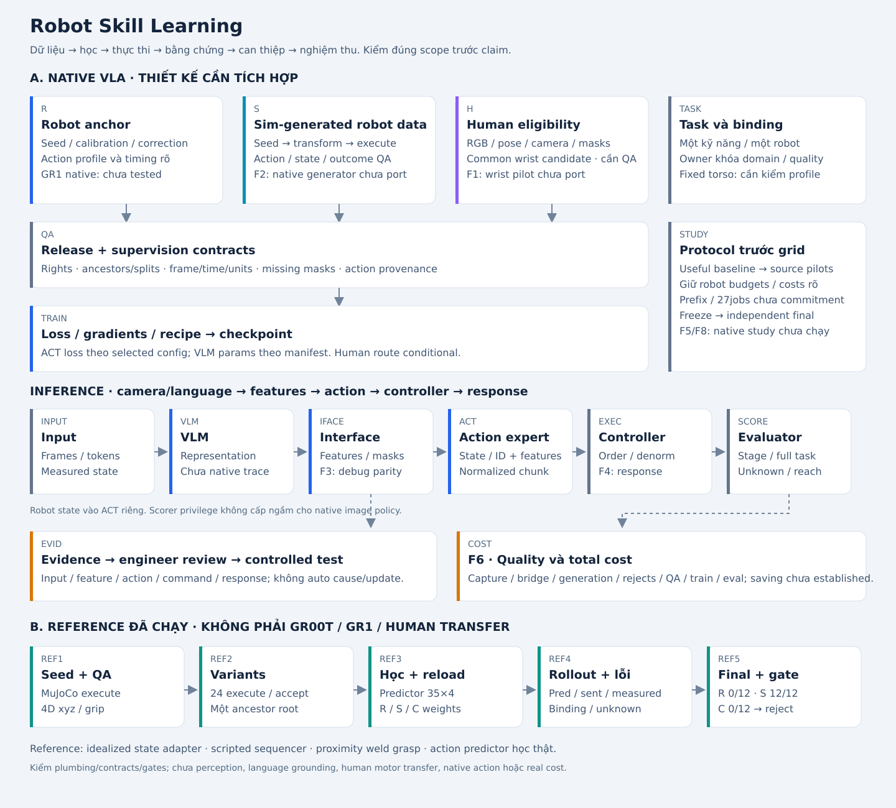

# 02 · Kiến trúc và cách học theo AI Engineering

_Snapshot kỹ thuật từ [hồ sơ engineering](../idea-v3-2026-10-05/02-kien-truc-va-cach-hoc.md); [IDEA.md](../IDEA.md) là bản trình bày gửi đánh giá, recipe mới nhất ở docs/implementation-plan/skill-a1._
[Model Engine Core · FluxVLA](../idea-v3-2026-10-05/17-model-engine-core-fluxvla.md): lý do chọn framework là hỗ trợ training → evaluation → inference trên robot thật; policy và data flywheel được nối bằng artifacts, runners và robot operators.
**Native: proposed / not tested. Reference: executed / scope giới hạn.** Không xem hai action profiles là tương đương.

## Model AI × Data Core

[16 · Model nền, components, training phases, loss/modules và World Model roles](../idea-v3-2026-10-05/16-model-ai-va-data-flywheel.md) bổ sung phần Model AI rõ trong solution. Data Core cấp release/targets; pretrained VLM + Action Expert học và xuất actions; inference/evaluation trả evidence vào vòng sau. Native là proposal, không execution.

## Stable nodes

| ID | Trách nhiệm |
|---|---|
| TASK | TaskSpec, domain/acceptance/binding owner duyệt |
| H | Human release eligibility/geometry; bridge chưa chọn |
| S | Seed transform → controller execution → positive-demo QA |
| R | Robot seed/calibration/corrections |
| QA | Signal, rights, geometry/time/action provenance, roots/splits |
| TRAIN | Loss/parameter manifest/sampling/optimizer/schedule/reload |
| INPUT | Actual frames/tokens/state và preprocessing |
| VLM | Native image/language representation; reference không có VLM |
| IFACE | Features/masks/projectors/shape/dtype và numerical parity |
| ACT | Native action expert; reference predictor 35×4 khác kiến trúc |
| EXEC | Denormalization/rate limits/scheduler/controller/response |
| SCORE | Independent stage và full-task scorer |
| EVID | Observed facts, hypotheses, controlled tests, engineer review |
| STUDY | Comparators, budgets/seeds, freeze/independent final |
| COST | Unique activities/resources và total cost at same quality |

## Taxonomy và training views hiện hành

[Blueprint dataset → training → evaluation → inference](../idea-v3-2026-10-05/15-dataset-training-blueprint.md) bổ sung 06/10/2026 sau khảo sát OpenVLA, π0, GR00T N1.5, FOCA, DreamGen, DreamZero và DreamerV3. Origin/cách tạo khác supervision và latent representation. Synthetic variants vào loader theo payload có thật; không một modality mới.

Native robot action view; action-free future-alignment candidate; human common-wrist candidate là ba routes riêng. Current inputs là conditioning; future action/frame/pose là offline targets. Upstream pretrained checkpoint cung cấp foundation prior; MVP không pretrain VLM từ đầu.

## Inference native

Actual image + instruction → VLM features/masks → action expert với measured robot state/embodiment ID → normalized action chunk → denormalize/order/clipping → scheduler/controller → measured response. Privileged scorer state không vào image-policy input ngầm. Một policy có thể điều khiển cả task; không bắt 5 policies hoặc LLM đổi policy mỗi bước.

Selected upstream config tham chiếu có chunk16, action tensor padded32 và ori_action_dim29, gồm arm/hand/waist. Đây là config observations, chưa selected task profile pass. 29 là schema/action semantics cần kiểm, không chỉ shape. Native fixed-torso/one-arm phải binding thật; reference4D không thay thế.

## Training native

Robot samples: processed images/tokens, state, embodiment ID, normalized future actions, action masks. Action objective của selected head áp vào những targets hợp lệ. FlowMatchingHead tham chiếu học velocity actions−noise trong training; predict_action tích phân để tạo action chunk. Không so training vector field với sent command như cùng đại lượng.

VLM và action expert không bắt hai training độc lập. Action loss backprop qua các modules được mở. Config khai tune_llm=False/tune_visual=True; kiểm actual requires_grad/optimizer/update hashes. Không gọi mọi run là fine-tune toàn VLM. Native text/semantic objective cần forward/loss riêng nếu selected wrapper không cung cấp; thêm labels vào batch chưa đủ.

## Loss routing cần khai trước run

| Source | Target/loss | Module path và điều kiện |
|---|---|---|
| Robot / sim execution | Native action objective | ACT và allowed VLM/IFACE params theo manifest |
| Human tracked | Motion objective có frame/time/masks hợp lệ | Adapters/decoder/representation route phải chọn và kiểm; chưa mặc định shared ACT |
| RGB + semantic labels | Objective tương ứng đã implemented | Semantic/temporal branch không tự robot-action supervision |
| Appearance valid parent | Parent objective | Chỉ kế thừa target sau QA; giữ root/split |
| Temporal video action-free | Future/temporal objective đã implemented | Recorded hoặc generated video; không robot action loss khi thiếu labels; target encoder và trainable route khai riêng |
| Generated video + IDM/latent labels | Inferred objective/decoder riêng | Alternative extension, giữ pseudo status; không measured ground truth |

## Human bridge: candidate và các alternatives

Recipe A1 hiện chọn common-wrist/shared motor route làm custom candidate, VLM frozen ở cả R_common và R_common+H; chi tiết ở [A1 recipe](../idea-v3-2026-10-05/../docs/implementation-plan/skill-a1/02-recipes-and-data.md). Chưa triển khai native hoặc chứng minh transfer. Các alternatives: auxiliary motion head trên shared features, hoặc validated retarget → sim execution → robot labels. Không chạy mọi bridge mặc định. Action-free FOCA/FLARE-style future route trả lời câu hỏi khác, không thay wrist objective bằng tên mới.

A có thể rẻ hơn nhưng không chứng minh motor trunk học human dynamics. B cần state/action representations, dimensions, normalization, sampling time, masking và per-embodiment loss/noise semantics. C cần kinematics/contact/reachability. Không có tracking/geometry thì branch motion disabled; không zero-fill. Cùng dimensions không đồng nghĩa cùng action semantics.

Chọn prefix/co-training/replay schedule theo development và risk forgetting; chưa khóa human prefix bắt buộc hoặc 27 jobs. Một human forward/backward thành công chưa transfer. Downstream R/H ở robot budget ngang và extra compute/cost khai mới đánh giá tác dụng.

## Reference implementation hiện chạy

Adapter đọc idealized simulator state + task target binding; scripted sequencer cấp stage riêng, không lấy stage từ scorer. Feature vector35 là one-hot stage và stage×object/target xy. Linear weights35×4 dự đoán absolute xyz/grip targets. Fit MSE qua closed-form ridge; reset policy memory giữa episodes. Không pretrained VLM, language grounding học được, flow matching hoặc human bridge.

MuJoCo step/controller tạo measured positions, conditional weld attach và outcome. Scorer stage riêng; stable0.6s trong reference, không native threshold2s. Checkpoints/reload, negative controls và local-vs-final gate được chạy. Vì reference có idealized state/scripted phases, kết quả không chứng minh visual generalization hay learned high-level task planning.

## Các checks cần vượt

Native batch/gradient/reload/inference parity → controller/scorer closed-loop → useful baseline → source route eligibility/gradients → development recipe → freeze/final. Instrumentation phải kiểm storage/latency và debug/optimized parity. Không coi hooks chạy trong Python là hooks hoạt động trong mọi optimized inference path.
