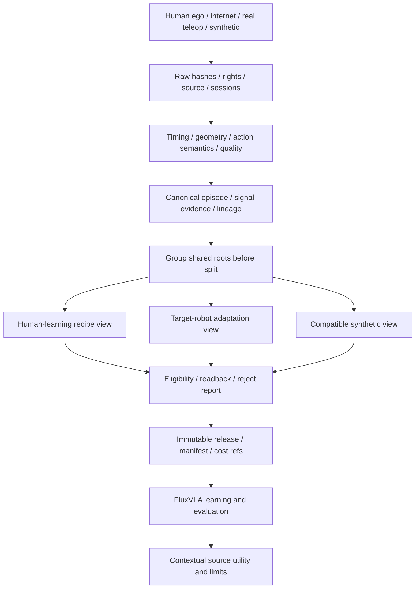

# 03 · Data Core cho learning đa nguồn

_Thiết kế chưa triển khai. Nguồn/signal/recipe khác nhau phải có views đúng objective._

## Sources và evidence

| Nguồn | Dùng cho | Tín hiệu/điều kiện cần |
|---|---|---|
| Human egocentric | Representation/task learning hoặc human action objective | Video/timing; pose/camera/object signals nếu recipe yêu cầu; inferred labels có confidence |
| Real-humanoid teleop, LeRobotDataset | Target-robot action adaptation | Dataset version, camera/state/action semantics, issued commands và measured response |
| Physics simulation | Training variants và controlled evaluation | Robot/controller/assets/scenario versions, executed actions/state/outcome |
| Appearance augmentation/generated video | Recipe-specific augmentation/auxiliary targets | Parent/generator/source rights; không tự có action supervision |
| Public/partner | Pretrained priors, compatible training cohort hoặc integration smoke | Rights, task/embodiment compatibility và split/provenance |
| Corrections/failures | Improvement khi có kiểm chứng | Failure không expert-positive BC; correction labels và execution evidence riêng |

Human source của đội định hướng giống EgoVLA; chưa có recording của đội được cung cấp. Website đã inspect mẫu public HumanEgo và Unitree G1, không tự coi chúng là DENSO data. Không coi fixed-camera RGB-D là thay thế mặc định cho egocentric recipe. Không zero-fill missing signals hoặc convert human wrist pose thành robot joint ground truth chỉ nhờ chung format.

## Data flow

## Quality gates và schema

Episode: root/session/task/embodiment, timestamps/fps, calibration/units/frame, measured/inferred/generated fields, outcome/role, parents/processors/rights/cost. QA: clock and frame alignment, missing/NaN fields, consistent units/action order, pose confidence, occlusion, duplicates/roots và source permissions. Numeric tolerances theo sensor/controller/task, chốt sau samples; không có threshold chung cho mọi camera.

LeRobot loader version pin cùng FluxVLA path. Format đọc được chưa đủ action compatibility. Human/robot normalization riêng khi semantics khác; transform phải versioned và test inverse/readback khi phù hợp.

Release immutable có views, root-aware train/development/final-test splits, hashes, transform revisions và quarantine list. Derivatives của một root không qua split khác. Holdout OOD conditions không xuất hiện trong train/tuning. Final test không dùng để chọn data/recipe hoặc sửa cùng acceptance round.

## Bridge và synthetic

Chọn một human-learning objective: (a) representation trước robot adaptation hoặc (b) structured hand/wrist action space và retargeting kiểu recipe đã chọn. Đây là hai đường khác nhau; không trộn supervision nếu không có loss/mask/mapping hợp lệ. Retargeted trajectory là candidate; nếu dùng thành demo simulation phải execute với controller và verify outcome.

Thứ tự canonical: basic appearance augmentation trước; Cosmos-Transfer2.5 chỉ khi visual hypothesis/QA/cost gate đủ; physics-executed variants sau controller/scorer và fidelity gate. Appearance giữ action labels chỉ khi transform không đổi semantics. Generated video cần objective phù hợp; chất lượng ảnh không là task success. Không bắt mọi release có synthetic.

## Dataset value tối thiểu và scale

Card ghi cohort/model/recipe/task/domain/budget, QA/coverage, comparator run/eval, marginal effect/uncertainty/cost và not-tested domains. Không có score chung cho dataset.

Human transfer: contrast baseline vs human+robot. Synthetic contribution: M1 vs M2. Addition và replacement có estimand khác; khai sample exposure/steps/compute. Frame/variants không tăng số independent roots. Single-run finding exploratory; giữ negative/inconclusive.

Pilot metadata/filesystem, content-hash cache và workspace private. Scale dùng object storage, partition workspace/task/source và bounded preprocessing jobs; multi-customer reuse chỉ với quyền rõ ràng.

## Catalog gói dữ liệu và reuse

Mỗi package ghi condition/actor/signals/eligible objectives/rights/root split, collect-new hoặc reuse-existing, estimated cost range và actual QA/reject/capture/GPU receipts. Reuse dữ liệu hợp lệ không thu lại; vẫn tính incremental QA/adapter/licensing. Human/internet clips chỉ nhập khi có hypothesis về lỗi representation/geometry; không thêm clip chỉ để đủ nhãn nguồn. Exposure/frame counts không thay root budget.

Catalog cho E4 được khóa trước chọn gói, gồm targeted robot corrections, augmentation rẻ và subsets đa nguồn đủ điều kiện. F fixed-mixture không lấy sample vô ích. A có thể chọn teleop giống T nếu đó là gói hợp lệ/chi phí tốt nhất; outcome là no-advantage khi hai choices tương đương. Không đặt source-value score chung hoặc estimated gain giả cho package chưa kiểm.

[Learning Core](04-learning-core.md) · [Contracts](05-contracts.md).

## Nguồn gốc không thay cho loại tín hiệu

Một human video có thể vừa egocentric vừa được publish trên internet; một synthetic video cũng có thể egocentric. Schema có axes riêng: provider/origin, actor, viewpoint, embodiment, signal type/evidence, confidence, rights, session/root và processor. Không ép bốn nhãn thành bốn tập rời nhau. Internet video thường observation-only; có pose inferred vẫn phải giữ confidence, không đổi thành measured action.

CanonicalEpisode dùng `null` + validity mask cho missing signals; raw luôn giữ nguyên để audit. Ví dụ public HumanEgo row 0: right confidence=-1, wrist raw=[0,0,0]. Normalized wrist phải missing, không là tay đặt ở gốc tọa độ. Root grouping diễn ra trước augmentation và trước mọi recipe views.

## Tận dụng teleop theo nhiều vai trò

Trong train/development roots: action supervision đúng embodiment, representation/task transitions, calibration cho retarget/IDM nếu recipe có dùng, contact/recovery/correction khi nhãn đúng. Failure không thành expert-positive behavior cloning. Final-test roots chỉ chấm nghiệm thu. Báo unique roots, exposure và compute riêng; "reuse đầy đủ" không có nghĩa train trên holdout.

[Public examples và provenance](12-public-data-examples.md).

## Correction views theo bước và chuyển tiếp

AcquisitionPackage ghi stage/condition, entry distribution, parent policy, hypothesized cause, correction reviewer và planned pre/post context. Dữ liệu có source action authority và takeover timestamps; quãng switch không mượt/missing targets phải QA/mask. Giữ đủ observation/action chunk horizon qua boundary, không nối giả hai episode.

Failed action trace có role diagnosis/negative outcome; chỉ hành động sửa đúng được review mới vào expert-positive action supervision. Successful prior roots và corrections trộn theo TrainingPlan; final roots vẫn cấm. Recovery demo từ state xấu có target đúng, không đổi failure nguyên trạng thành expert demo. Window/validity/readback checks thuộc D0/E0. [Semantics đầy đủ](14-task-improvement.md).
