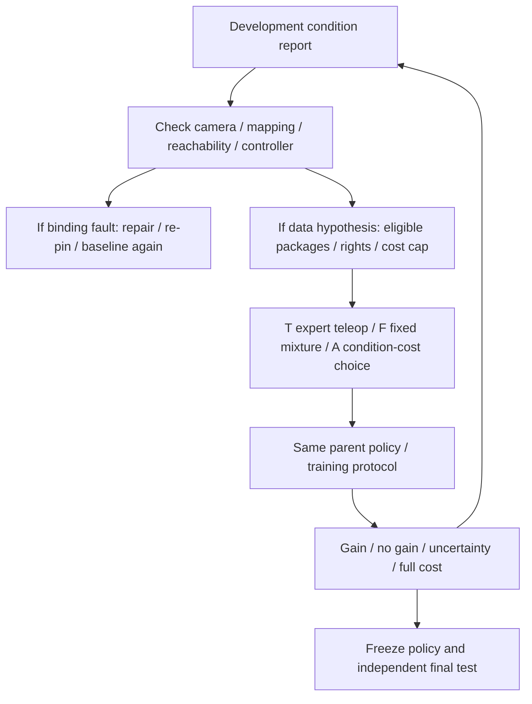
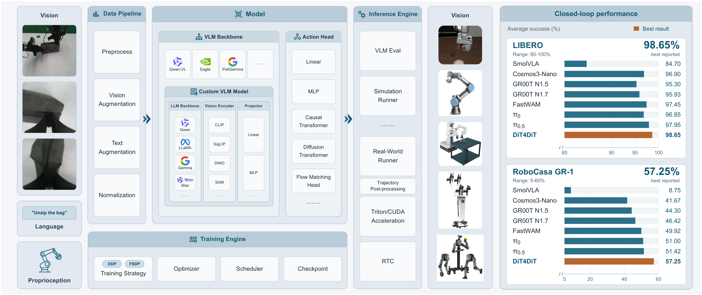

# 04 · Learning Core trên FluxVLA

_Thiết kế chính đã chọn; các adapters/objectives chưa được đội triển khai hoặc chạy. E0 là điều kiện xác nhận tương thích._

## Cơ chế từ video đến kỹ năng

Với lệnh “Đặt linh kiện màu vàng vào ô A1”, video người bổ sung tín hiệu trình tự tiếp cận–gắp–đặt, và wrist motion khi đủ nhãn tin cậy. Mẫu thao tác robot dạy hành động đúng với GR1. Khi thực thi, camera, trạng thái hiện tại và câu lệnh đi vào policy; policy dự đoán hành động, controller thực thi và scorer chấm kết quả.

Hai cách học để giải thích phép so: (1) mô hình có sẵn được post-train bằng mẫu robot; (2) giữ đường action đó, bổ sung mục tiêu học từ video và/hoặc biến thể hình ảnh đủ điều kiện. So cùng chất lượng và đo tổng công. Video bridge là nhánh cần kiểm tích hợp; nếu chưa chạy, báo rõ và dùng contrast augmentation cơ bản hợp lệ. Attribution lợi ích video chỉ sau source/compute controls trong protocol, không suy từ một mixture thắng.

FluxVLA/GR00T/RoboCasa là phần kế thừa. Đội phát triển adapters/masks, auxiliary objectives, task wrapper/scorer và quy trình chọn dữ liệu/báo cáo. Phần dưới giữ thiết kế kỹ thuật chi tiết; không đổi số runs core hoặc điều kiện mở extension.

## Quyết định kỹ thuật

| Thành phần | Chính | Dự phòng và quy tắc đổi |
|---|---|---|
| Engine | FluxVLA, pin commit/config sau E0 | Giữ engine; không dựng platform huấn luyện khác |
| Policy | GR00T N1.5 pretrained base, cùng initialization cho mọi đối chứng | SmolVLA nếu N1.5 fail E0; mọi nhóm khởi động lại cùng init của model mới |
| Humanoid/sim | GR1 trong RoboCasa/MuJoCo, base/torso khóa, một tay active | Giữ GR1; không thay final humanoid evidence bằng LIBERO arm evidence |
| Task | Lấy linh kiện cứng vào ô khay; custom wrapper/scorer | Task pick-and-place GR1 upstream nếu wrapper fail; đổi task công khai trước splits/experiments |
| Human bridge có gate | Shared visual features + head dự đoán bước; wrist-motion khi geometry hợp lệ, chỉ bật khi hypothesis/QA/compute hợp lý | Stage/order giảm loss chưa đủ; downstream transfer phải kiểm so robot baseline, source-drop/compute control khi attribution |
| Internet có gate | Licensed task-relevant RGB clips: stage/order objective khi condition liên quan và có QA trong cost cap | Reuse hợp lệ trước thu/curate mới; thiếu quyền/tín hiệu thì not-tested; prior checkpoint ghi riêng |
| Appearance theo condition | Basic augmentation trước; Cosmos-Transfer2.5 từ train video + depth/segmentation khi QA/cost gate đủ | Chỉ nhận model-generated gain nếu generator và downstream contrast đã chạy; không bắt mọi recipe có synthetic |
| Synthetic nâng cao | Physics-executed variants cùng controller/scorer, sau gate | Không dùng generated videos/pseudo-actions chưa kiểm như measured actions |

[FluxVLA upstream](https://github.com/FluxVLA/FluxVLA) công bố GR00T N1.5, SmolVLA và đường RoboCasa GR1; config tham chiếu `configs/gr00tn15/gr00tn15_eagle_3b_robocasa_30_eps_full_finetune.py`. Đây là cơ sở lựa chọn, không bằng chứng task khay hay auxiliary losses đã được hỗ trợ. Checkpoint download/revision và licenses phải khóa ở E0; không dùng task-finetuned weights chưa biết nguồn test làm base rồi nhận independent holdout.

## Synthetic từ model được chọn

[Cosmos-Transfer2.5](https://docs.nvidia.com/cosmos/latest/transfer2.5/index.html) nhận structured video controls để tạo biến thể hình ảnh. Thiết kế dùng RGB/depth/segmentation từ train simulation trajectories đã thực thi, giữ geometry/timing và action trace gốc, thay nền/ánh sáng/texture trong phạm vi cho phép. Generator revision/prompt/control maps/parent roots, QA reject rate và GPU/person cost phải ghi.

Generated views chỉ nhận action target kế thừa khi kiểm vật, tay, trajectory/timing và outcome không đổi nghĩa; không mặc định control maps bảo đảm labels đúng. Không sinh robot actions từ video này. Nếu QA fail thì reject hoặc dùng RGB objective phù hợp; final-test scenes không vào generator. Basic augmentation là gói đầu tiên để kiểm lỗi thị giác; E3 mở một Cosmos contrast khi cần, báo not-tested/fallback nếu thiếu evidence. Physics và unconditioned world-video/IDM sau gate, không bắt buộc cho core acquisition trial.

## Recipe và objectives cần hiện thực

Hai nhánh học sử dụng shared image features: robot head có action/state thực theo config upstream; auxiliary heads học tín hiệu human/video. Source adapter cung cấp mask cho từng target. Đây là thiết kế custom port vào FluxVLA, không gọi là plugin EgoVLA đã có.

| Nhánh | Input → target | Cập nhật đề xuất và kiểm tra |
|---|---|---|
| Robot action | Camera/language/state → action chunk đúng robot profile | Native action loss; train action head và phần encoder có trong config |
| Human structured | Clip + frame/timing + wrist hợp lệ → bước thao tác và chuyển động wrist tương lai trong camera frame | Stage classifier + wrist regression riêng, confidence mask; kiểm calibration và gradient; không biến pose người thành joint labels |
| Human/internet RGB | Task-relevant clip + nhãn bước đã QA → bước và temporal order | Classification/order prediction trên shared features; nhãn bước và công QA ghi nguồn; không cần robot-action labels giả |
| Appearance synthetic | Train robot/human view đã QA → giữ target tương ứng | Dùng đúng loss gốc; đánh giá augmentation nào bị reject và chi phí |

Wrist head học translation/motion ở camera frame trong subset chuẩn hóa được, không dùng raw world coordinates từ camera khác. Không có geometry hợp lệ thì bỏ loss wrist cho sample đó, không zero-fill. Bước thao tác dùng cùng taxonomy tiếp cận/gắp/chuyển/đặt nhưng không giả thời gian người và robot đã ghép cặp. Temporal-order samples cùng clip, split theo recording trước tạo cặp.

E0 phải xác định điểm lấy shared features, tham số cập nhật, normalization, loss implementation, gradient flow và batch scheduler thật. Bắt đầu heads/adapter và một phần encoder cho phép fine-tune; chỉ dùng LoRA nếu path đó có support và test. Đầu học RGB phụ là giả thuyết transfer, có thể gây negative transfer; việc có forward/backward không chứng minh hiệu quả.

## Các recipes so sánh

- **R0:** cùng base pretrained → target-robot post-training. Khai prior human/internet/robot trong upstream; không gọi toàn bộ lifecycle là robot-only.
- **T:** từ parent R0, engineer chọn targeted teleop/corrections đúng condition. Native action path và basic augmentation đã khai; đây là đối chứng thực dụng, không random collection.
- **F:** từ cùng parent R0, mixture/quy tắc bổ sung cố định đăng ký trước trong catalog hợp lệ. Human/internet/synthetic chỉ vào objective đã pass mini-batch/QA gate; không cố ý chọn data vô ích.
- **A:** từ cùng parent R0, chọn gói đủ tín hiệu/quyền/cap theo condition và chi phí. Có thể chọn teleop/basic augmentation; không ép multisource. Không có expected gain đo được thì ghi hypothesis/unknown. Mọi arm khóa post-train schedule và ghi auxiliary steps/GPU costs.
- **R1/R2 mở rộng:** human+internet auxiliary bridge và appearance contrast khi cần attribution từng nguồn; không bắt một parent R2 phải tồn tại trước E4.

Core E1+E4 gồm 15 runs theo [Protocol](06-validation-and-roadmap.md). Human/internet attribution cần hai source-drop và compute-matched control ở một budget; synthetic attribution cần một contrast. Gated extension tối đa 12 runs nữa, core+extension 27, chưa thực hiện. Workflow T/F/A khác sources/objectives nên khai compute/labels confounds; không gọi causal human gain từ cost comparison. Nếu chỉ có prior trong weights, không nhận đã dùng internet subset mới.

## E0: kiểm tra trước khi triển khai thí nghiệm

1. Pin FluxVLA/model/simulator/controller versions và xác nhận quyền của inputs/checkpoint.
2. Robot loader/controller/scorer trước; catalog bốn nguồn ghi quyền và signals. Human/internet samples chỉ mở loss khi eligible; LeRobot v3 G1 cần version-aware adapter, không tự tương thích.
3. Một mini-batch mỗi loss thực dùng: masks/units/gradient đúng; log missing/rejected. Branch chưa pass đánh dấu disabled/not-tested, không gọi bốn nguồn integrated.
4. Save/reload tạo cùng output trong tolerance; runtime đọc normalization và action profile đúng.
5. Chạy robot-action inference closed-loop GR1, scorer chạy được; tách learned policy chưa học task khỏi thành công nhiệm vụ. Kinematic playback chỉ kiểm controller, không là policy demo.
6. Ghi compatibility report và quyết định pass/fallback trước cuối tuần 2. Nếu cả model chính/dự phòng không chạy thì thu hẹp lại thiết kế, không tiếp tục nhận khả thi đã được chứng minh.

## Một vòng chọn dữ liệu theo lỗi

Vị trí mới yếu: kiểm reachability/calibration/timing; thử targeted teleop coverage trước human/physics tốn công hơn. Nền mới: basic augmentation rồi appearance/RGB exposure nếu hypothesis/QA/cost đủ. Contact/recovery: controller trước, targeted corrections rồi physics fidelity phù hợp; RGB-only không tự thay contact labels. Repair tách khỏi E4 và re-pin baseline; data arms giữ binding cố định. Có stop/defer/no-change khi gói chưa đủ evidence/cap. Final test không chọn nguồn/checkpoint.

## Inference bundle và chuyển sang robot thật

Bundle: weights, normalization, camera/action/controller/calibration profile, FluxVLA/environment refs, task/scorer/domain và acceptance. Runtime tách issued command và measured response, dùng bounds/deadline/stop theo controller đã kiểm. Base/torso/hand active hoặc locked được khai; không cắt whole-body tensor để nhận upper-body compatibility.

Sim chỉ chứng minh domain sim. Teleop real theo LeRobot đi vào train/calibration/corrections khi robot đích đã được cung cấp; toàn bộ unique roots đều tính vào budget. Evaluation roots tách hẳn, công/chi phí eval vẫn tính. Public G1/HumanEgo numerical previews phục vụ kiểm thiết kế, không thay dữ liệu/rollout task đã chọn.

[Protocol](06-validation-and-roadmap.md) · [Contracts](05-contracts.md) · [Data Core](03-data-core.md).

## Architecture gốc của FluxVLA và cách idea tận dụng

Nguồn: Li và cộng sự (2026), **Figure 1, trang 2**, [FluxVLA Engine: A One-Stop VLA Engineering Platform for Embodied Intelligence, arXiv:2609.17210v1](https://arxiv.org/pdf/2609.17210v1#page=2). Hình trích trực tiếp từ PDF, giữ nguyên kiến trúc và bảng kết quả. Các số liệu bên phải là kết quả tác giả; training/evaluation budgets khác nhau giữa integrations, không phải kết quả của đội hoặc so sánh công bằng giữa các model.

Đọc từ trái sang phải: ảnh, language và proprioception vào Data Pipeline; Model ghép backbone với action head; Inference Engine nối evaluator/simulator/robot, acceleration, RTC và trajectory post-processing. Training Engine bên dưới quản lý distributed strategy, optimizer, scheduler và checkpoint.

Idea tái sử dụng dataset/config/transforms/statistics, robot-action path GR00T N1.5, train runners và RoboCasa GR1 evaluation. Phần cần xây: source adapters/masks/lineage, custom stage/order/wrist objectives trên shared features, appearance QA, task khay/scorer/binding và condition-to-package loop. Không tự nhận engine/foundation model mới.

Platform tiết kiệm công xây plumbing đã có tiền lệ; không tự đảm bảo human RGB trở thành robot action. E0 kiểm điểm lấy shared features, từng loss gradient và reload/closed-loop trên selected config. Các capabilities LoRA/RTC/acceleration hỗ trợ theo model/config, không mặc định đều dùng được cùng nhau. E4 kiểm giá trị của vòng chọn nguồn bằng đối chứng cost-matched.

## Public humanoid benchmark cho bước kiểm đầu

[RoboCasa GR1 tabletop tasks](https://github.com/robocasa/robocasa-gr1-tabletop-tasks) có simulator/scorer cho 24 task. [NVIDIA teleop-sim](https://huggingface.co/datasets/nvidia/PhysicalAI-Robotics-GR00T-Teleop-Sim) là reference demonstrations, không robot thật; card công bố 1000 demos/task và CC BY-NC 4.0. FluxVLA có subset 30/task (24 folders, 720 episode Parquets). Public examples trên website ưu tiên GR1 ở LeRobot v2.1 để gần đường triển khai hơn LIBERO/Panda.

Pinned sample PnPBottleToCabinetClose có 29 state/action dimensions ở 20fps và waist unlocked. Không tự áp schema này cho G1 hay mọi release GR1. Metadata subset còn splits.train=0:100 dù 30 episodes; loader cần actual episode validation. Instruction indices 0 và 1 trùng text, không là hai task độc lập. Task khay fixed-torso của proposal cần wrapper/scorer/data phù hợp, không nhận dataset household này đã giải task DENSO. Source và hashes ở [Public examples](12-public-data-examples.md).

12 contrast runs chỉ áp khi comparator/parent phù hợp đã có trong core; nếu cần train thêm parents hoặc rerun health baseline, phải cập nhật run grid và study budget trước. 27 không là trần tuyệt đối của mọi thí nghiệm.
