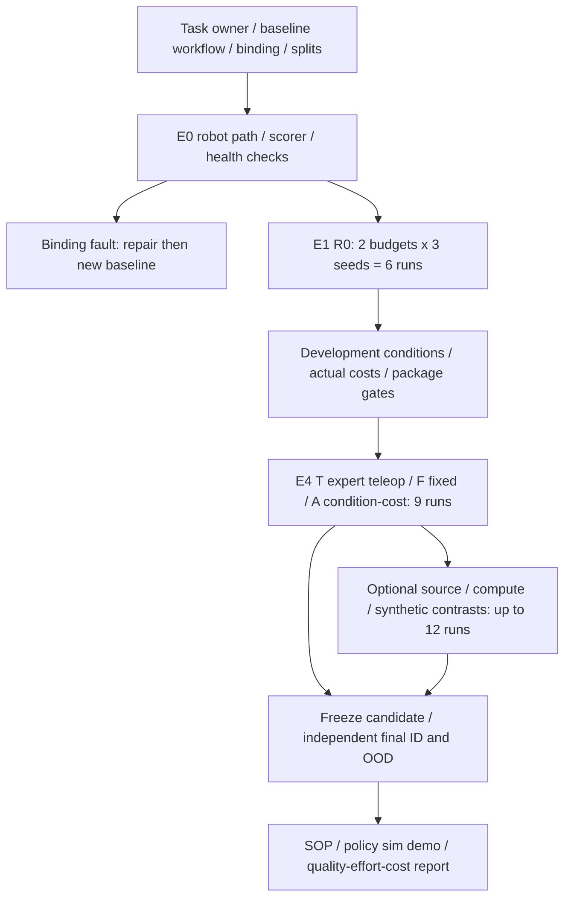

# 06 · Protocol, roadmap và rủi ro kỹ thuật

_05/10/2026 · Một skill trước; kiểm giá trị so targeted teleop. Thiết kế, chưa runs hoặc savings._

## Câu hỏi cần trả lời

Q1: can thiệp theo condition/cost có giảm engineer-hours, robot-hours và elapsed time tới cùng accepted quality hơn cách kỹ sư thu targeted teleop? Q2: có hơn mixture cố định đủ điều kiện? Q3: nguồn nào thực sự giúp sau masks/QA và extra compute? Q1/Q2 là core; attribution từng nguồn chỉ sau gate.

## Khóa đúng task và điểm nghẽn

Tuần 1: task owner xác nhận workflow hiện hành, công reset/thu/QA/calibration/debug/acceptance, robot availability, cycle time và lỗi. So công việc hiện tại hoặc automation phù hợp; lý do dùng humanoid chưa được DENSO xác nhận. Chọn một condition visual/spatial và một contact/recovery khả thi, không thay bộ gắp/reachability để tạo OOD không giải được bằng dữ liệu.

Case khay: đúng vật/đúng ô/đã nhả/stable ≥2s trong ≤30s, mọi timeout/rơi/collision tính fail. Đây là PoC thông số đề xuất; production thresholds do owner chốt riêng. GR1/base/torso/controller/camera/scorer pin trước runs. Repair calibration/controller là stage riêng: re-pin và lập baseline mới, không trộn repair vào E4 data-only arms.

Development chọn condition/gói/recipe. Final ID/OOD conditions và scenario seeds khóa riêng; final không quay về train, calibration, selection hoặc generator. Derivatives cùng recording ancestor cùng split. Khi đổi task/model/binding, reset comparator và final plan.

## Experiments và 15 core runs

| Experiment | Thiết kế | Gate / claim |
|---|---|---|
| E0 | Robot samples → action loss/gradient → reload → GR1 closed-loop/scorer; health checks; mini-batch mỗi auxiliary loss sẽ dùng | Branch fail disabled/not-tested; loader-only chưa đủ; không nhận task success từ runtime smoke |
| D0 | Stage verifier/unknown/never-reached/retries, paired natural/restaged probes, zero-task/no-basic cases | Scorer agreement/readiness, probes hợp lệ, costs; website fixtures chưa robot validation |
| E1 | R0 tại 2 target-demo budgets ×3 seeds =6 runs | Same pretrained init/task/controller/scorer; baseline và failure map; budget chốt sau E0 |
| E4-T | T: engineer chọn targeted robot teleop/corrections từ parent R0, cùng stage traces/probe access | Đối chứng thực dụng; cùng condition/chi phí bổ sung |
| E4-F | F: mixture/quy tắc fixed đăng ký trước, catalog đủ quyền/tín hiệu | Không cố ý lấy data vô ích; basic augmentation đã khai |
| E4-A | A: condition/cost choice; được chọn teleop/reuse/basic augmentation/human/internet/synthetic hợp lệ | Không ép đủ nguồn; unknown utility không thành predicted gain |

Chọn một E1 budget trên development; từ 3 parent R0 seeds fork T/F/A: 3 arms ×3 seeds =9 runs. **Core =6+9=15 training runs**, chưa chạy. E4 so workflow/source choice, không human-only causal attribution. Cần ≥2 training approaches thực sự khác objective/data recipe trong report; nếu auxiliary branch không pass, native post-train vs declared augmentation route là fallback và không claim human/internet gain.

### E4 cùng điều kiện

Khóa catalog, target stages/condition, useful parent, quyền/signals, probe access, cap và fixed-mixture rule trước lựa chọn. T do engineer chọn targeted robot corrections; F theo mixture đã khai; A theo eligibility/condition/cost, engineer duyệt. A chọn giống T thì có thể no-advantage. Không dự đoán gain bằng rules hoặc ép source để đủ bốn nhãn.

Binding/task-stage verifier/scorer và post-train schedule cố định; auxiliary steps/parameters/compute khác phải ghi. Acquisition cap bao gồm capture/reset/QA/reject, rights, preprocessing/generation và selection/planning person-time; phần learning/evaluation/analysis cost báo riêng trong total. Khóa thêm total incremental cost cap để A không dùng extra compute vượt T. Cap tolerance đề xuất 5%; không cân bằng được thì exploratory cost–quality frontier, không claim fair cost superiority.

So T/F/A trên cùng held-out conditions, paired scenario seeds khi hợp lệ; mọi retries/no-gain có ledger. Same-quality cần acceptance/noninferiority margin và sample size chốt trước; baseline chưa đạt threshold không tính saving ở threshold. Không infer causal diagnosis từ failure clip. Fixed là core; nếu muốn claim hơn random nói chung, thêm repeated random-package draws trong budget mở rộng, không suy từ một draw.

### Extension theo gate: thêm tối đa 12 runs

Tại một budget/recipe hợp lệ: human-drop, internet-drop, compute-matched robot control và Cosmos-vs-basic contrast, mỗi nhóm ×3 seeds =12. Chỉ chạy contrast phù hợp; nếu parent recipe không có human/internet thì không chạy source-drop vô nghĩa. Tổng core+toàn extension **27 runs dự kiến**. Thêm budget/model/random draws chỉ với plan/budget version mới; không dùng số 30 cũ làm ngân sách mới.

## KPI và giới hạn

| KPI | Cách đo | Giới hạn |
|---|---|---|
| Quality | Full-task ID/OOD success, stage conditional success/reach/unknown coverage, transitions/regression, tất cả trials/CI | ≥75%/≥70% là PoC targets, không production-ready |
| Total effort / time | Engineer/operator-hours, allocated GPU-hours, robot-hours, elapsed days tới acceptance | Reuse/sponsored/sunk/incremental tách; chưa time-motion thì estimated |
| Acquisition value | A vs T và F, quality/noninferiority + total incremental cost + uncertainty | Hơn random chưa chứng minh hơn expert teleop; no-gain giữ lại |
| Demo efficiency | Union target roots gồm calibration/corrections/selection; eval roots riêng | 30% là target; views/frames không demos mới; chưa baseline threshold thì undefined |
| Reliability | Cycle p50/p95, interventions/1000 attempts, recovery minutes, good outputs/giờ | Không lấy timeout 30s làm measured cycle; sim và real riêng |
| Reuse | Task thứ hai cùng robot: công adapter tới quality target | Chưa task thứ hai thì chưa scalability evidence |

Thiết kế đầu ≥3 train seeds và ~100 trials/checkpoint/condition; pilot chỉnh sample size/noninferiority margin. Wilson trial intervals và train-seed variation báo riêng; 100 trials không đảm bảo equivalence ±5 điểm phần trăm. Core R&D ledger gồm từng train/eval/selection job, không giả một skill production là toàn study.

## 12 tuần và gates

| Tuần | Đầu ra | Quyết định |
|---|---|---|
| 1–2 | Owner workflow/task/quality, binding/scorer/E0, rights và package samples | Main/fallback; sửa runtime trước data experiment |
| 3–4 | D0 stage verification/probes và E1 useful R0; branch mini-batches/catalog | No useful parent: bootstrap theo cap/replan hoặc rescope/stop |
| 5–6 | Lock T/F/A, hai condition feasibility, caps và selection receipts | Chọn một budget; chưa eligibility thì defer branch |
| 7–9 | E4 9 runs, same-quality/total cost và repeated trials | A so T/F; no-gain là kết quả hợp lệ |
| 10 | Gated source/compute/synthetic extension nếu cần và đủ budget | Không mở all-source grid trước core evidence |
| 11–12 | Freeze/final ID/OOD, SOP/report/checkpoint/binding/learned sim demo | Chỉ claim trong domain được kiểm; real acceptance riêng |

## Risk register

| Rủi ro | Gate / xử lý |
|---|---|
| Chẩn đoán nhầm controller lỗi thành thiếu data | Health checks, command/response/calibration; repair baseline riêng |
| Human RGB loss giảm nhưng robot không khá hơn | Downstream E4/extension, source-drop/compute control khi attribution; giữ negative transfer |
| Selection/QA overhead lớn hơn saving | Cap cả planning/selection, actual time-motion; stop/defer hoặc gói rẻ hơn |
| A không hơn targeted teleop | Báo no-advantage; không gọi workflow tối ưu hoặc algorithmic novelty |
| Synthetic đổi contact/labels | Basic trước Cosmos; semantic QA/reject ledger; physics fidelity riêng |
| Leakage/test quyết định gói | Root split/final-ref checks; contaminated plan invalidate và rerun |
| Task DENSO khác GR1 proxy | Adapter và owner acceptance riêng; không chuyển sim success sang real |
| Scope UI/model quá rộng | CLI/report trước; một task/model, chưa multi-user/full WM |

Gate sản phẩm: một skill được owner nghiệm thu → task thứ hai cùng robot → robot thứ hai với binding/acceptance riêng. Production auth/jobs/backup/rollback theo [TDD](02-system-architecture.md), không dùng sơ đồ để nhận đã triển khai.

[Product](01-product.md) · [Learning Core](04-learning-core.md) · [Business case](07-business-case.md).

12 contrast runs chỉ áp khi comparator/parent phù hợp đã có trong core; nếu cần train thêm parents hoặc rerun health baseline, phải cập nhật run grid và study budget trước. 27 không là trần tuyệt đối của mọi thí nghiệm.

## D0 và điều kiện để core15 có ý nghĩa

D0 cần golden traces: not-attempted sau early fail, unknown sensors, retries/abort, late failure từ earlier pose, 0 task success có local progress và no basic skill. Test verifier agreement và readiness, snapshot reset/reachability, natural-vs-restaged entry; người kiểm labels và cost. Offline website fixtures là software/content checks, không scientific D0 pass.

R0 phải useful ở ít nhất một phần tác vụ và có signal học hợp lệ. Chưa useful thì BOOT expert seed/curriculum; extra train jobs/model change/R0 replacement phải version RunPlan, comparator và splits. D0 thêm recording/probe/eval/person/robot jobs, không mặc định nằm miễn phí trong15 training runs. Không claim saving khi baseline/candidate chưa same quality.

E4 T có cùng stage/scorer/health và quyền probe như A; decision/collection overhead mỗi arm ghi riêng. Freeze common training schedule/data eligibility/caps, khai sampling/auxiliary confounds. Sau update kiểm local + transitions + full-task natural starts và regression conditions tốt. Source attribution hoặc residual-RL cần extension budget riêng. [Chi tiết](14-task-improvement.md).
