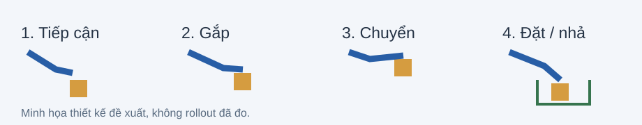

# 13 · Kết quả dự kiến và task example nghiệm thu

_05/10/2026 · Mục tiêu bàn giao, chưa kết quả của đội. Task đại diện đề xuất; DENSO task/robot cuối cần khóa lại trước experiments._

## Ba sản phẩm cuối

| Đầu ra | Nội dung bàn giao | Gate |
|---|---|---|
| Policy chạy được | Checkpoint, normalizer, action/controller binding, runtime config | GR1 closed-loop và independent scorer, không expert playback |
| SOP/data package dùng lại | Rights, source versions, masks, root splits, QA/reject records, releases và hướng dẫn chọn package | Recipe tái chạy được, holdout không leakage |
| Evidence/cost report | Stage/transition/full-task/regression, unknown/reach/probes, bootstrap/correction decisions; R0 và ≥2 cách học thực sự chạy, E4 T/F/A từ cùng R0, ID/OOD final, all trials, train seed và cost receipts | Có thể kết luận achieved, no-gain hoặc inconclusive đúng evidence |

## Lợi ích kỳ vọng

| Mục tiêu PoC | Cách xác nhận | Giới hạn |
|---|---|---|
| ≥75% lượt gắp–đặt thành công | Chấm đúng vật/ô, nhả/ổn định và timeout trên toàn bộ lượt | Thông số ban đầu cần người phụ trách tác vụ duyệt |
| ≥70% trên biến thể giữ riêng | Kiểm từng biến thể hình ảnh/vị trí chưa dùng để train/tune | Trong miền thao tác khả thi, chưa là chuẩn nhà máy |
| Giảm ≥30% mẫu robot ở cùng chất lượng | So phương án với cách học chuẩn, tính đủ roots hiệu chuẩn/sửa lỗi | Mục tiêu, chưa đường cong học hoặc saving đo được |
| Giảm tổng công phát triển kỹ năng | Giờ kỹ sư/operator/robot/GPU và thời gian đến nghiệm thu | Chưa đặt tỷ lệ tiết kiệm; tính cả QA, xử lý, train/eval/retry |

Đầu ra bàn giao là cam kết phạm vi triển khai; mức cải thiện là giả thuyết cần kiểm. Giảm số mẫu không tự đồng nghĩa giảm chi phí. Bước mở rộng là đo tái sử dụng ở tác vụ thứ hai, rồi nghiệm thu robot thật riêng.

## Một task cụ thể

Instruction: **“Đặt linh kiện màu vàng vào ô A1.”** Humanoid fixed-base/torso, một tay hoạt động, tay kia ở pose nghỉ; rigid part và vị trí nằm trong khả năng gripper/reachability đã kiểm.

1. Camera + measured state + instruction đi vào policy.
2. Policy dự đoán action chunks; normalizer và binding đúng joints/units/frame; controller thực thi. Không playback expert trace.
3. Tiếp cận → gắp → chuyển → đặt → nhả. Scorer chấm đúng vật trong đúng ô, gripper đã nhả, stable ≥2s trong ≤30s. Rơi/timeout/đặt sai/collision là fail.
4. Thử ID và biến thể nền/ánh sáng/vị trí giữ riêng; final OOD không dùng chọn package/tune model.
5. Nếu development yếu ở nền mới: kiểm camera/timing/geometry, thử basic augmentation hoặc package qua gate, so T expert teleop / F fixed mixture / A condition-cost từ cùng R0/catalog/caps/train steps. Nếu không cải thiện, báo no-gain và giữ giới hạn claim.

Hình minh họa quy trình do đội thiết kế, không ảnh/video policy đã thực hiện. Website có video tác giả và G1/HumanEgo/LIBERO public examples riêng; không ghép chúng thành rollout của task này.

## Mục tiêu và bằng chứng

- ≥75% success là target; nâng cao ≥70% trên biến thể chưa train. Owner phải duyệt scorer/threshold, trial protocol và domain.
- Giảm ≥30% robot demos tại cùng quality là target, không budget reduction tự chứng minh. Baseline phải đạt quality trước; union target roots gồm calibration/corrections/model selection, eval riêng.
- Không đặt saving% chi phí trước. Full cost có thể tăng dù teleop giảm; báo tradeoff thay vì chọn bỏ QA/train/integration costs.
- Source-choice advantage chỉ nhận sau A vs T và F fair contrast; A chọn như T chưa có advantage; giữ no-gain/inconclusive.
- Independent final logs phải có actual numbers, run IDs, releases, trial errors/timeouts, domain và uncertainty giữa trials/train seeds. Video demo chỉ một phần evidence, không thay success protocol.

## Mở sang sản phẩm và industry

Một task/robot/model trước; thêm task thứ hai trên cùng robot và đo công thay adapter/scorer/data. Sau đó robot thứ hai. Real-humanoid có controller/camera/calibration/real acceptance riêng; sim pass không tự là real-cell pass. Auth/jobs/backup/rollback và cell integration triển khai theo nhu cầu pilot thật.

[Product](01-product.md) · [Learning Core](04-learning-core.md) · [Protocol](06-validation-and-roadmap.md) · [Chi phí](07-business-case.md).

## Đầu ra kinh tế và reliability bổ sung

Report tách R&D-sim toàn study, per-skill sau pipeline và production-real. Không coi 16.359,98 USD full-source stress scenario là toàn ngân sách12 tuần; không thay assumptions để tạo saving. Cost missing giữ unknown; caps ngang chưa chứng minh same-quality. Đo engineer/operator/robot/GPU-hours và elapsed time, cyclep50/p95, interventions/1000, recoveryminutes, acceptedoutputs/hour. Targets75%/30%/OOD70% là PoC, cần production criteria riêng.

Core15 runs: R0 2budgets ×3seeds =6 và T/F/A ×3parentseeds =9. Extensions source/compute/Cosmos có gate; nếu branch fail vẫn báo ≥2 cách học hợp lệ như native vs declared augmentation, không claim human/internet gain.

## Bàn giao bằng chứng của vòng cải thiện

Thêm task-stage specs/verifier review, traces theo pass/fail/not-attempted/unknown, natural/restaged probe receipts, Acquisition/Bootstrap/TrainingPlans và regression suites. Demo sửa một bước chưa là full-task acceptance. Report bao quát partial progress, no basic skill, unseen stages, transition failures, health repair và no-gain/stop; trường chưa đo giữ unknown.

Chưa có useful R0 hoặc local verifier thì không giao claim “hệ thống biết train đúng chỗ”. Thiết kế đã bổ sung ở [Task improvement](14-task-improvement.md); kết quả chỉ sau E0/D0/E1/E4/final. Costs/numbers core15 chỉ conditional, bootstrap/retrain có thể tăng study jobs.
