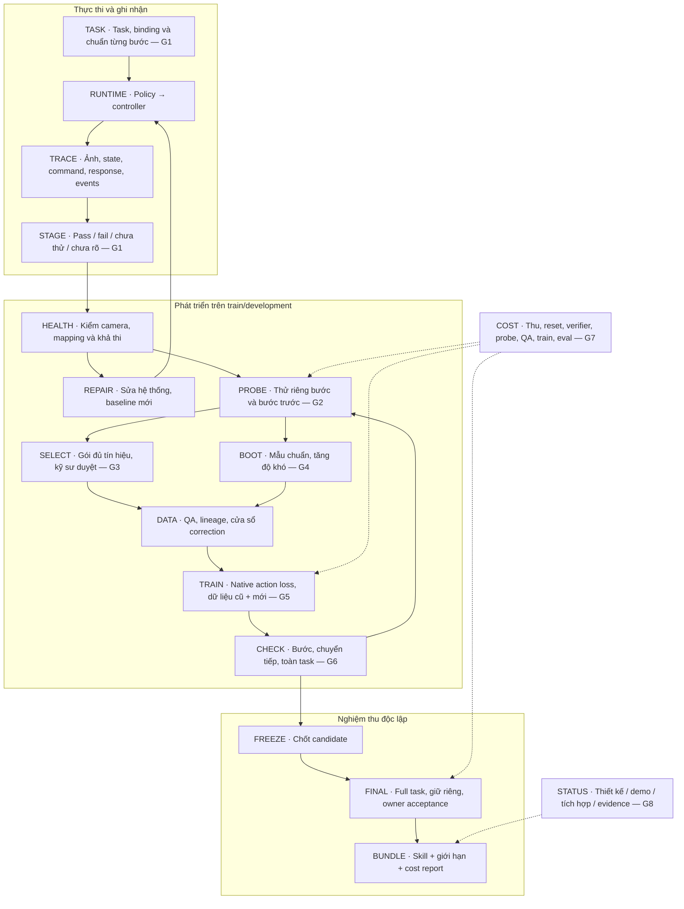

# 14 · Từ task thất bại đến kế hoạch cải thiện

_Revision improvement-v2 · 05/10/2026. Thiết kế đề xuất cho một skill GR1 gắp–đặt. Website chạy ví dụ được khai báo; chưa có bộ chấm robot, adapter huấn luyện, rollout hoặc saving của đội._

## Luận điểm và trách nhiệm

Công cụ giúp kỹ sư xác định robot đã thử bước nào, khoanh vùng điểm nghẽn bằng phép thử, chọn sửa hệ thống hay thu dữ liệu đúng, huấn luyện và đo lại cả task. Giá trị cần chứng minh là tổng công tới cùng chất lượng so với kỹ sư thu correction có chủ đích. Không nhận tự chẩn đoán nhân quả, tự tìm đúng neuron hoặc chắc chắn cải thiện mọi task.

Hai core vẫn giữ: Data Core quản dữ liệu và nhãn; Learning Core chạy học và đánh giá. Bổ sung vòng cải thiện task là chức năng bắt buộc, robot-action baseline trước; human/video và generator mở sau gate. Các bước runtime chỉ để ghi nhận và đánh giá; một policy có thể điều khiển cả task, không bắt chia thành năm model hoặc gọi LLM để đổi policy ở mỗi bước.

## Kiến trúc có ID và ranh giới

Graph `task-improvement`, revision `improvement-v2`, representation `proposed_design`. Số hiệu G1–G8 là findings của audit cùng revision, không kết quả thí nghiệm.

Final không quay về SELECT/BOOT/TRAIN trong cùng vòng acceptance. Đổi scorer/binding/task phải version lại, baseline mới và khóa final plan mới; dữ liệu test bị lộ không còn là holdout của vòng đó.

## TASK: định nghĩa từng bước trước khi thống kê

Một task có thể là graph gồm nhánh/retry; MVP chọn chuỗi cố định một vật, một tay, torso/base khóa. Ghi precondition, entry, completion, timeout, điều kiện sẵn sàng cho bước sau, failure/abort và cách reset cho từng bước. Tolerances khoảng cách/lực/tốc độ chỉ chốt sau pilot, không invent universal threshold.

| Bước | Điều kiện bắt đầu | Hoàn thành / sẵn sàng bước sau | Dấu hiệu cần kiểm |
|---|---|---|---|
| Tiếp cận | Đúng vật trong vùng tay với tới, quan sát hợp lệ | Bộ gắp ở pose tiếp cận phù hợp, chưa va chạm | Lệch vị trí, timeout, vật bị che |
| Gắp | Pose tiếp cận hợp lệ | Vật được giữ với pose cho phép nâng/chuyển; đóng gripper đơn thuần chưa pass | Gắp hụt, giữ lệch, vật không đi cùng tay |
| Nâng/chuyển | Vật đang được giữ, task không aborted | Giữ vật đến pose đặt khả thi, đường đi hợp lệ | Tuột/rơi, va chạm, pose gắp gây cản |
| Đặt | Vật ở vùng đặt đúng ô | Vật ở pose cho phép nhả, không bị kẹt/chèn | Sai ô, chưa chạm vị trí hợp lệ |
| Nhả/rút | Pose đặt hợp lệ | Đúng vật nằm hoàn toàn ô A1, đã nhả, ổn định ≥2s | Kéo vật theo tay, rơi, sai ô |

Toàn task ≤30s là thông số PoC cần owner duyệt. Trong sim, scorer có thể dùng object poses/contact/measured state từ simulator. Privileged sim state chỉ phục vụ chấm/reset, không cấp vào policy ảnh/state nếu recipe không có input đó. Robot thật cần verifier từ sensors thật hoặc human labels; không tự suy force từ dataset không có force.

STAGE có bốn trạng thái: `pass`, `fail`, `not_attempted`, `unknown`. Chưa tới bước không tính fail. Verifier không đủ bằng chứng thì unknown; đã bắt đầu nhưng mất quan sát ghi unknown và tính trong coverage. Aborted/safety/timeout vẫn fail ở full-task denominator. Log retry từng attempt, không lấy lượt cuối thành công để che attempts trước; báo thêm unique episodes và số lần intervention.

Báo `pass / (pass + fail)` cho những attempts xác định được, đồng thời công bố số unknown và coverage `known / entered`. Khi unknown cao không xếp bottleneck theo point rate; báo khoảng thành công thấp/cao `pass/entered` và `(pass+unknown)/entered`. Báo reach rate `entered episodes / toàn episodes` riêng; count retries không tráo với unique episode count. Kiểm scorer bằng annotated traces, false-pass/false-fail và transitions; không chỉ accuracy tổng hoặc train loss.

## PROBE: lỗi xuất hiện ở đâu, sửa từ đâu?

Scorer ghi hiện tượng; nhân quả là giả thuyết. Ví dụ vật rơi ở chuyển nhưng pose gắp từ trước không hợp lệ. Engineer review traces, commanded-vs-measured response, calibration/time/reachability; giữ alternative causes.

Probe P1: thử chuyển từ pose gắp chuẩn khả thi. Probe P2: thử chuyển từ pose do current policy tự tạo. Giữ vật, controller, camera, version và seed/scenario tương ứng khi hợp lệ. Nếu P1 tốt/P2 yếu, ưu tiên gắp/transition; nếu cả hai yếu, kiểm giữ/chuyển/controller; samples ít hoặc verifier không rõ thì kết luận chưa đủ. Kết quả này khoanh vùng, chưa cô lập hoàn toàn mọi confound của restaging.

Entry states thử riêng phải reachable, ghi `natural` / `restaged` / `human_assisted` và parent episode. Sim snapshot/reset có hash; robot thật cần setup/replay an toàn đã kiểm và human reset khi cần. Báo sai khác entry distributions; luôn kiểm lại từ đầu task bằng policy, không lấy staged success làm end-to-end success. Probe dùng development, không test final. Chi phí label/reset/scenario authoring tính vào quyết định.

Không đặt fail-rate cao nhất thành ưu tiên tự động. Xét first divergence, prerequisites, reached/known counts, mức tác động full task, rủi ro/quyền/tín hiệu và chi phí thu/đánh giá. Khi chưa có utility thực, đề xuất pilot nhỏ trong cap và engineer duyệt; không fabricate gain score. Sau cap hoặc số vòng không cải thiện đăng ký trước: defer/stop/rescope, giữ reason và no-gain.

## SELECT và BOOT: bao quát các trạng thái năng lực

| Trạng thái | Quyết định hợp lệ |
|---|---|
| Lỗi camera/mapping/controller hoặc task ngoài khả năng bộ gắp | Repair/rescope; không đưa vào data-only E4 |
| Một vài bước yếu, các bước khác ổn | Targeted correction; giữ prior dữ liệu tốt và transition context |
| 0 full-task success nhưng vẫn có bước làm được | Chấm từng bước, probe và luyện bottleneck; chưa gọi toàn skill bằng 0 |
| Chưa có bằng chứng bước cơ bản nào làm được | Thu expert demonstrations task đơn giản; native action post-train để tạo R0 |
| Chưa tới các bước sau | Restage hợp lệ để khảo sát; kết quả bước sau chưa biết trước probe |
| Từng bước riêng tốt nhưng nối task yếu | Thu natural-entry transitions/recovery; kiểm preconditions và readiness |
| Không có labels/verifier/action phù hợp | Thu/annotate hoặc defer; RGB-only không thay robot action |
| Gói hợp lệ nhưng không cải thiện hoặc chi phí vượt cap | Giữ no-gain, thử alternative đã đăng ký hoặc dừng |

BOOT dùng pretrained base và expert robot data; không foundation training từ đầu. Curriculum đề xuất: một vật/vị trí/ánh sáng cố định → cả chuỗi đơn giản → biến thể vị trí → ánh sáng/vật trong miền khả thi. Gate lên mức khó gồm đủ trials/coverage, criterion owner chốt và full-task check; không dùng một demo đẹp. Khi các bước cơ bản chỉ chạy được sau nhiều expert assistance, giữ trạng thái bootstrap và intervention rate; chưa nhận useful autonomous baseline.

Nếu model path không qua E0: thử fallback và reset comparators như docs04. Nếu baseline không hữu ích sau cap đã khóa: thu hẹp task hoặc báo chưa khả thi; không mở tiếp E4 để nhận data-selection advantage. BOOT costs/setup/sample collection thuộc E1/shared parent; bootstrap policy của A khác T/F thì không còn phép so chung parent.

## DATA và TRAIN: chuyển điểm nghẽn thành dữ liệu và cập nhật

AcquisitionPlan ghi target stage/condition, hypothesized cause, entry distribution, correction protocol, input/target validity, parent policy, reuse/new roots, pre/post window, reviewer, cap và alternatives. Corrections lấy tại hoặc gần state policy gây ra, trước khi sự cố không thể phục hồi. Human takeover/controller switch có timestamp và action authority riêng; action discontinuities bị QA, không coi mọi intervention là expert sạch.

Giữ context trước lỗi và sau sửa; action chunks cắt qua boundary cần horizon/timing đúng. Không tùy ý crop một frame lỗi hoặc nối các episodes tạo discontinuity. Failed original actions dùng analysis/negative-outcome role, không expert-positive imitation targets. Recovery demonstration có thể bắt đầu từ state xấu nhưng target là hành động sửa đúng đã kiểm.

| Tham số kế hoạch học | Phải khai / cách kiểm |
|---|---|
| Khởi đầu | Cùng R0 checkpoint/hash cho T/F/A tại mỗi seed |
| Supervision | Native action objective của selected GR00T config; đúng normalization/embodiment, mask targets missing |
| Sampling | Dữ liệu correction và successful prior roots; giữ transition windows; mixture ratio đăng ký qua development |
| Tham số cập nhật | Action head/adapter/encoder theo config qua E0; manifest trainable/frozen params, LR/steps/batch/seed |
| Lịch học | Cùng protocol/caps giữa arms; extra auxiliary compute/labels khai confounds |
| Kiểm hồi quy | Các bước/conditions vốn tốt, full-task ID/OOD; không promote chỉ vì loss giảm |

Với shared policy, tập trung training data vào gắp không tương đương chỉ cập nhật neuron của gắp. Freeze hay adapter giảm phạm vi update nhưng không đảm bảo giữ mọi skill. Replay prior dữ liệu và regression evaluation là bắt buộc. Ratio, LR và tham số cụ thể chưa benchmark; phải chốt bằng development/config integration. Human/video stage classifier là auxiliary supervision, không mặc định là runtime subtask verifier.

Residual correction policy hoặc RL local rewards là extension có gate: cần base đủ để productive exploration, entry/reset/verifier valid, action composition/bounds/runtime selection/reward learner riêng, matched budget và counterfactual full-task test. Không coi PARTS/CR-DAgger đã plug-in GR00T/GR1. MVP dùng targeted supervised post-training trước; không biến failures thành positive BC bằng nhãn reward.

## CHECK, FINAL và chi phí

Bộ kiểm bắt buộc: verifier agreement/unknown coverage; step conditional success/reach; transition readiness; full-task success/all trials; recovery/interventions/timeouts/cycle time; regression các conditions tốt; cost/hours tới acceptance. Local gains có thể full-task không tăng. Development dùng để chọn package/checkpoint; final chỉ chạy sau freeze và không feedback cùng round.

D0 diagnostic gate thêm trước E4: annotated traces có late failure do earlier grasp, local motion error, unknown sensors, never-reached stages, 0 task success và no basic skill; paired natural/restaged probes và checksum/reset test. Không tự giả D0 là zero GPU/person/robot cost; offline contract fixtures của website chỉ kiểm logic ví dụ, không validation verifier robot.

Core 15 training runs là acquisition study có điều kiện: 6 E1 +9 T/F/A từ ba parent seeds. D0 là thêm việc recording/probe/eval chứ không mặc định thêm training run. BOOT thêm train jobs, đổi model hoặc D0 cần retrain thì phải tăng RunPlan/BudgetLedger; source contrasts/residual RL không nằm sẵn trong 15. E4 so A với expert T có cùng traces/health/scorer/allowed probe access và cap; overhead selection/reset thực tế mỗi arm tính riêng. F rule cố định nhưng vẫn đủ quyền/tín hiệu, không cố ý kém.

Costs ghi activity IDs cho stage specification/verifier annotations, diagnostic robot/sim probes, reset/retry/human assist, correction QA, baseline bootstrap, prior replay/train, local+global regression, final và reporting. Setup dùng chung phân bổ; capture resets đã trong collection không cộng lại vào probe/reset. Blank chưa đo giữ unknown. Không tính saving khi cùng quality chưa đạt, unknown cost thiếu trọng yếu hoặc bootstrap chưa có useful parent.

## Nguồn phương pháp và giới hạn tận dụng

- [DAgger, Ross et al., PMLR 15:627–635, 2011](https://proceedings.mlr.press/v15/ross11a.html): học tuần tự chịu phân bố state do policy tạo; là cơ sở cho correction gần rollout states. Không chứng minh pipeline của đội tiết kiệm.
- [MimicGen TaskSpec, documentation](https://mimicgen.github.io/docs/modules/task_spec.html): khai subtask termination signals và segment selection. Đội cần định nghĩa scorer riêng cho GR1/task khay, không giả auto segmentation.
- [PARTS, arXiv:2609.21788v2, §I và §III-A/B, 30/09/2026](https://arxiv.org/html/2609.21788v2): local bottleneck learning, readiness và restaged entry; cần task base, selectors/verifiers/reset. Tham khảo phân rã/phép kiểm; chưa port residual RL.
- [CR-DAgger, NeurIPS 2025, system/method](https://compliant-residual-dagger.github.io/): correction interface và residual learner khác fine-tune toàn policy; takeover có thể lệch phân bố/không mượt. Không chuyển kết quả contact trên robot tác giả thành kết quả GR1.

[Audit toàn idea](reviews/full-idea-audit-2026-10-05.md) · [Learning Core](04-learning-core.md) · [Protocol](06-validation-and-roadmap.md) · [Contracts](05-contracts.md).
