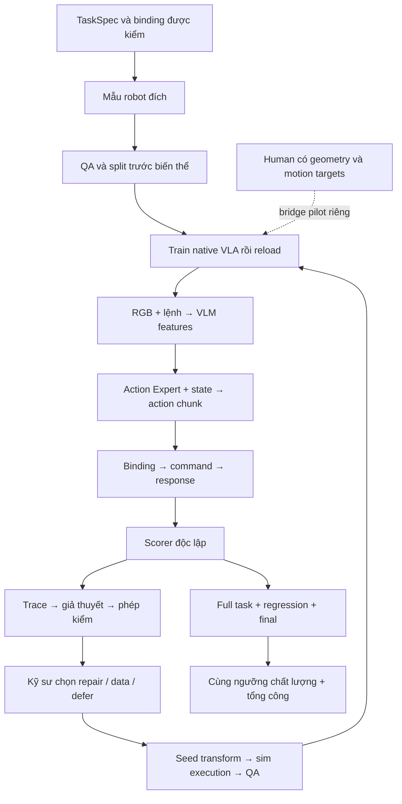

# Bản triển khai để xem trước · Skill A1

**Trạng thái: recipe A1 đề xuất hiện hành, được website tham chiếu từ 07/10/2026; chưa có native results.** Giữ mục tiêu human/synthetic data efficiency; cụ thể hóa task, recipe và phép đo. Không tạo một idea mới hoặc nâng điểm vì thêm tài liệu.

## Giá trị đề xuất

Giúp đội phát triển kỹ năng gắp–đặt đạt một tiêu chuẩn rõ ràng với ít công thu mẫu robot và ít tổng công hơn. Phần đội xây là nguồn dữ liệu có QA, binding/scorer, traces, quyết định can thiệp có bằng chứng và báo cáo quality/cost. Giá trị thêm của evidence workflow cần kiểm riêng bằng công kỹ sư và chất lượng quyết định; không nhận đây là thuật toán VLA mới.

Người dùng đầu tiên: kỹ sư robot learning cần đưa skill mới hoặc thay đổi điều kiện lên một robot đã có pretrained policy. Operator thu seed/correction và reset. Task owner xác định vật, đích, domain và tiêu chuẩn chấp nhận. Đây là giả thuyết người dùng; chưa có khảo sát DENSO để gọi là pain point đã xác nhận.

## Example được giữ xuyên suốt

“Lấy đúng linh kiện vàng và đặt vào ô A1, nhả rồi rút tay.” Gắp–đặt thô trong mô phỏng là phạm vi MVP đề xuất. Không bao gồm lắp ghép chính xác, full-body locomotion hoặc chuyển giao robot thật trong phép thử đầu.

Geometry và ngưỡng ở TaskSpec là **defaults để thử**, không phải số đo, yêu cầu nhà máy hoặc quyết định owner đã duyệt. A1 là custom task cần port. Kiểm native loader/controller trước bằng task upstream `PosttrainPnPNovelFromTrayToPlateSplitA` có trong config tham chiếu; pass task này không nghiệm thu A1.

Sơ đồ là proposal, không phải bản chạy native. Nhánh dữ liệu chỉ được mở sau health checks; S không được tạo từ final. Human không nối trực tiếp vào robot-action loader.

## Ba việc làm trước

| Việc | Đầu ra cụ thể | Gate |
|---|---|---|
| Khóa task và native compatibility | TaskSpec, action/state/camera/controller manifests; một upstream smoke trace rồi A1 expert replay | Task feasible, commands/response đúng, scorer chấm được |
| Chạy baseline robot-data-only | Dataset R, native trainer/gradient/reload receipts và full-task traces | Học và inference có thật, không dùng scripted policy làm baseline |
| Thử synthetic trên cùng robot budget | Dataset R+S, generation attempts/rejects/QA, candidate và quality-cost comparison | Positive execution labels đúng profile; gain/no-gain đều báo |

Human motor pilot tiếp theo có recipe riêng ở tài liệu02. Không mở ba human routes cùng lúc. Không mặc định nguồn nào phải thắng.

## Mở từng tài liệu

1. [Task, tiêu chuẩn chấm và native baseline](01-native-task.md).
2. [Robot/synthetic recipes và human motor pilot](02-recipes-and-data.md).
3. [Example lỗi → phép kiểm → can thiệp → đo lại](03-example-failure-and-recovery.md).
4. [Phép đo chất lượng, tiết kiệm và mở rộng](04-evaluation-and-cost.md).
5. [Decision/coverage/RunPlan và FOCA contract](05-data-decision-and-run-contracts.md).
6. [TaskSpec đề xuất dạng dữ liệu](task-spec.proposed.json), [preflight máy hiện tại](native-preflight.json), [ledger chưa có số đo](cost-ledger.template.csv).

## Cách trình bày lại trên website sau khi xem bản này

Giữ phong cách phần Ý tưởng & vấn đề hiện tại. Đầu trang nêu một pain point, một task và một luồng hệ thống. Example có ba nhãn rõ: dữ kiện đo được / giả thuyết / phép kiểm cần chạy. Mỗi cảnh nối cùng episode/checkpoint/release thay vì nhiều hình rời. Kết quả chưa chạy hiện là “cần đo”, không cho animation kết thúc thành công mặc định.

## Các tiêu chí được cải thiện bằng gì?

| Tiêu chí | Cụ thể hóa ở bản này | Bằng chứng còn phải có |
|---|---|---|
| Sáng tạo | Đóng góp ở recipe/evidence/QA/quality-cost; benchmark against engineer workflow riêng | Giá trị thêm của quy trình, không chỉ phối hợp nguồn |
| Nghiệp vụ | Persona, task, đầu vào/đầu ra và giả thuyết công cần giảm | Task owner và baseline workflow thực |
| Kỹ thuật | R/S recipes; một human motor route có target/loss/gradient rõ; five-boundary trace | Native receipts, contact-valid execution, downstream outcomes |
| Hiệu quả | Cùng quality threshold; cost ledger và robot-budget curve | Giờ công, chi phí và số skill changes/năm thực |
| Mở rộng | Task2 cùng robot, đo reused/rebuilt components | Công integration và quality của task2 |

Điểm5,7 hiện tại không tự tăng khi hoàn thiện bản đề xuất này. Máy kiểm hiện không có CUDA device khả dụng, chưa cài FluxVLA và không có native checkpoint. MuJoCo/reference dùng được; chưa thể chạy native ở môi trường này. Preflight là kiểm môi trường, không kết luận model không khả thi.

## Hợp đồng quyết định và tài nguyên

[Acquisition decision](acquisition-decision.template.json) · [Coverage/dedup release receipt](release-quality.template.json) · [Measured RunPlan](run-plan.template.json). Các file là template, null là chưa đo; không phải backend hoặc kết quả native.
