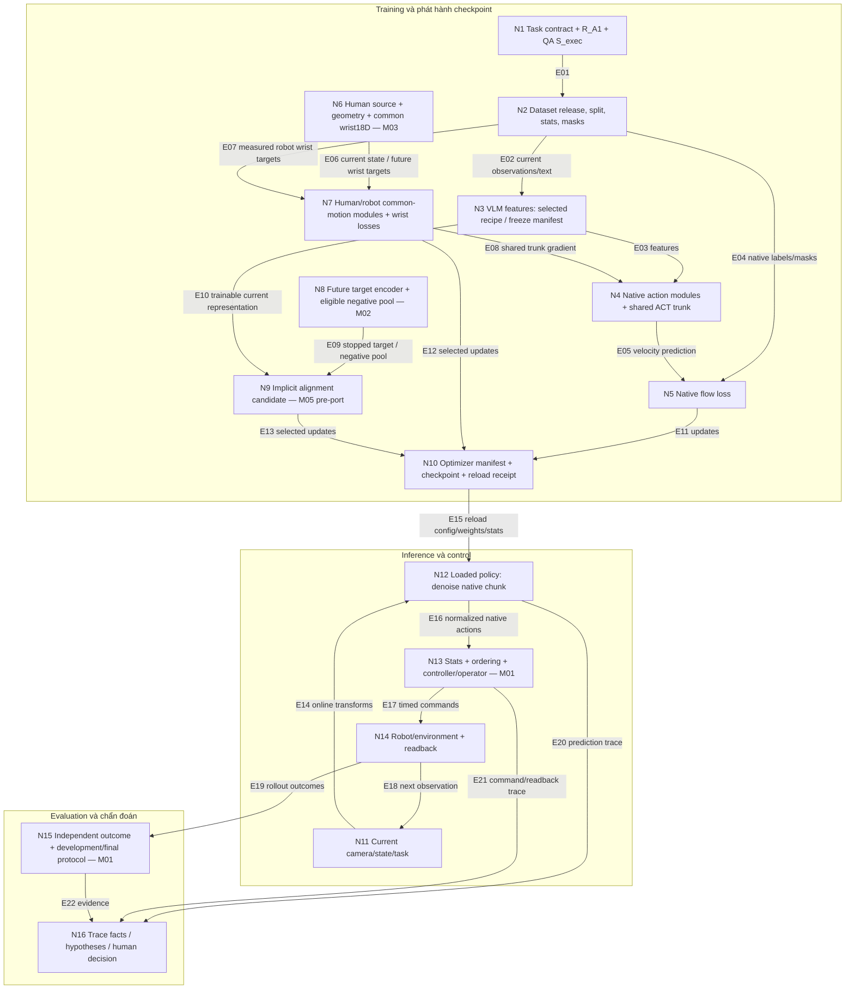

# Phản biện Astra A — VLA, world model và model engine

Ngày hoàn tất: 07/10/2026. Đối tượng: nội dung đóng băng trong [snapshot.json](/home/hiwe/denso-challenge/docs/reviews/astra-website-review-2026-10-06/snapshot.json), HEAD `e45cf7f0309f3fe58112c98c10b1111f5bee1864` và các digest của working tree trong manifest. Báo cáo này là phản biện nội dung/kiến trúc, không phải tái lập thực nghiệm. Không sửa website, không chạy native training hay robot. Đọc mã tạo các trang; việc kiểm tra giao diện live thuộc người tổng hợp.

## Kết luận có phạm vi

**Thiết kế hiện tại có cơ sở nghiên cứu hợp lý và đã sửa được nhiều kiểu nhầm lẫn nghiêm trọng thường gặp khi ghép VLA với data flywheel. Trong phạm vi đã đọc, tôi không tìm thấy lỗi nền tảng đã chứng minh khiến lựa chọn FluxVLA + GR00T-style policy hoặc human shared-trunk không thể hoạt động. Tuy nhiên, chưa có bằng chứng native A1 cho thấy chuỗi dữ liệu → policy → controller đạt chất lượng hữu ích.** Website nhìn chung nói rõ giới hạn này; không nên biến tình trạng chưa triển khai thành lỗi khoa học.

Điểm cần bổ sung rõ nhất vào thiết kế là **nguồn negative cho FOCA khi A1 chỉ có một tác vụ**. Đây là rủi ro có thể suy ra trực tiếp từ objective gốc, trước khi trả chi phí port. Điểm quyết định lớn nhất đối với toàn đề án vẫn là **binding A1 và native baseline có ích**, không phải thêm một nhánh world model. Human wrist-only là một thí nghiệm có ý nghĩa nhưng câu hỏi mà nó trả lời hẹp hơn khả năng “học thao tác từ video người” nói chung.

Một vấn đề tĩnh trong nhánh implicit-only của mã FOCA upstream được ghi riêng ở phụ lục M05. Nó là đầu mục kiểm tra trước port đối với phiên bản mã đã truy xuất, **không phải lỗi runtime A1 đã quan sát**, và không làm mất giá trị của website vốn đã ghi nhánh này là candidate chưa triển khai.

## Những điểm thiết kế được nguồn hỗ trợ

1. **Đã phân biệt đúng framework, policy và environment.** FluxVLA là lớp thực thi/tích hợp; `LlavaVLA + EagleBackbone + FlowMatchingHead` là một cấu hình policy; RoboCasa/GR1 là integration mô phỏng cụ thể. Tên engine không bảo đảm mọi policy, task và robot chạy được với nhau. Cách trình bày tại [doc17:7](/home/hiwe/denso-challenge/idea-v3-2026-10-05/17-model-engine-core-fluxvla.md:7), [doc17:119](/home/hiwe/denso-challenge/idea-v3-2026-10-05/17-model-engine-core-fluxvla.md:119) phù hợp với cấu trúc framework trong [FluxVLA v1, tr. 6–14](/home/hiwe/denso-challenge/docs/references/papers/FluxVLA.pdf).
2. **Đã sửa đúng nhầm lẫn “GR00T N1.5 luôn frozen VLM”.** Website ghi official N1.5 giữ VLM frozen, còn selected Flux recipe có `tune_llm=False`, `tune_visual=True`, `freeze_vlm_backbone=False`; đồng thời không gọi recipe đó là bản tái lập official. Đối chiếu [doc17:86–90](/home/hiwe/denso-challenge/idea-v3-2026-10-05/17-model-engine-core-fluxvla.md:86), [NVIDIA N1.5, Architecture/Training](https://research.nvidia.com/labs/gear/gr00t-n1_5/) và [config upstream](https://github.com/FluxVLA/FluxVLA/blob/main/configs/gr00tn15/gr00tn15_eagle_3b_robocasa_30_eps_full_finetune.py). Không coi sự khác biệt giữa hai recipe là mâu thuẫn nếu config của từng thí nghiệm được pin riêng.
3. **Action objective được mô tả đúng ngữ nghĩa.** Với convention selected Flux head, training dự đoán velocity cho noisy chunk, không trực tiếp xuất command; inference tích phân để thu chunk. Website cũng phân biệt action 29 chiều hữu hiệu/padded 32, state 64, horizon 16, số bước tích phân 4 và số bước thực thi K. Những số này thuộc selected integration. [Doc17:84–86,113](/home/hiwe/denso-challenge/idea-v3-2026-10-05/17-model-engine-core-fluxvla.md:84); [head upstream](https://raw.githubusercontent.com/FluxVLA/FluxVLA/main/fluxvla/models/heads/flow_matching_head.py).
4. **Human motor pilot đã có đường gradient hợp lý về mặt thiết kế.** Human wrist targets đi qua common motion modules và shared Action Expert trunk; robot vẫn có native action path và common wrist path. VLM frozen ở cả hai human-study arms để kiểm tác động lên Action Expert. H không giả thành robot29D, không update native robot decoder. Đây là đề xuất có thể triển khai; cùng hidden width không được dùng làm bằng chứng transfer. [Recipe:29–65](/home/hiwe/denso-challenge/docs/implementation-plan/skill-a1/02-recipes-and-data.md:29).
5. **World model được chia theo vai trò có ích.** DreamGen là nguồn sinh dữ liệu offline; FOCA/FLARE cung cấp supervision về tương lai; DreamZero là một policy world-action khác có video-action generation ở runtime; DreamerV3 thuộc hướng học dynamics và actor/critic qua imagination. Không có căn cứ bắt A1 phải mang toàn bộ các vai trò này vào một pipeline. [Doc15:20–28](/home/hiwe/denso-challenge/idea-v3-2026-10-05/15-dataset-training-blueprint.md:20), [doc16:79–91](/home/hiwe/denso-challenge/idea-v3-2026-10-05/16-model-ai-va-data-flywheel.md:79); nguồn chính về FOCA và DreamZero ở bảng coverage bên dưới.
6. **Claims về diagnostic và novelty tương đối thận trọng.** Probes/hidden features là evidence để đề xuất giả thuyết, chưa là nguyên nhân lỗi; controller repair không được đếm là data-only gain; nguồn human/synthetic tự thân không được nhận là mới. So sánh source ablation khác với chứng minh workflow chọn lần thu dữ liệu tiếp theo có ích. [IDEA:150–180,204–214](/home/hiwe/denso-challenge/IDEA.md:150), [doc17:139–147](/home/hiwe/denso-challenge/idea-v3-2026-10-05/17-model-engine-core-fluxvla.md:139).

Các kết luận “phù hợp nguồn” ở trên không có nghĩa các branch đã chạy, đã đạt action parity hoặc đã cải thiện success. Đặc biệt, tên FLARE/N1.5 và một tensor mang tên future token không tự chứng minh auxiliary loss đó đang thực thi.

## Bản đồ kiến trúc dùng để gắn nhận xét

Sơ đồ dưới đây là **tái dựng từ thiết kế của đội**, không phải hình nguyên bản của paper, không phải kiến trúc đã được chạy. ID `N*` là node; `E*` là cạnh. Hai nhánh H và F là optional research candidates. Nhánh FOCА chỉ thể hiện Q2-inspired implicit route mà website chọn; không gộp toàn bộ FOCA vào đó.

E08 là đường đóng góp gradient vào shared trunk, không có nghĩa wrist prediction trở thành robot command. E09 chỉ tồn tại trong training; future target không là input inference. E10 phải có trainable source path khi dùng implicit alignment: stop-gradient ở target không đồng nghĩa freeze cả hai phía. E15 cần kiểm mới biết training-only modules có được lưu và load đúng hay không. M04 là nhãn tài liệu ở catalog, nên không gắn giả vào một node tính toán.

### Kiểm tra tính liên tục của chuỗi

| Mắt xích | Nội dung hiện tại | Kết luận trong phạm vi kiểm tra |
|---|---|---|
| Dataset → targets | R/S có executed actions; H có wrist geometry/masks; video-only có future embeddings; không tự bịa nhãn robot | Hợp lý. Vẫn cần release thực với timebase, unit, branch ID và split; mô tả schema không thay data inspection. |
| Targets → losses | Native flow, common wrist flow và implicit alignment được tách; thiếu nhãn không tính action loss | Hợp lý. FOCA negative pool cho single-task A1 chưa được chốt: M02. |
| Loss → gradient scope | Selected visual-unfreeze baseline khác frozen human study; target encoder frozen riêng | Không thấy mâu thuẫn ở recipe chi tiết. Cần manifest + gradient receipt theo từng source/loss. |
| Gradient → checkpoint | Có yêu cầu optimizer groups, new keys/init, parent/config/statistics/digests | Đúng yêu cầu cần có, chưa có native artifact xác nhận. |
| Checkpoint → inference | Native action branch, same processor/stats, reload parity; H wrist decoder có thể training-only | Hợp lý nếu branch conditioning và key mapping giữ đúng. Không chứng minh parity bằng checkpoint load thành công đơn thuần. |
| Inference → control | Denormalize, action mode/order, H/K, timestamps, runner/operator, readback | Đây là gate lớn nhất chưa đo: M01. Public GR1 waist/29D khác task một tay torso cố định. |
| Control → evaluation | Whole-task, ID/OOD, failure/timeout/intervention, uncertainty, latency/cost; dev/final tách | Thiết kế có cơ sở; chưa có kết quả native chứng minh quality. Demo MuJoCo nhỏ không lấp khoảng này. |
| Evaluation → diagnosis | Trace facts, hypotheses, repair/acquisition decision; không tự gán nhân quả từ attention | Cách diễn giải đúng. Muốn claim workflow có ích phải so quyết định và kết quả downstream, không chỉ chất lượng representation. |

Anchors của bảng: [doc11:5–29](/home/hiwe/denso-challenge/idea-v3-2026-10-05/11-contracts-va-logic.md:5), [doc15:49–78,98–143](/home/hiwe/denso-challenge/idea-v3-2026-10-05/15-dataset-training-blueprint.md:49), [recipe:45–74](/home/hiwe/denso-challenge/docs/implementation-plan/skill-a1/02-recipes-and-data.md:45), [doc17:96–147](/home/hiwe/denso-challenge/idea-v3-2026-10-05/17-model-engine-core-fluxvla.md:96).

## Nhận xét được xếp theo ảnh hưởng đến quyết định

| ID | Mức ưu tiên | Cơ sở | Kết luận |
|---|---|---|---|
| M01 | Decision-blocking đối với claim native feasibility/quality | `unresolved`, đã được tác giả thừa nhận | Chưa khép binding và native baseline A1; đây là gate, không phải bằng chứng chọn sai architecture. |
| M02 | Material nếu chọn FOCA Q2 candidate | `inferred_risk` từ objective gốc | Một tác vụ không tự cung cấp task-mismatched negatives; loss có thể suy biến hoặc objective bị đổi ngầm. |
| M03 | Material đối với cách diễn giải human pilot | `accepted_tradeoff` + rủi ro transfer đã thừa nhận | Wrist-only/shared-trunk/frozen-VLM kiểm một giả thuyết hẹp; chưa đủ suy ra grasp/contact hay human transfer tổng quát. |
| M04 | Minor | `interface inconsistency` về nhãn tài liệu, chưa phải mâu thuẫn tính toán | Catalog “auxiliary human heads” chưa diễn đạt lựa chọn common wrist/shared ACT trunk rõ như recipe mới. |

### M01 — Native A1 binding là khoảng chưa được bằng chứng lấp, không phải lỗi đã chạy

**Target:** N13, E16–E19, N15. **Website:** `#engine` và `#learning`; [model-engine-core.js:14](/home/hiwe/denso-challenge/presentation-site/dist/model-engine-core.js:14), [learning-core.js:21](/home/hiwe/denso-challenge/presentation-site/dist/learning-core.js:21), [doc17:111–135](/home/hiwe/denso-challenge/idea-v3-2026-10-05/17-model-engine-core-fluxvla.md:111), [doc13:3–7](/home/hiwe/denso-challenge/idea-v3-2026-10-05/13-example-native-tu-dau-den-cuoi.md:3).

**Tiền đề và lập luận.** Public recipe chia action thành hai tay, hai bàn tay và waist; A1 đề xuất một tay/torso cố định. Dùng cùng tên GR1/N1.5 không quyết định được inactive joints xử lý thế nào, state/action order ra sao, lệnh absolute hay delta, control timebase, camera calibration và task scorer. Một transform sai có thể làm một policy được train đúng xuất command sai; một task/scorer khác cũng không nhận trực tiếp benchmark upstream. Vì vậy không thể suy feasibility/quality native từ public config hoặc từ bài ridge/MuJoCo 4D. [Config GR1 upstream](https://github.com/FluxVLA/FluxVLA/blob/main/configs/gr00tn15/gr00tn15_eagle_3b_robocasa_30_eps_full_finetune.py); [FluxVLA v1, tr. 12–14 và 18–25](/home/hiwe/denso-challenge/docs/references/papers/FluxVLA.pdf).

**Ảnh hưởng.** Đây là điều kiện trước khi bỏ ngân sách so H/S hoặc tuyên bố engine đã tạo skill bundle A1 có ích. Mức ưu tiên cao xuất phát từ vị trí của gate trong pipeline, không phải từ xác suất thất bại đã biết.

**Bằng chứng chống lại nhận xét mạnh hơn.** Website đã nói rõ native chưa chạy; doc17 ghi đúng gap waist/torso, `H` khác `K`, real-robot runner examples không chứng minh GR1 A1, và có yêu cầu readback/reload. FluxVLA có architecture và integration thật, không phải engine chỉ tồn tại trên slide. Do đó không có căn cứ kết luận phải bỏ FluxVLA hoặc chuyển sang WAM.

**Sửa/bổ sung cụ thể.** Giữ nhãn “proposal”; biến gate đã nêu thành một bảng binding có phiên bản: thứ tự và đơn vị từng channel, active/inactive masks, absolute/delta, rate/latency, camera frame/time, chunk H/K, source state, inverse normalization, model/controller limits, outcome semantics. Gắn policy/config/stats/asset digest cùng artifact. Đây là cụ thể hóa contract đã có, không phải đề nghị viết lại thiết kế.

**Phép kiểm tra phân biệt kế tiếp.** (1) Một executed expert trajectory qua đúng binding và scorer, có desired command/readback; (2) kiểm shape/mask/gradient + một batch/short overfit để xác nhận đường học; (3) reload checkpoint với processor/stats và kiểm action parity dưới cùng observation/noise; (4) native robot-only rollout qua các seed/scenes development đã định trước, báo cả failure và quality interval. Các bước đầu kiểm plumbing, không thay bước (4). Gate đóng khi native baseline đủ hữu ích theo tiêu chí đăng ký trước; chưa cần chứng minh human branch để qua gate này. Chi phí phải đo theo cấu hình thật; không suy VRAM từ tên “FSDP” vì selected recipe dùng `no-shard`.

### M02 — FOCA Q2 cần đặc tả negatives trước khi dùng cho single-task A1

**Target:** N8 và E09. **Website:** `#overview`/`#engine`, [overview-flywheel.json:102–103](/home/hiwe/denso-challenge/presentation-site/content/overview-flywheel.json:102), [overview-flywheel.json:314–327](/home/hiwe/denso-challenge/presentation-site/content/overview-flywheel.json:314), [doc16:79–83](/home/hiwe/denso-challenge/idea-v3-2026-10-05/16-model-ai-va-data-flywheel.md:79). A1 scope: [IDEA:37–43](/home/hiwe/denso-challenge/IDEA.md:37).

**Tiền đề từ nguồn.** FOCA v1 §3.3, tr. 5, Eq. (10) chọn negatives từ episodes khác có task description khác; Eq. (11) đặt positive và tập đó trong mẫu số InfoNCE. Q2 tại tr. 8 dùng implicit-only video phase, rồi action + implicit trên robot data, explicit prediction disabled. Đây chính là phạm vi website đã chọn, không phải suy diễn từ tiêu đề paper. [FOCA v1, tr. 5,8](/home/hiwe/denso-challenge/docs/references/papers/FOCA.pdf); [bản HTML chính thức](https://arxiv.org/html/2606.20867v1).

**Lập luận có điều kiện.** Nếu batch/pool của pilot chỉ chứa cùng một task description A1, áp dụng nguyên Eq. (10) cho tập negative rỗng. Khi đó mỗi hạng Eq. (11) còn:

\[
-\log\frac{\exp(s_+/\tau)}{\exp(s_+/\tau)}=0.
\]

Đây là suy luận đại số của reviewer, không phải kết quả chạy. Nếu triển khai dùng mọi mẫu khác trong batch làm negatives để tránh rỗng, objective đã khác paper; các trạng thái đích hợp lệ của cùng task có thể thành false negatives. Đổi câu chữ của cùng instruction thành nhiều chuỗi không tự tạo ra nhiều nhiệm vụ khác nhau về ngữ nghĩa.

**Kết luận và ảnh hưởng.** Website mô tả objective đúng nhưng chưa chốt nó lấy negatives từ đâu cho A1. Chỉ có future frame và frozen target encoder chưa đủ thành recipe. Rủi ro là nhánh tốn compute mà không có signal phân biệt, hoặc so kết quả dưới nhãn FOCA trong khi đã đổi negative semantics.

**Bằng chứng chống lại nhận xét mạnh hơn.** Nguồn H/video hoặc robot pretraining có thể có nhiều task; website chưa cấm dùng một train-only multitask pool. FOCA cũng báo cáo nhiều setting và robot tasks; không được kết luận phương pháp chỉ hoạt động trong một benchmark. Nhánh này được ghi rõ là candidate cần port. Vì vậy đây là missing specification có hậu quả điều kiện, không phải loss A1 đang chạy bị lỗi và không phải bác bỏ FOCA.

**Sửa/bổ sung cụ thể.** Thêm vào RunPlan: semantic task ID, eligible negative pool, train-only provenance, sampling/batch composition, minimum negative count và xử lý zero-negative batch. Nếu chọn một objective khác phù hợp single-task, ghi đó là adaptation; kiểm tra collapse và false negatives riêng. Chi phí mới gồm nguồn nhiều task, sampling và khả năng thêm domain shift; không có phương án miễn phí mặc định.

**Phép kiểm tra phân biệt.** Trước native training, đưa một batch đơn task và một batch có nhiều task thật qua objective. Log eligible negative counts, positive/negative similarities, loss và gradient theo module; trường hợp đơn task phải được từ chối/bỏ có giải thích hoặc có pool hợp lệ từ ngoài batch. Sau khi plumbing đúng mới so action-only với action+implicit dưới cùng parent/split/label/compute protocol và rollout downstream. Nhận xét “thiếu negatives” được giải quyết bằng pool/semantics đã kiểm; loss giảm riêng chưa chứng minh control gain.

### M03 — Human wrist pilot hợp lý nhưng không đại diện toàn bộ motor transfer

**Target:** N6–N7, E06–E08; phạm vi claim ở N15. **Website:** `#learning`, [learning-core.js:5,30–34](/home/hiwe/denso-challenge/presentation-site/dist/learning-core.js:5), [doc16:69–75](/home/hiwe/denso-challenge/idea-v3-2026-10-05/16-model-ai-va-data-flywheel.md:69), [recipe:37–76](/home/hiwe/denso-challenge/docs/implementation-plan/skill-a1/02-recipes-and-data.md:37).

**Tiền đề và lập luận.** Recipe dự đoán translation + rotation6D của wrist trong current-camera frame, có robot FK/readback tương ứng, nhưng không có finger/contact targets khi source không đo. Cùng biểu diễn hình học làm interface có nghĩa; nó không tự đồng nhất camera/object/hand appearance, dynamics, affordance hay quality của tracking giữa người và robot. Một trunk học approach/transport tốt hơn vẫn có thể thất bại ở đóng tay/giữ vật. EgoScale cung cấp tiền lệ nhưng dùng scale lớn và aligned play; ablation wrist-only yếu hơn cho thao tác khéo. [EgoScale v1, §2 và §3.6](https://arxiv.org/html/2602.16710v1); [project chính thức](https://research.nvidia.com/labs/gear/egoscale/).

**Ảnh hưởng.** Không nên đọc “H update ACT” thành “H đã truyền kỹ năng gắp”. Ngược lại, full-task no-gain không chứng minh H không mang tín hiệu motion; bottleneck có thể nằm ở contact hoặc representation khác. Đây là giới hạn endpoint, không phải lập luận chống chọn pilot hẹp.

**Bằng chứng chống lại nhận xét mạnh hơn.** Recipe đã nói không guarantee transfer, không invent grasp labels, real-human/sim-robot là domain risk chứ không incompatibility, và no-gain chỉ áp dụng frozen wrist recipe. VLM frozen vẫn tạo features khác cho inputs khác; official N1.5 cũng cho thấy frozen VLM không đồng nghĩa không thể học từ video qua objective khác. Vì vậy không có căn cứ yêu cầu mặc định unfreeze VLM hoặc thay route trước khi thử.

**Sửa/bổ sung cụ thể.** Giữ chọn lựa wrist-only như một tradeoff và làm claim trên trang khớp endpoint: “kiểm human motion supervision có giúp shared Action Expert trong recipe này”. Ghi mức quality/tracking/occlusion và relevance của H; đo riêng approach, grasp acquisition, retention, placement, nhưng giữ whole-task success là endpoint quyết định. Không dùng các sub-metrics để che full-task không đạt.

**Phép kiểm tra phân biệt.** So `R_common` với `R_common+H`, cùng VLM freeze, parent, robot roots, optimizer/steps và protocol; nếu claim gain do nguồn thì cần control tính thêm compute/samples. Kiểm H-only backward update ACT/common/human modules nhưng không update detached VLM hoặc native decoder; kiểm R paths và checkpoint reload riêng. Nếu motion cải thiện nhưng grasp không cải thiện, kết luận hẹp tương ứng. Chỉ mở thêm visual/interface tuning bằng thí nghiệm mới có no-H/H controls tương ứng. Các phép kiểm này phần lớn đã nằm trong recipe: việc cần làm là thực thi và gắn receipts, không thêm độ phức tạp vào slide.

### M04 — Nhãn “auxiliary human heads” chưa diễn đạt lựa chọn hiện tại đủ rõ

**Target:** catalog/documentation interface, không là lỗi một node model. **Website:** `#research`; [research-and-media.json:10](/home/hiwe/denso-challenge/presentation-site/content/research-and-media.json:10), phần render catalog [app.js:38](/home/hiwe/denso-challenge/presentation-site/dist/app.js:38). Đối chiếu [recipe:29–31,53–65](/home/hiwe/denso-challenge/docs/implementation-plan/skill-a1/02-recipes-and-data.md:29).

**Quan sát.** Card EgoVLA nói MVP chọn auxiliary human heads trên FluxVLA, trong khi mô tả chi tiết chọn common wrist-motion objective qua shared ACT trunk, kèm human adapter và native robot branch. “Auxiliary heads” có thể bao gồm thiết kế đó, nên chưa đủ kết luận hai kiến trúc trái nhau. Tuy nhiên người đọc catalog có thể hiểu đây chỉ là supervision lên VLM hoặc một human head không đi qua ACT.

**Tác động và phản chứng.** Đây là lỗi rõ nghĩa nhỏ, không ảnh hưởng một implementation đã tồn tại. Những trang chi tiết đã giải thích route đúng. **Sửa:** đổi riêng reuse text thành mô tả ngắn có “common wrist18D + shared Action Expert trunk, custom candidate” và link recipe. **Kiểm tra:** đọc catalog, `#learning`, `#engine` và recipe theo cùng một ví dụ H batch; cả bốn phải trả lời thống nhất H targets gì, update đâu và robot inference đi nhánh nào. Không cần benchmark để giải quyết nhận xét này.

## Đánh giá nguồn, world model và phạm vi claims

### Những kết luận không nên nâng thành “lỗi website”

- **Không có native run** là trạng thái đã công bố. Reference MuJoCo dùng mô hình nhỏ và action khác; website không được dùng nó làm native receipt, nhưng có thể dùng để minh họa lineage, parity và phép so sánh. Hiện các đoạn đã kiểm ghi rõ khác biệt. [Doc02:71–73](/home/hiwe/denso-challenge/idea-v3-2026-10-05/02-kien-truc-va-cach-hoc.md:71), [doc11:19](/home/hiwe/denso-challenge/idea-v3-2026-10-05/11-contracts-va-logic.md:19).
- **Model engine không mới về thuật toán** không làm integration vô giá trị. Cần định vị đóng góp ở data release/QA, lựa chọn update, tracing và đánh giá chất lượng/tổng chi phí. Muốn claim cải thiện quy trình phải có control quy trình, không chỉ `R` so `R+S/H`. Nội dung hiện tại đã phân biệt hai câu hỏi. [IDEA:204–214](/home/hiwe/denso-challenge/IDEA.md:204).
- **Human bridge chưa triển khai** không chứng minh bridge sai. Interface hình học, masks, optimizer groups và source-specific gradient scope đã được đề xuất cụ thể. Tính hữu ích vẫn là câu hỏi thực nghiệm.
- **Official upstream có real robot** không chứng minh real GR1 A1; ngược lại **GR1 A1 chưa có operator được kiểm** không chứng minh framework không hỗ trợ real robot. Doc17 đã giữ ranh giới này đúng.
- **Một mô hình VLA lớn có thể quá tốn cho một tác vụ hẹp** là câu hỏi efficiency có ích, không phải lỗi chỉ vì A1 đơn giản. OpenVLA có trường hợp Diffusion Policy thuận lợi hơn ở single-instruction narrow setting, nhưng benchmark đó không chọn hộ kiến trúc A1. Nếu sau này claim engine được chọn “tối ưu chi phí/chất lượng”, mới cần baseline phù hợp cùng robot/data/protocol. Website hiện nói selected route, không SOTA winner. [OpenVLA, experiments](https://openvla.github.io/).

### Phân biệt các mức world-model claim

| Vai trò | Điều nguồn cho phép nói | Điều chưa được suy ra cho A1 |
|---|---|---|
| Video generation offline | Có thể mở coverage hình ảnh/task; cần QA và supervision phù hợp | Video hợp mắt chưa có executed joint labels; inverse action labels không mặc định đúng |
| Future latent objective, FOCA/FLARE | Có tiền lệ dùng future targets trong training, không cần future GT online | Có loss/target không bảo đảm control gain; frozen target không bảo đảm source path học |
| WAM, như DreamZero | Video-action joint model là lựa chọn policy/runtime khác, có compute và control protocol riêng | Không phải module plug-in miễn phí vào selected Flux policy; kết quả authors không là A1 |
| Dynamics + imagination actor/critic | Là một lớp phương pháp riêng | Không thể đổi tên mọi VLA có future loss thành Dreamer-style world model |

DreamZero được đọc ở cơ chế diffusion/joint video-action và inference/training protocol, không chỉ abstract: [v1, tr. 3–9,21–22](/home/hiwe/denso-challenge/docs/references/papers/DreamZero.pdf). Phân loại trên nhằm giữ đúng mục đích sử dụng, không xếp hạng các họ mô hình theo benchmark không tương đương. Với A1, world model nên được đưa vào khi một phép so cụ thể cần nó; việc có thêm WAM không tự làm đề án mới hơn hoặc khả thi hơn.

### Kiểm số liệu quan trọng của FOCA

Website giữ được điều kiện Table 2: tại 40% demonstrations, baseline π0 89,9%, FOCA implicit 93,0%, FOCA + DreamGen 95,7%; 40% trong setting đó tương ứng 20 demonstrations/task. Đây là số tác giả báo trên LIBERO và protocol của họ, không phải A1. Nếu tính chênh lệch, 95,7 − 89,9 = **5,8 điểm phần trăm**; không phải giảm 60% tổng chi phí dự án. Cần tính cả generation/QA và hai giai đoạn training trước claim kinh tế. [FOCA v1, tr. 7–8,20–23](/home/hiwe/denso-challenge/docs/references/papers/FOCA.pdf); [doc15:32–34](/home/hiwe/denso-challenge/idea-v3-2026-10-05/15-dataset-training-blueprint.md:32).

FOCA paper có full-objective mô tả tổng quát và Q2 implicit-only protocol hẹp hơn. Website dùng Q2 khi bàn video candidate; đó là chọn đúng subsection, không phải bỏ sót explicit loss do không đọc paper. Kết quả generated-video adaptation cũng không làm inverse action labels trở thành điều kiện bắt buộc của FOCA.

## Phụ lục M05 — Kiểm tra trước port mã FOCA implicit-only

**Ưu tiên:** secondary, chỉ material nếu thực sự dùng đoạn upstream đó. **Basis:** `demonstrated_error` trong phép slicing của đoạn mã đã truy xuất; applicability với A1 là `unresolved`. **Target:** N9, không phải native A1 runtime.

Ngày truy xuất 07/10/2026, web cache báo “last week”; ref là `main`, chưa có commit hash. [Mã upstream chính thức](https://raw.githubusercontent.com/cair-vinuni/FOCA/main/lerobot/common/policies/pi0/modeling_pi0.py), đoạn `forward`, dòng 933–948 theo bản truy xuất: khi implicit bật và explicit tắt, dòng 941 chọn `prefix_emb_after_o_proj[:,-self.config.num_view_images: 0,:]`; dòng 947 sau đó index theo view.

Với chiều sequence lớn hơn số view dương, slice dạng `[-V:0]` rỗng. Đây là nhận xét tĩnh về Python slicing. Nhánh full FOCA có explicit bật đi đường khác; bản commit khác hoặc patch có thể đã sửa. Không chạy forward nên không báo observed exception, không suy toàn repo hỏng. Website đã ghi Q2 candidate chưa port ở [overview-flywheel.json:327](/home/hiwe/denso-challenge/presentation-site/content/overview-flywheel.json:327) và [doc15:34](/home/hiwe/denso-challenge/idea-v3-2026-10-05/15-dataset-training-blueprint.md:34).

**Hành động phù hợp:** pin commit trước khi port; chạy kiểm forward/backward đúng `implicit=True, explicit=False`, xác nhận tensor có đủ view tokens và target/source gradients như dự kiến. Kiểm vị trí tokens trước khi sửa slice; không sửa theo tên biến đơn thuần. Nếu bản pin không chứa đường này hoặc test đúng branch qua được với shapes hợp lệ, mối lo áp dụng cho bản port được giải quyết. Không cần mở một dự án sửa FOCA để hoàn tất review website.

Một kiểm tra độc lập cần giữ là M02: loss caller trong đoạn upstream nhận current/goal embeddings, nên không được mặc định task-negative semantics của paper đã được tái lập chỉ vì import được module. Chưa audit toàn sampler nên không kết luận toàn code thiếu task filtering.

## Coverage và giới hạn bằng chứng

### Nguồn gốc thực sự đã đọc

Các trang PDF dưới đây là số trang in/PDF tương ứng trong bản local; coverage có chọn lọc được ghi rõ. Không tuyên bố đã đọc toàn bộ appendix, mọi implementation hoặc toàn bộ catalog papers.

| Nguồn/version | Coverage đã kiểm | Dùng để kết luận gì |
|---|---|---|
| [FluxVLA, arXiv:2609.17210v1](/home/hiwe/denso-challenge/docs/references/papers/FluxVLA.pdf), 31 trang | Tr. 1–2; 6–14; các phần liên quan tr. 18–25. Đã xem ảnh Figure 1/tr.2, Figure 2/tr.8, Figure 3/tr.9, Figure 4/tr.12. Một số extraction dài appendix bị cắt, không nhận full appendix coverage. | Architecture framework, input/training lifecycle, evaluation và real-robot boundaries; không coi paper throughput là số đo A1 |
| [FOCA, arXiv:2606.20867v1](/home/hiwe/denso-challenge/docs/references/papers/FOCA.pdf), 34 trang | Tr. 1–9; limitations tr.15; architecture/implementation tr.17,19–20; generation/protocol tr.21–23. Đã xem Figure 1/tr.3; Eq.8–13/tr.5 và Q2/tr.8 đọc trực tiếp | Future conditioning, implicit vs explicit, negative semantics, training scope, Table2 và compute/protocol conditions |
| [GR00T N1.5 official](https://research.nvidia.com/labs/gear/gr00t-n1_5/), trang công bố 11/06/2025 | Architecture, training/data, FLARE, simulation và real-robot experiments | Official frozen-VLM recipe khác selected Flux config; FLARE không tự có do tên checkpoint |
| [Selected Flux config](https://github.com/FluxVLA/FluxVLA/blob/main/configs/gr00tn15/gr00tn15_eagle_3b_robocasa_30_eps_full_finetune.py), `main` | Model flags/shapes, training transforms, optimizer/runner và eval config | Pin meaning của selected recipe. Đây là ref di động; review không biến nó thành reproducible commit |
| [Flux flow head](https://raw.githubusercontent.com/FluxVLA/FluxVLA/main/fluxvla/models/heads/flow_matching_head.py), `main` | Training noise/interpolation/velocity/mask-aware loss và inference integration | Action/loss semantics; không gọi tensor velocity là command |
| [FOCA official repo](https://github.com/cair-vinuni/FOCA), `main`; raw module tại M05 | README DreamGen stages/release status; các đoạn `ClipInfoNCE`, `forward`, goal extraction và `sample_actions` liên quan | Pre-port warning có giới hạn; chưa full-repo audit hoặc reproduction |
| [DreamZero, arXiv:2602.15922v1](/home/hiwe/denso-challenge/docs/references/papers/DreamZero.pdf) | Cơ chế/protocol tr.3–9; Appendix C/tr.21 và algorithms/tr.22. Đã xem Figure2/tr.3; Figure4 mechanism đọc text, không nhận đã xem ảnh figure đó | Joint video-action WAM khác future auxiliary của selected VLA |
| [π0, arXiv:2410.24164v1](https://arxiv.org/html/2410.24164v1) | §III, các phần experiments §V và Appendix A liên quan | Grounding VLM/action expert/flow chunk; không áp mọi hyperparameter π0 sang N1.5 |
| [OpenVLA official](https://openvla.github.io/) | Architecture, experiments và PEFT/fine-tuning findings | Token action VLA khác flow expert; source-specific frozen-vision/narrow-task findings không là universal law |
| [EgoScale, arXiv:2602.16710v1](https://arxiv.org/html/2602.16710v1), [official project](https://research.nvidia.com/labs/gear/egoscale/) | §2.1–2.4, §3.4–3.6, phần D.1 liên quan; framework/scaling trên official page | Common wrist/embodiment adaptation precedent, alignment và scale conditions, wrist-only limitation |
| DreamGen, Fast WAM, Faster WAM, WALA, Tau0-WM, HumanEgo local PDFs | Screening abstracts/first pages; không audit đầy đủ cơ chế/kết quả | Chỉ dùng để xác định họ phương pháp; không tuyên bố đã kiểm mọi result của những paper này |

Đối với web pages, `main` và cache là giới hạn version thật; không gán commit chưa kiểm. Những kết luận chủ chốt về FluxVLA, FOCA và WAM không chỉ dựa trên survey của website: đã đọc original PDF và official code/doc như bảng trên. Nguồn thứ cấp không được dùng để xác lập kết luận kỹ thuật.

### Nội dung local đã đối chiếu

- `IDEA.md`; các tài liệu `idea-v3-2026-10-05/02`, `09`, `11`, `13`, `15`, `16`, `17`; human/native recipe tại `docs/implementation-plan/skill-a1/02-recipes-and-data.md`.
- Toàn phần model/data/gradient/cost-role liên quan trong `presentation-site/content/model-engine-core.json`, `training-blueprint.json`, `overview-flywheel.json`; các entries VLA/WAM/human liên quan trong `research-and-media.json`. Không nhận đã independently fact-check mọi media caption hay mọi paper trong catalog.
- Mã render `dist/learning-core.js`, `model-engine-core.js`, `training-blueprint.js`, `overview-flywheel.js`; các đoạn liên quan trong `app.js`, `idea-opening.js`, `skill-plan.js`. Các route trọng tâm là `#overview`, `#learning`, `#engine`, `#research`; các claim interface/validation được đối chiếu dossier. Không có thao tác browser UI trong sub-review này.
- Áp dụng [architecture-critique skill](/home/hiwe/.codex/skills/architecture-critique/SKILL.md), [finding contract](/home/hiwe/.codex/skills/architecture-critique/references/findings.md) và [scientific argument standard](/home/hiwe/.codex/skills/architecture-critique/references/scientific-argument.md). Bản đồ và findings lưu local theo yêu cầu, không tuyên bố đã ghi vào Research Workspace.

### Việc nên làm kế tiếp theo thứ tự

1. Đóng gate M01 bằng native binding và baseline receipt; giữ evaluation final tách biệt. Đây là dữ kiện phân biệt đáng tiền nhất cho đề án.
2. Nếu chọn nhánh human, thực thi đúng control/gradient/geometry checks đã mô tả và đọc kết quả theo phạm vi M03. Nếu chưa chọn H, không cần implement chỉ để website có thêm một nhánh.
3. Nếu chọn FOCA, chốt task-negative contract M02 và kiểm đúng optional path M05 trước khi dành ngân sách training. Giữ nhãn candidate cho tới khi có artifact.
4. Sửa nhãn catalog M04 cho thống nhất; không cần đổi kiến trúc vì wording này.

Không có thí nghiệm đề xuất nào trong báo cáo đã được chạy. Kết luận cuối cùng về native usefulness, human transfer và gain từ world-model supervision vẫn cần các phép kiểm tương ứng; review nguồn không thay được chúng.
