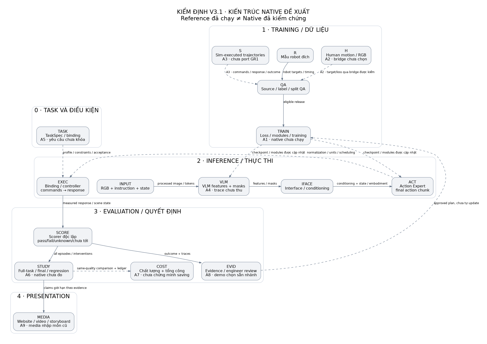

# Kiểm định nội dung v3.1 · 05/10/2026

**Kết luận:** Nội dung đã phân biệt đúng nhiều ranh giới AI Engineering, nhưng chưa đủ bằng chứng để nói toàn solution native hoạt động hoặc giảm chi phí. Human bridge, synthetic generator cho GR1 và learned native rollout chưa được kiểm. Ví dụ đã chạy là reference thu nhỏ; đó là bằng chứng engineering trong phạm vi riêng.

Đây là báo cáo đánh giá độc lập với tài liệu authority hiện hành. Không đổi thiết kế hoặc giao diện website trong lượt review này. Findings là draft cục bộ, không phải records đã lưu trong Research Workspace. Không tái lập kết quả paper; không kiểm robot thật. Không tìm thấy bằng chứng một lỗi toán học khiến toàn kiến trúc vô hiệu trong phạm vi đã đọc; các khoảng trống dưới đây chủ yếu là specification và validation.

## Phạm vi và cách kiểm

Đọc toàn bộ hồ sơ v3.1, spec, native walkthrough, code/results/tests của reference và nội dung đang hiển thị trên 12 routes. Đối chiếu nguồn tác giả/code ở phần nguồn. Snapshot hashes nằm ở [snapshot.json](snapshot.json); base Git HEAD e45cf7f0309f3fe58112c98c10b1111f5bee1864 chưa bao gồm các thay đổi đang review. Vì vậy không dùng riêng HEAD làm định danh nội dung.

Các kiểm tra đã thực hiện: 24 reference tests pass; verifier site pass (12 routes/30 docs/18 frames/5 fixtures); kiểm fixture counts/routing pass; manifest 19 artifacts cùng source/world/tests/report khớp. Các phép kiểm này không xác nhận native GR00T, human transfer hoặc tiết kiệm chi phí.

## Những nội dung đã đứng vững trong phạm vi kiểm

1. **VLM → interface → Action Expert:** phù hợp selected upstream interface dùng features và masks. Không bắt model xuất semantic JSON khi nó không có output đó. Cấu trúc hai phần không đồng nghĩa luôn huấn luyện bằng hai job độc lập. Action loss có thể cập nhật nhiều module theo gradient route thực; cần kiểm actual trainable parameters. Xem nguồn W1–W3.
2. **Flow matching:** velocity target lúc training khác action chunk cuối sau inference integration; không dùng hai tensor như cùng một command. Xem W3.
3. **Latent evidence:** lưu tensor có nguồn là hợp lý; probe đọc được thông tin chưa chứng minh Action Expert sử dụng thông tin đó hoặc xác định nguyên nhân. Kết luận này là giới hạn suy luận của audit, không phải một benchmark đã tái lập.
4. **Synthetic actions:** quỹ đạo thực thi trong simulator có thể ghi commands/response và tạo action targets sau QA. Video sinh một mình không phải measured robot actions. MimicGen cho tiền lệ object-centric generation có task/controller requirements; xem W4.
5. **Fail/unknown/chưa tới:** reference và fixtures giữ đúng mẫu số cho bước được thử, không gán bước chưa tới thành fail, không coi thiếu verifier là pass. Zero toàn task không tự xóa local progress. Đây là điểm đã kiểm bằng tests trong reference.
6. **Đối chứng và phạm vi:** final độc lập, prior-data replay, regression và total cost đã được nêu trong protocol. Nguồn/tài liệu external không bị gán thành kết quả đội. Thiết kế phép kiểm tốt chưa đồng nghĩa phép kiểm native đã chạy.

## Kiến trúc có đánh dấu điểm cần kiểm

Sơ đồ tái dựng từ thiết kế project, tách training, inference, evaluation và presentation. Marker A1–A9 nối tới bảng dưới. Các mũi tên nét đứt còn thiếu native implementation/proof hoặc là đường quyết định có điều kiện; không hàm ý hệ thống tự training sau mỗi lỗi. Node IDs giữ theo project; MEDIA được bổ sung để thể hiện consistency của presentation. Đây không phải hình gốc của paper.

## Bảng phát hiện

| ID | Nội dung | Mức độ | Trạng thái bằng chứng |
|---|---|---|---|
| [A1](#a1) | Chưa có bằng chứng chạy toàn hệ native | Chặn kết luận hoàn thành | Chưa có kiểm chứng tương ứng |
| [A2](#a2) | Human bridge là phần nghiên cứu chưa chốt | Chặn kết luận hoàn thành | Chưa có kiểm chứng tương ứng |
| [A3](#a3) | Synthetic action hợp lệ trong sim chưa đủ cho GR1 | Chặn kết luận hoàn thành | Chưa có kiểm chứng tương ứng |
| [A4](#a4) | Trace VLM/latent hỗ trợ giả thuyết, chưa chứng minh module lỗi | Quan trọng | Chưa có kiểm chứng tương ứng |
| [A5](#a5) | Task A1 chưa khóa yêu cầu để xét nguồn có phù hợp | Chặn kết luận hoàn thành | Chưa có kiểm chứng tương ứng |
| [A6](#a6) | Tập reference không kiểm visual generalization hoặc hiệu quả native | Quan trọng | Chưa có kiểm chứng tương ứng |
| [A7](#a7) | Giảm tổng chi phí vẫn là giả thuyết trung tâm | Chặn kết luận hoàn thành | Chưa có kiểm chứng tương ứng |
| [A8](#a8) | Nhánh demo được chọn sẵn dễ tạo cảm giác đã chẩn đoán | Cần làm rõ trình bày | Rủi ro cách hiểu |
| [A9](#a9) | Ảnh/video tải về còn là câu chuyện phiên bản ban đầu | Cần làm rõ trình bày | Giới hạn đã công bố |

## A1

**Chưa có bằng chứng chạy toàn hệ native** · Targets: `TRAIN, ACT, EXEC, STUDY`

**Quan sát:** ProjectSpec ghi native not_tested; walkthrough số 13 là contract triển khai. Ví dụ có weights thật là ridge 35×4, state lý tưởng và sequencer dựng sẵn.

**Cơ sở:** D1: native_vla/GR1 chưa kiểm. D7: chưa có native checkpoint, rollout hoặc receipts. D8–D9: reference không chứa VLM/Action Expert hoặc bàn tay GR1.

**Lập luận và kết luận:** Bằng chứng reference xác nhận một pipeline thu nhỏ nối được; thay model, observation và controller làm thay đổi interfaces cần kiểm. Chưa đạt yêu cầu “một example chạy toàn solution trên VLA/GR1”. Không có cơ sở kết luận native đã chạy hoặc sẽ fail.

**Cách giải thích khác / giới hạn:** Native có thể đã chạy ở môi trường ngoài hồ sơ, nhưng chưa có artifact để kiểm định. Thiếu bằng chứng không phải bằng chứng thất bại.

**Sửa nội dung đề xuất:** Nêu ngay đầu: thiết kế native + ví dụ reference đã chạy. Chỉ đổi trạng thái native khi có artifacts tương ứng.

**Phép kiểm tiếp theo:** Pin code/config/weights; chạy một task GR1 được upstream hỗ trợ: batch → gradient/update → checkpoint reload → learned closed-loop → independent scorer và trace.

**Điều kiện giải quyết hoặc bác giả thuyết:** Receipts và rollout native tái lập được trên đúng profile sẽ giải quyết khoảng trống này; test reference bổ sung không giải quyết nó.

**Công phát sinh:** GPU, cài native runtime, dữ liệu seed, binding và thời gian integration; chưa đo.

**Nguồn:** D1, D7, D8, D9, W1.

## A2

**Human bridge là phần nghiên cứu chưa chốt** · Targets: `H, E_H_QA, TRAIN`

**Quan sát:** Có ba candidate A/B/C nhưng chưa có route, target/loss, adapter và receipt dùng human batch trên selected model.

**Cơ sở:** D2–D3: human not_integrated; route A auxiliary, B embodiment adapter, C retarget→execute đều conditional. W5: human action-labeled data có thể học motor prior trong recipe của tác giả. W6: human-to-robot cũng có recipe không dùng robot demonstrations trong phạm vi riêng.

**Lập luận và kết luận:** Tiền lệ chứng minh không nên giới hạn human vào “chỉ dạy VLM”; cũng không chứng minh loader GR00T hiện tại hiểu human action. Thesis dùng human có cơ sở; cách học của project còn thiếu một quyết định kỹ thuật cốt lõi. Mẫu robot đích là lựa chọn của project, không phải quy luật cho mọi phương pháp.

**Cách giải thích khác / giới hạn:** Giữ ba route ở giai đoạn exploration là hợp lý; chưa hợp lý nếu trình bày như recipe sẵn sàng chạy. Thiếu bằng chứng không phải bằng chứng thất bại.

**Sửa nội dung đề xuất:** Sơ đồ đặt gate “bridge được chọn và kiểm” trên mũi tên H→TRAIN; mô tả rõ source, target, frame, loss, module và chi phí của route được chọn sau pilot.

**Phép kiểm tiếp theo:** Một source có geometry/timing hợp lệ → một route được chọn → target batch/loss/module gradients → robot downstream đối chứng R/H với chi phí và compute ghi riêng.

**Điều kiện giải quyết hoặc bác giả thuyết:** Route có artifacts hợp lệ sẽ giải quyết thiếu specification; downstream không tăng chất lượng trong budget sẽ bác lợi ích của route đó trong task này, không bác mọi human learning.

**Công phát sinh:** Tracking/geometry, adapter hoặc retarget, training và controls; phải tính cả source reject.

**Nguồn:** D1, D2, D3, W5, W6, W8.

## A3

**Synthetic action hợp lệ trong sim chưa đủ cho GR1** · Targets: `S, E_S_QA, QA, EXEC`

**Quan sát:** Reference sinh action Cartesian 4D và gắp bằng weld. Native config 29D arm/hand/waist chưa có generator/controller port và acceptance traces.

**Cơ sở:** D8–D9: mô hình gắp reference không kiểm contact/finger dynamics. W1: action profile native khác. W4: generation cần subtask/object-frame/termination và execution adapter.

**Lập luận và kết luận:** Action đã thực thi có provenance tốt hơn video-only; tính đúng của nhãn vẫn phụ thuộc profile, controller, outcome và fidelity. Có thể sinh robot action bằng thực thi trong simulator. Chưa chứng minh generator hiện tại sinh dữ liệu đúng cho GR1 hoặc giữ được vật thật.

**Cách giải thích khác / giới hạn:** Weld là approximation có chủ đích để kiểm contracts; không phải lỗi của reference khi đã công bố scope. Thiếu bằng chứng không phải bằng chứng thất bại.

**Sửa nội dung đề xuất:** Giữ hai nhánh tách bạch: sim-executed robot trajectories và generated video/pseudo labels; chỉ nhánh có QA phù hợp được vào robot-action loss.

**Phép kiểm tiếp theo:** Replay một GR1 seed; sinh variants trong miền đã chốt; lưu commands/response/contact/outcome/reject rate; QA rồi train S và đo full-task.

**Điều kiện giải quyết hoặc bác giả thuyết:** Native executed trajectories đúng schema, binding và outcome sẽ giải quyết compatibility; sim pass vẫn không đủ xác nhận sim-to-real.

**Công phát sinh:** Task assets, controller adapter, physics/contact calibration và generation rejects; chưa đo.

**Nguồn:** D2, D3, D8, D9, W1, W4.

## A4

**Trace VLM/latent hỗ trợ giả thuyết, chưa chứng minh module lỗi** · Targets: `VLM, IFACE, ACT, EVID`

**Quan sát:** Nội dung đã phân biệt feature, final action, command và response. Chưa có native hooks, optimized parity, probes và interventions thực.

**Cơ sở:** W2–W3: selected interface dùng features/masks; flow training velocity khác integrated action. W1: training/inference head implementations khác. D4: probe đọc được tín hiệu không tự là causal diagnosis.

**Lập luận và kết luận:** Tensor quan sát được chỉ cho biết đầu ra tại boundary. Muốn chọn training scope phải kiểm mapping, effect và alternatives; instrumentation còn có thể làm thay đổi runtime. Yêu cầu kiểm cả VLM và Action Expert đã đúng hướng. Chưa thể nói hệ thống xác định chính xác module cần train từ video, attention hoặc probe.

**Cách giải thích khác / giới hạn:** MVP engineer-assisted không cần automatic causal classifier; đây là giới hạn hợp lý nếu giữ đúng wording. Thiếu bằng chứng không phải bằng chứng thất bại.

**Sửa nội dung đề xuất:** EvidenceCard phải có observation/hypothesis/test/decision cùng link artifacts; route update luôn có engineer review và no-gain/defer.

**Phép kiểm tiếp theo:** Một lỗi native có synchronized five-boundary trace, action noise seed, debug/optimized parity, labels độc lập và phép kiểm đổi một yếu tố; lưu cả giả thuyết bị loại và chưa biết.

**Điều kiện giải quyết hoặc bác giả thuyết:** Trace/hook parity giải quyết khả năng quan sát; can thiệp và rollout controls mới kiểm giả thuyết module. Probe score tốt một mình không đủ.

**Công phát sinh:** Logging/storage, calibration labels, probe controls và overhead; cần pilot giới hạn.

**Nguồn:** D2, D4, D7, W1, W2, W3, W7.

## A5

**Task A1 chưa khóa yêu cầu để xét nguồn có phù hợp** · Targets: `TASK, H, EXEC`

**Quan sát:** Dung sai, domain và owner acceptance pending; fixed torso/one arm là đề xuất binding. Không thể xét source transfer bằng hình gắp-đặt chung.

**Cơ sở:** D1/D7: task acceptance chưa chốt. W6 FAQ: tác giả nêu precision khoảng 1 cm và real results dùng parallel-jaw; chưa thử real dexterous hand. W5: có hướng dexterous human transfer khác, nhưng recipe và quy mô khác.

**Lập luận và kết luận:** Nếu task cần độ chính xác hoặc contact ngoài miền nguồn đã chứng minh thì source precedent không đủ. Tuy nhiên task hiện chưa có tolerance, nên chưa kết luận bất tương thích. Chưa thể nói HumanEgo hoặc bridge bất kỳ phù hợp với A1/GR1. Phải phân biệt gắp-đặt thô với lắp/đặt chính xác và bàn tay nhiều ngón.

**Cách giải thích khác / giới hạn:** Nếu A1 là đặt thô với tolerance rộng, HumanEgo precedent có thể phù hợp hơn; chưa có số đo để quyết định. Thiếu bằng chứng không phải bằng chứng thất bại.

**Sửa nội dung đề xuất:** Trình bày ô A1 có kích thước và tiêu chuẩn pass cụ thể; đánh dấu one-arm/fixed-torso là binding cần kiểm.

**Phép kiểm tiếp theo:** Owner khóa object/target geometry, pose tolerance, holding/slip criteria, timeout, cycle, camera và action binding; replay seed kiểm reachability/contact trước chọn nguồn.

**Điều kiện giải quyết hoặc bác giả thuyết:** TaskSpec và replay cho thấy source/bridge đạt dung sai sẽ giải quyết risk; yêu cầu chặt hơn giới hạn nguồn có thể bác việc dùng nguyên recipe cho task này.

**Công phát sinh:** Owner spec, calibration, seed replay và verifier; thường nhỏ hơn triển khai thêm model nhưng chưa có giờ công đo.

**Nguồn:** D1, D7, W5, W6.

## A6

**Tập reference không kiểm visual generalization hoặc hiệu quả native** · Targets: `SCORE, STUDY`

**Quan sát:** 12 final scenes chủ yếu thay vị trí trong miền gần miền sinh train; regression chỉ một vị trí gần seed. Tests pass không phải native experiments.

**Cơ sở:** D8 lines 200–223: train/final spatial ranges chồng nhiều; regression gần seed. D5: đã ghi sample nhỏ/deterministic và native study chưa chạy. D8: policy nhận idealized state, không RGB.

**Lập luận và kết luận:** Scenario IDs độc lập giúp tránh tái dùng scene cụ thể nhưng không mở rộng coverage sang ảnh, lighting, object, contact hay embodiment. Final12/12 xác nhận scope nhỏ của reference; chưa đo native robustness, human transfer, production rate hoặc VLM quality.

**Cách giải thích khác / giới hạn:** Final interpolation là hợp lệ cho smoke/reference test; chỉ sai scope nếu dùng kết luận OOD hoặc robot thật. Thiếu bằng chứng không phải bằng chứng thất bại.

**Sửa nội dung đề xuất:** Ghi rõ observed metrics thuộc model/task nào; giữ scenario/root split và final độc lập; không quảng bá “24 tests” thành “24 thí nghiệm robot”.

**Phép kiểm tiếp theo:** Sau native baseline, khóa conditions, multiple training seeds, full natural starts, transitions/regression, scorer coverage và uncertainty; chọn cỡ mẫu theo câu hỏi trước final.

**Điều kiện giải quyết hoặc bác giả thuyết:** Native independent outcomes đủ coverage/uncertainty mới hỗ trợ claim tương ứng; tăng số unit tests không thay phép thử behavior.

**Công phát sinh:** Native runs, resets, scoring/annotation, seeds và fresh final; chưa định budget.

**Nguồn:** D5, D8, D9.

## A7

**Giảm tổng chi phí vẫn là giả thuyết trung tâm** · Targets: `COST, STUDY`

**Quan sát:** Không có native quality-cost curve hoặc ledger human/robot/bridge/generation/QA/train/eval. 24 variants chỉ từ một seed root.

**Cơ sở:** D1/D6: savings not_established, total-cost components đã liệt kê. D8: source variants là descendants một root, không phải independent collected seeds. D5: source contrasts cần compute/cost controls và cùng tiêu chuẩn chất lượng.

**Lập luận và kết luận:** Collection giảm có thể bị offset bởi integration, labels, generation rejects, GPU và evaluation. Không đủ quality thì cost-per-accepted-skill chưa xác định. Nội dung không nên hứa “giảm mạnh chi phí” ở hiện trạng. Có thể trình bày đây là mục tiêu cần kiểm, với tiền lệ data efficiency từ nguồn.

**Cách giải thích khác / giới hạn:** Có thể có saving ở skill tiếp theo sau amortized setup; phải tách giả thuyết first-skill và repeated-skill để kiểm. Thiếu bằng chứng không phải bằng chứng thất bại.

**Sửa nội dung đề xuất:** Hero nói “mục tiêu giảm công”; phần giá trị hiển thị chất lượng và tổng công cùng scope, thay mọi số tiết kiệm minh họa bằng số đo khi có ledger.

**Phép kiểm tiếp theo:** Đo R và source pilot qua nhiều target-robot budgets tới cùng ngưỡng chất lượng; tính setup một lần, công lặp lại, rejected data, training/compute và tất cả failed attempts.

**Điều kiện giải quyết hoặc bác giả thuyết:** Source đạt cùng chất lượng với tổng cost thấp hơn trong miền/budget đã chốt sẽ hỗ trợ claim; giảm robot samples nhưng total cost tăng sẽ bác claim tiết kiệm tổng ở miền đó.

**Công phát sinh:** Activity tracking và đối chứng baseline/source; không thể định số tiết kiệm trước đo.

**Nguồn:** D1, D5, D6, D8, W5, W6.

## A8

**Nhánh demo được chọn sẵn dễ tạo cảm giác đã chẩn đoán** · Targets: `EVID, E_EVID_TRAIN`

**Quan sát:** Website mặc định health=data; scenario chọn sẵn augmentation/correction. Labels minh họa đã có nhưng người xem có thể bỏ qua.

**Cơ sở:** D10: default branch và c.choice có sẵn, không chạy diagnosis. Live overview: hiển thị “Đã kiểm, xét dữ liệu” và ảnh kết quả kỳ vọng. D4: engineer phải thử giả thuyết trước quyết định.

**Lập luận và kết luận:** Các trạng thái UI là nội dung dựng để giải thích đường đi, không có actual probe kết luận camera/lighting sạch. Không tìm thấy claim automatic diagnosis đã được chứng minh; rủi ro là cách đọc của demo làm quá mức evidence đang có.

**Cách giải thích khác / giới hạn:** Top-level labels đã nêu minh họa và engineer review, nên đây là clarity risk chứ không khẳng định đội đã giả mạo kết quả. Thiếu bằng chứng không phải bằng chứng thất bại.

**Sửa nội dung đề xuất:** Khi chỉnh sau audit, trạng thái ban đầu nên là “chưa có phép kiểm”; nhánh hiện tại đặt tên “giả sử kiểm hệ thống đạt”.

**Phép kiểm tiếp theo:** Kiểm một native EvidenceCard thực và cách viewer phân biệt observed/hypothesis/pending decision; user comprehension check cho câu “vì sao chọn nhánh này?”.

**Điều kiện giải quyết hoặc bác giả thuyết:** Viewer hiểu đây là nhánh giả định và xem được probe artifact ở bản thực sẽ giảm risk; animation đẹp hơn không giải quyết evidence.

**Công phát sinh:** Chỉnh copy/state nhỏ; native diagnosis artifact vẫn cần công riêng.

**Nguồn:** D4, D10.

## A9

**Ảnh/video tải về còn là câu chuyện phiên bản ban đầu** · Targets: `MEDIA`

**Quan sát:** Text tương tác v3.1 đã cập nhật VLM/Action Expert/bridge, nhưng source storyboard vẫn mô tả human chủ yếu là trình tự và execution tổng quát. Video/ZIP được gắn nhãn ban đầu.

**Cơ sở:** D11: disclosure video nhập môn ban đầu, không thay v3.1 spec. D12: dữ liệu học/chạy thử chưa có các boundary và gates hiện hành. Live overview: link tải video/bộ cảnh ban đầu còn hoạt động.

**Lập luận và kết luận:** Những bản tóm tắt không nhất thiết sai cơ chế, nhưng không đáp ứng nhu cầu một bộ media tự chứa toàn workflow cuối khi chia sẻ ngoài website. Media được scoped minh họa nên không phải lỗi scientific validity. Còn khoảng trống đồng nhất nội dung và độ đầy đủ của bản tải về.

**Cách giải thích khác / giới hạn:** Video nhập môn cố ý đơn giản hóa, phù hợp nếu chỉ dùng để giới thiệu, không làm bản triển khai đầy đủ. Thiếu bằng chứng không phải bằng chứng thất bại.

**Sửa nội dung đề xuất:** Dùng một authority cho text tương tác/captions/storyboard khi được yêu cầu chỉnh; giữ lịch sử ban đầu có revision riêng.

**Phép kiểm tiếp theo:** Đối chiếu captions/ảnh/ZIP với revision được công bố; từng claim native gắn trạng thái và cùng một example artifact xuyên suốt.

**Điều kiện giải quyết hoặc bác giả thuyết:** Bộ media xuất từ một script nội dung hiện hành và kiểm các captions sẽ giải quyết drift; chỉ đổi nhãn ZIP chưa cập nhật nội dung.

**Công phát sinh:** Cập nhật story source, render media và visual QA; không phải chạy thêm training.

**Nguồn:** D11, D12.

## Việc cần làm trước, để không tiếp tục đổi idea vòng quanh

**Giữ câu hỏi chính:** dữ liệu người và sim có giúp đạt cùng chất lượng với ít mẫu robot và ít tổng công hơn hay không? Evidence là công cụ cho kỹ sư quyết định; không biến mục tiêu thành nền tảng tự diễn giải mọi latent.

1. Khóa một task và tiêu chuẩn pass cụ thể; pin native model/checkpoint/profile. Nếu task A1 chưa có adapter, kiểm đường chạy trên một task GR1 upstream hỗ trợ trước, rồi mới port A1. Cách này xác nhận native pipeline; không thay nghiệm thu A1.
2. Làm một native baseline R có training/reload/closed-loop/scorer/trace thật. Nếu baseline hoặc controller chưa chạy, chưa mở nhiều source experiments.
3. Pilot một source có điều kiện hợp lệ: sim execution hoặc một human bridge đã chọn. Lưu gradient path, rejected data, downstream no-gain và chi phí. Không bắt pilot phải thắng và không tự thêm cả ba bridge.
4. Sau pilot mới khóa so sánh nguồn và cỡ mẫu. Cùng quality threshold; tách giảm mẫu robot khỏi giảm total cost. Final không quay vào tuning cùng round.
5. Dùng đúng một episode xuyên suốt khi trình bày: input → features → predicted action → sent command → response → outcome → hypothesis/test → approved plan → new checkpoint → independent evaluation. Giữ rõ status nếu còn là scenario minh họa.

**Cách mô tả hiện trạng chính xác:** “Project đề xuất và kiểm chứng một recipe phát triển kỹ năng trên VLA/GR1 bằng dữ liệu người và quỹ đạo mô phỏng. Reference pipeline đã chạy để kiểm contracts và evaluation logic; native integration, human transfer và tổng tiết kiệm chưa có kết quả.”

## Nguồn và version boundaries

Nguồn web dưới đây đã được đọc trực tiếp. Repo main chỉ là snapshot quan sát, không phải code đã pin để chạy. Paper N1 v1 không phải selected N1.5 implementation. Website tác giả hỗ trợ tác giả báo cáo gì; không phải independent reproduction. Không chuyển percentages hoặc lời quảng bá của nguồn thành kết quả project.

- **D1:** [idea-v3-2026-10-05/project-spec.json](/home/hiwe/denso-challenge/idea-v3-2026-10-05/project-spec.json) · native / human / reference / study.
- **D2:** [idea-v3-2026-10-05/02-kien-truc-va-cach-hoc.md](/home/hiwe/denso-challenge/idea-v3-2026-10-05/02-kien-truc-va-cach-hoc.md) · Native model / human candidates / instrumentation gates.
- **D3:** [idea-v3-2026-10-05/03-workflow-du-lieu.md](/home/hiwe/denso-challenge/idea-v3-2026-10-05/03-workflow-du-lieu.md) · Human release / synthetic / QA.
- **D4:** [idea-v3-2026-10-05/04-bang-chung-vla-va-loi.md](/home/hiwe/denso-challenge/idea-v3-2026-10-05/04-bang-chung-vla-va-loi.md) · Probes / stage semantics / zero success.
- **D5:** [idea-v3-2026-10-05/05-thiet-ke-kiem-chung.md](/home/hiwe/denso-challenge/idea-v3-2026-10-05/05-thiet-ke-kiem-chung.md) · Native contrasts / final / acceptance.
- **D6:** [idea-v3-2026-10-05/06-chi-phi-va-kha-thi.md](/home/hiwe/denso-challenge/idea-v3-2026-10-05/06-chi-phi-va-kha-thi.md) · Total cost / resource feasibility.
- **D7:** [idea-v3-2026-10-05/13-example-native-tu-dau-den-cuoi.md](/home/hiwe/denso-challenge/idea-v3-2026-10-05/13-example-native-tu-dau-den-cuoi.md) · TaskSpec / native walkthrough / missing proofs.
- **D8:** [examples/engineering-loop/run.py](/home/hiwe/denso-challenge/examples/engineering-loop/run.py) · lines 1–3, 187–254: reference simulator, source contrasts and final.
- **D9:** [examples/engineering-loop/world.xml](/home/hiwe/denso-challenge/examples/engineering-loop/world.xml) · tip collision disabled / proximity weld.
- **D10:** [presentation-site/dist/idea-opening.js](/home/hiwe/denso-challenge/presentation-site/dist/idea-opening.js) · openingCaseBody / health=data default.
- **D11:** [presentation-site/dist/idea-story.js](/home/hiwe/denso-challenge/presentation-site/dist/idea-story.js) · current story / introductory video disclosure.
- **D12:** [presentation-site/content/solution-story.json](/home/hiwe/denso-challenge/presentation-site/content/solution-story.json) · original scene text used for media generation.
- **W1:** [model / inference_model / evaluation: 29D, padded32, chunk16, distinct inference head](https://github.com/FluxVLA/FluxVLA/blob/main/configs/gr00tn15/gr00tn15_eagle_3b_robocasa_30_eps_full_finetune.py) · main observed 2026-10-05; not commit-pinned.
- **W2:** [forward / predict_action: features and masks](https://raw.githubusercontent.com/FluxVLA/FluxVLA/main/fluxvla/models/vlas/llava_vla.py) · main observed 2026-10-05; not commit-pinned.
- **W3:** [forward: velocity supervision; denoise / predict: integrated action chunk](https://raw.githubusercontent.com/FluxVLA/FluxVLA/main/fluxvla/models/heads/flow_matching_head.py) · main observed 2026-10-05; not commit-pinned.
- **W4:** [object frames / subtask termination / waypoint interpolation](https://mimicgen.github.io/docs/modules/task_spec.html) · documentation 1.0 observed 2026-10-05.
- **W5:** [Human-to-Robot Learning Framework / action-labeled pretraining and aligned transfer](https://research.nvidia.com/labs/gear/egoscale/) · official project page dated 2026-02-19; observed 2026-10-05.
- **W6:** [Architecture / preprocessing / FAQ: dexterous hands and precision limitations](https://humanego-ai.github.io/) · official project page observed 2026-10-05; not paper reproduction.
- **W7:** [2.1–2.3: VLM/action architecture and offline latent-action/synthetic supervision](https://arxiv.org/html/2503.14734v1) · arXiv v1.
- **W8:** [3.2, 5, 7: human action representation, robot adaptation and limits](https://arxiv.org/html/2507.12440v1) · arXiv v1.

Structured graph/findings: [findings.json](findings.json). Sơ đồ vector: [architecture.svg](architecture.svg).
