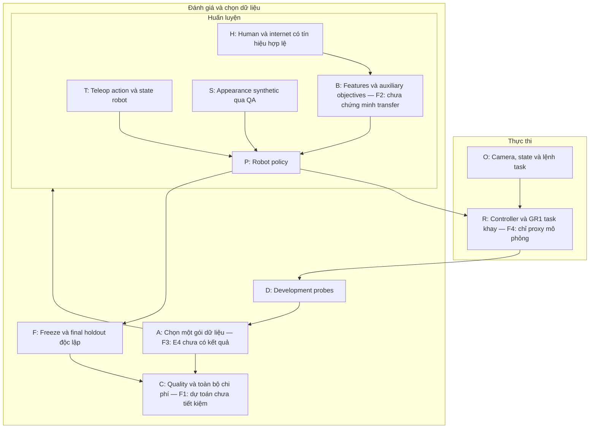

# Rà lại idea · 05/10/2026

> Review lịch sử trước task-improvement revision2; audit hiện hành: [Rà soát toàn idea](full-idea-audit-2026-10-05.md). Không coi score/runs cũ là evidence sau sửa.

Đánh giá thiết kế hiện có, không tính đội/ngân sách sẵn có, không phải điểm BTC hoặc kết quả huấn luyện. Giữ mức tham chiếu nội bộ **6,5/10**: (7×30+8×20+6×20+4×15+7×10)/95 = 6,5263. Lượt này không có bằng chứng thực nghiệm mới để nâng điểm kỹ thuật/hiệu quả.

## Kết luận

Idea có trọng tâm: giúp kỹ sư chọn gói dữ liệu bổ sung cho điều kiện một kỹ năng humanoid còn yếu, rồi kiểm chất lượng và tổng chi phí. Case một tay lấy linh kiện vào ô khay đủ cụ thể để phát triển PoC. Phần khác biệt cần bảo vệ là vòng quyết định dữ liệu và phép kiểm E4, không phải số nguồn hay số màn hình.

Điểm còn yếu nhất là bằng chứng giá trị: human/video auxiliary objectives, task khay và vòng chọn nguồn đang là thiết kế; dự toán mặc định còn cho tổng chi phí cao hơn baseline. Vì vậy, “giảm công/chi phí” phải trình bày là giả thuyết cần kiểm.

## Phạm vi và nguồn

Đã đọc bản workspace ngày 05/10/2026: Product, Learning Core, Protocol, Business Case, review/score cũ; kiểm trang overview hiện hành, mã công thức chi phí và inputs mặc định. Các tài liệu thiết kế mang ngày 02/10, website mang ngày 03/10. Đây là checkout có thay đổi chưa commit; không gán một commit Git cho nội dung.

- [Product](../01-product.md): task, bốn nguồn, đóng góp, acceptance.
- [Learning Core](../04-learning-core.md): source masks, shared features, auxiliary heads, E0 và inference bundle.
- [Protocol](../06-validation-and-roadmap.md): E1–E4, controls, splits và 30 runs dự kiến.
- [Business Case](../07-business-case.md): chi phí có điều kiện, sim/real boundaries.
- [Inputs](../../presentation-site/content/industrial-cost-model.json) và [công thức](../../presentation-site/dist/cost-model.js): tính lại trực tiếp; chưa cập nhật/kiểm lại đơn giá thị trường trong lượt này.
- [FluxVLA upstream](https://github.com/FluxVLA/FluxVLA), README main truy cập 05/10/2026: có đường GR00T N1.5/RoboCasa GR1; đây là cơ sở tái sử dụng, không chứng minh auxiliary heads hoặc task khay của proposal đã tích hợp. Không audit toàn paper hay tái lập benchmark tác giả.

## Sơ đồ thiết kế với vị trí cần kiểm

Sơ đồ dựng lại từ tài liệu proposal; không phải Figure 1 tác giả, không phải hệ thống đã triển khai. IDs chỉ có phạm vi bản review này (`idea-recheck-2026-10-05`, revision 1).

Các đường H→B và B→P là đường học; O→R là đường inference. Final holdout F không quay về A. Graph không giả human và robot có dữ liệu paired.

## Findings

| ID / vị trí | Nhận định và trạng thái | Tác động, giới hạn và phép kiểm tiếp |
|---|---|---|
| F1 / C | **Giá trị kinh tế chưa được hỗ trợ.** Inputs mặc định cho baseline 9.315,89 USD, đa nguồn 16.359,98 USD: tăng 7.044,09 USD cho skill đầu; recurring tăng 1.415,52 USD/skill. Tính lại công thức khớp docs07. | Đây là kết quả có điều kiện, không chứng minh đa nguồn luôn đắt. Dự toán có thể đổi khi đo công/QA thực hoặc chất lượng tốt hơn; hiện chưa có break-even theo số skill vì recurring saving âm. Giữ task và accepted quality như nhau, thay giả định bằng activity logs để kiểm net saving. Không chỉ đo số demo giảm. |
| F2 / H→B→P | **Rủi ro transfer, chưa phải lỗi đã chứng minh.** Docs04 dùng stage/order/wrist losses trên shared features; RGB phụ và action robot có tín hiệu khác nhau. | Mask/geometry rules trong thiết kế đã giảm rủi ro nhãn sai, nhưng gradient hợp lệ chưa đủ chứng minh robot làm tốt hơn. E0 kiểm masks, units, gradient, reload và closed-loop; E2/source-drop cùng budget và compute control kiểm downstream benefit hoặc negative transfer. Kết quả E2 tốt sẽ thu hẹp rủi ro này. |
| F3 / A | **Khác biệt sản phẩm chưa được chứng minh.** Docs01 chọn nguồn theo condition; docs06 đã có E4 cùng parent/catalog/cost cap và control hợp lệ. | Đây là điểm mạnh của protocol, không thiếu đối chứng ở mức thiết kế. Còn thiếu kết quả thực thi. Nếu targeted không hơn control thì chỉ claim workflow/SOP; nếu có gain, giữ scope theo task/condition/package draws đã thử. Chạy E4 sau baseline/bridge; báo quality, total cost và uncertainty. |
| F4 / R→F | **Proxy mô phỏng là tradeoff được chấp nhận, real transfer còn mở.** Case khay chưa là task DENSO đã nghiệm thu; controller/base/torso là config đề xuất. | Docs01/04 đã ghi rõ giới hạn sim và adapter riêng, nên không coi đây là mâu thuẫn thiết kế. Cần khóa task/scorer/controller và chạy E0 trước. Real-teleop saving/real performance chỉ được claim sau acceptance trên robot đích, không suy từ GR1 sim. |

## Ưu tiên thực hiện

1. Khóa một task/scorer và chạy E0: policy quan sát–ra action–closed-loop, từng loss và save/reload. Có log/cấu hình/artifact để đánh giá tính tích hợp.
2. Lấy baseline và một bridge recipe tại demo budget cố định; đo task success và tổng công trước khi mở rộng nguồn/model.
3. Giữ E4 là phép kiểm đóng góp riêng: cùng parent, catalog đủ điều kiện, ngân sách bổ sung và training protocol; final holdout độc lập.
4. Khi trình bày, dẫn bằng task cụ thể và quyết định dữ liệu. Dùng “kiểm khả năng giảm công teleop ở cùng chất lượng”; chưa trình bày saving 30% hoặc ROI như kết quả.

Website đã mở thành công tại [bản local](http://127.0.0.1:4175/#overview). Đã xác nhận nội dung overview xuất hiện trong browser; chưa kiểm lại toàn bộ 12 routes/media trong lượt này.
