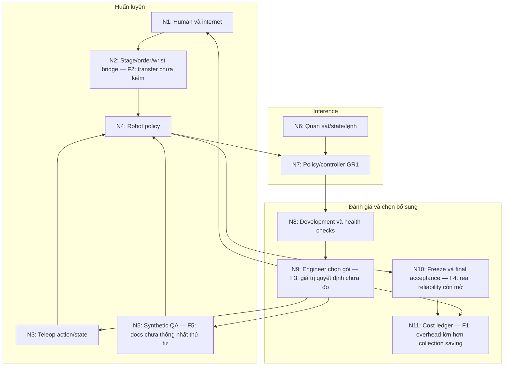

# Idea, solution, chi phí và điểm nghẽn · 05/10/2026

## Kết luận có phạm vi

Proposal đánh vào một điểm nghẽn thực của robot learning: chọn và biến dữ liệu thành cải thiện có ích cho một task cụ thể. Chưa có evidence cho thấy đây là điểm nghẽn lớn nhất tại DENSO hoặc workflow của đội đã giảm nó. Thiết kế hiện ưu tiên đa nguồn nhưng công tích hợp, QA, contact/recovery và nghiệm thu có thể mới là phần hạn chế tốc độ/chi phí.

Với inputs mặc định, robot collection giảm 400,24 USD nhưng công/compute đa nguồn bổ sung tăng 1.815,76 USD/skill, trước chi phí tích hợp mới. Đây là kết quả công thức theo giả định, không là kết quả policy hay giá DENSO. Một skill đơn giản ở quy mô 400 demos chưa có luận điểm tiết kiệm mạnh. Cơ hội tốt hơn là tác vụ thay đổi vật/điều kiện thường xuyên, robot-time khan hiếm hoặc đã có dữ liệu dùng lại và pipeline QA hiệu quả.

## Phạm vi kiểm tra

Đọc Product, TDD, Data Core, Learning Core, Protocol, Business Case, PRD, SOP, method survey và review trước. Tính trực tiếp bằng `calculateIndustrialCost` với inputs canonical. [Calculation audit](cost-audit-2026-10-05.json) lưu đầy đủ outputs/inputs và SHA-256 các source thiết kế, không gán commit cho checkout chưa commit. Không chạy train/eval/robot; không kiểm lại toàn website. Nguồn online kiểm ngày 05/10/2026, không tái lập kết quả tác giả.

## Cơ chế của giải pháp

1. Khóa task/robot/controller/scorer: rigid part → tray, base/torso khóa, một tay; chuẩn 30 giây và ổn định 2 giây là đề xuất.
2. Data Core kiểm nguồn, tín hiệu, QA, lineage, splits và eligibility của từng loss. Cùng recording root không đi qua train/test khác nhau.
3. Learning Core tái sử dụng robot-action path FluxVLA/GR00T N1.5/GR1; thêm human/video stage/order và wrist-motion objectives khi geometry hợp lệ.
4. Appearance synthetic mở biến thể hình ảnh, kế thừa labels chỉ sau QA. Physics/controller-executed data là một nhánh supervision khác.
5. Development probes → kiểm binding/reachability → engineer chọn hypothesis và gói dữ liệu → so fixed/random cùng parent/cost cap/protocol.
6. Freeze policy; final holdout độc lập; báo success, failures, công, GPU-giờ và tổng cost.

Điểm mạnh: phân biệt RGB và actions, công khai chưa có kết quả, có source-drop/compute controls/E4, không đồng nhất sim và real. Rủi ro: stage/order classifier có thể chỉ học nhận diện bước; chưa chứng minh cải thiện policy motor/contact. Một model pretrained mạnh có thể đã có prior này. Wrist-motion proxy cần geometry và embodiment adaptation; observation-only video không tự cung cấp lực tiếp xúc, friction hay recovery commands của robot.

## Graph và findings

Graph dựng lại từ proposal hiện hành, revision 1, local ID `solution-cost-2026-10-05`. Không phải kiến trúc tác giả paper, không phải implementation đã chạy.

| ID / vị trí / mức ảnh hưởng | Premises → nhận định | Counterevidence, giới hạn, phép kiểm |
|---|---|---|
| F1 / N11 / material | Docs07 + công thức: saving collection 400,24; gross overhead 1.815,76; extra integration 5.628,57 USD. Vì overhead lớn hơn saving, chưa có net saving theo inputs này. | Có ledger đầy đủ hơn toy ROI và đã công khai no-saving. Không suy mọi deployment đều đắt. Đo time-motion/quality; kiểm liệu overhead hoặc robot costs khác inputs. |
| F2 / N1→N2→N4 / material | Docs04: auxiliary stage/order/wrist, không full action-space recipe EgoVLA. Không có downstream runs được ghi nhận trong inspected proposal, nên transfer benefit còn unsupported. | Masks/geometry và E0/E2 đã có kế hoạch, giảm rủi ro nhãn sai. Không gọi là architecture error. E2/source-drop/compute control và fixed target roots đo task outcome; loss giảm riêng chưa đủ. |
| F3 / N8→N9 / material | Docs01/06: engineer chọn hypothesis, E4 planned. Chưa có source-choice advantage; rules tương ứng lỗi không tự là causal diagnosis. | E4 cùng catalog/cost cap/parent là thiết kế đối chứng tốt. Thêm targeted robot-corrections comparator để tránh việc chỉ hơn random nhưng không hơn cách kỹ sư thường làm. Quyết định phải được đánh giá sau trừ selection/QA cost. |
| F4 / N10 / material | Docs01/06: sim domain, 75% design target; chưa task-owner acceptance. Không đủ kết luận vận hành nhà máy. | Proxy sim và locked holdout là tradeoff được khai đúng. Mục tiêu không sai vì chưa đạt. Đo real cycle time, intervention/failure/recovery và task-owner quality gates riêng; chỉ claim trong domain được thử. |
| F5 / N5 / minor specification inconsistency | Docs03 mục Bridge và synthetic: “Synthetic đầu tiên dùng physics-valid variants”; docs04/PRD chọn appearance Cosmos bắt buộc và physics sau gate. Hai thứ tự khác nhau trong cùng MVP. | Docs04 và các mục thêm cuối đã có main route. Đây là lệch tài liệu, không chứng minh runtime bug. Trước E0 thống nhất một route canonical để không tính nhầm QA/compute và lịch thực hiện. |

## Phân rã chi phí

Đơn giá GPU hiện khớp [Runpod pricing](https://www.runpod.io/pricing): A100 PCIe 80GB 1,59, H100 SXM 3,49, RTX4090 0,74 USD/GPU-giờ; storage standard dưới 1TB 0,07 USD/GB-tháng. Giờ chạy/model compatibility chưa benchmark.

Labor dùng [BLS assembler](https://www.bls.gov/ooh/production/assemblers-and-fabricators.htm) 21,85 và [industrial engineer](https://www.bls.gov/ooh/architecture-and-engineering/industrial-engineers.htm) 49,25 USD/h, sau burden 30% theo giả định docs07 thành 31,21 và 70,36 USD/h. Không phải lương teleoperator/robotics engineer Việt Nam; áp chung burden là mô hình, không đo nghề cụ thể tại DENSO.

| Khoản USD/skill | Baseline | Đa nguồn | Chênh lệch đa nguồn |
|---|---:|---:|---:|
| Thu/reset/QA/sử dụng robot | 1.334,13 | 933,89 | −400,24 |
| Debug/correction review | 422,14 | 703,57 | +281,43 |
| Thu human | 0 | 104,05 | +104,05 |
| Human/internet curation và QA | 0 | 820,83 | +820,83 |
| Synthetic generation và QA | 0 | 491,94 | +491,94 |
| Bridge/preprocess GPU thêm | 0 | 110,51 | +110,51 |
| Storage thêm | — | — | +7,00 |
| Recurring tổng, gồm các khoản chung khác | 3.687,32 | 5.102,83 | +1.415,52 |
| Tích hợp một lần | 5.628,57 | 11.257,14 | +5.628,57 |
| Skill đầu | **9.315,89** | **16.359,98** | **+7.044,09 (+75,6%)** |

Toàn GPU development trong candidate mặc định ~414,53 USD; giảm một nửa GPU chỉ giảm ~207,26 USD. Labor/QA/integration là driver lớn trong mô hình này, chưa phải cost mix đã đo. Robot-use rẻ một phần vì giả định cell dùng 320h/tháng; robot khó tiếp cận, scheduling/reset và factory downtime có thể làm economic cost khác. Dữ liệu sẵn có cần tính incremental QA, không thu lại toàn bộ; quyền dùng và compatibility vẫn cần kiểm.

### Điều kiện hòa vốn

Theo inputs giữ nguyên, accepted target demo có cost collection/QA/use khoảng 3,335 USD. Gross extra recurring 1.815,76 USD và extra oneoff 5.628,57 USD.

Với số demo baseline $N$, tỷ lệ giảm $r$ và số skill chia tích hợp $K$:

$$\Delta C = 1815.76 + 5628.57/K - 3.33533\,rN.$$

$\Delta C < 0$ mới tiết kiệm. Nếu $r=30\%$: skill đầu cần khoảng 7.440 baseline demos; chia tích hợp cho 10 skills cần khoảng 2.378 demos/skill; loại hoàn toàn extra integration vẫn cần khoảng 1.815 demos/skill. Đây là độ nhạy cơ học với overhead cố định, không learning curve hay forecast. Overhead/data needed có thể tăng theo scale; demo reduction/equal quality chưa đo.

Kịch bản existing 2.000→1.400 và 10 skills còn tăng 377,41 USD/skill. Pilot 400 demos thậm chí bỏ toàn bộ extra integration vẫn tăng recurring 1.415,52 USD. Do đó “nhiều khách hàng sẽ tự hòa vốn” không được hỗ trợ cho cùng workflow/volume này.

Nếu chỉ đổi labor thành placeholder operator 5/kỹ sư 15 USD/h, burden 0, totals thành 2.240,59/3.871,55, chênh 1.630,96. Đây là tình huống minh họa, không báo giá địa phương. Đơn giá thấp làm headline USD nhỏ hơn nhưng chưa đảo chiều cost vì cả teleop savings cũng giảm.

### Ba ngân sách khác nhau

- **R&D/PoC 12 tuần:** implementation, thử thất bại, 30 planned training runs, seeds/source-drop/compute controls, nhiều evaluation và study coordination. Model skill mặc định chưa biểu diễn đầy đủ protocol R&D; đặc biệt không có khoản riêng rõ ràng cho engineer lựa chọn hypothesis/catalog và phân tích trials E4.
- **Một skill sau khi pipeline sẵn:** collection, QA, adaptation, acceptance, phân bổ integration thực sự dùng lại. 16.359,98 USD thuộc engineering scenario đầu, không là báo giá toàn 12 tuần.
- **Vận hành production:** model ~2.614,66 USD/tháng/arm với capital allocation và dedicated GPU idle; chưa runtime benchmark, operator sản xuất, interventions/downtime đầy đủ. Không cộng purchase robot và depreciation hai lần.

Minh họa thuần GPU: nếu cả 30 jobs đều dùng 120 A100 GPU-giờ +15% retry thì target training alone ~6.582,60 USD. Không phải run-time forecast, không cộng cứng vào tổng skill vì dễ double-count các stage. Baseline human labels, sim-only R&D và real production budgets cần hồ sơ riêng. Cell 75.000 USD là giả định cần quote, không giá robot hiện hành được xác minh.

## Đánh đúng điểm nghẽn tới đâu?

| Điểm nghẽn | Mức proposal tác động | Phép kiểm còn thiếu |
|---|---|---|
| Nguồn dữ liệu robot đúng task đắt/khan hiếm | Trực tiếp, qua thay thế/bổ sung dữ liệu | Same-quality learning curves, cost time-motion và quyền dùng |
| Generalist policy thiếu năng lực ở condition cụ thể | Trực tiếp, qua development probes và acquisition | Targeted hơn valid controls trong condition giữ riêng |
| Human-video → robot embodiment/action/contact | Một phần; masks/auxiliary bridge | Downstream transfer, contact/recovery traces và matched compute |
| Factory binding, controller/calibration/integration | Có thiết kế nhưng thêm nguồn không tự sửa | E0/runtime tests; phân biệt controller lỗi và thiếu data |
| Reliability/cycle time/recovery/intervention | Gián tiếp, chưa có learned rollouts | Accepted output/giờ, intervention/1000 cycles, p95 cycle time, recovery time |
| Task economics/humanoid vs automation existing | Chưa xác lập | Process-owner interview, cell quotes, workstation constraints và baseline nghiệp vụ |

Các nguồn hỗ trợ phạm vi nhận định:

- [EgoVLA v1](https://arxiv.org/html/2507.12440v1), §§3–5, 7 và appendix training: human pose/wrist data có recipe transfer; benchmark simulation không thiết kế cho direct sim-to-real; cấu hình tác giả vẫn cần robot post-training. Không suy mọi phương pháp human transfer đều cần teleop.
- [EgoScale](https://research.nvidia.com/labs/gear/egoscale/), framework/scaling/mid-training: action-labeled human pretraining >20k giờ và aligned mid-training khác xa 200 human clips/task-local auxiliary heads. Suy luận: kết quả này hỗ trợ hướng nghiên cứu, chưa chứng minh recipe nhỏ của proposal có gain.
- [DataMIL v1](https://arxiv.org/html/2505.09603v1), §§1,4,5,7: chọn dữ liệu theo policy performance có tiền lệ; authors acknowledge estimator compute có thể đắt nhiều lần training. Proposal chọn gói thu/sinh mới đa nguồn theo cost khác bài subset-selection này; khoảng trống chi phí có cơ sở nhưng chưa là algorithmic novelty.
- [FluxVLA upstream](https://github.com/FluxVLA/FluxVLA), configs/training/evaluation/SDG: có robot path để reuse; task khay và auxiliary objectives riêng chưa được source đó chứng minh.
- [Cosmos Transfer2.5](https://docs.nvidia.com/cosmos/latest/transfer2.5/index.html): structured RGB/depth/segmentation augmentation. Không tự chứng minh generated view bảo toàn action/contact semantics.
- [BMW, 21/09/2026](https://www.bmwgroup.com/en/news/general/2026/humanoid-robot-in-leipzig.html), From lab to line và practical testing: production integration còn phụ thuộc IT/data, interfaces, workstation/plant constraints. Đây là evidence một deployment, không diagnosis cho DENSO.

75% success là design target PoC, không production criterion đã được owner chọn. Minh họa độc lập: nếu cycle 30s và success 75%, trong 8h có 960 nominal attempts và kỳ vọng 240 failures, trước reset/recovery/downtime. Không dùng giả định này làm forecast robot; nó chỉ giải thích vì sao cần đo lỗi/giờ và intervention ngoài success trung bình.

Task cố định một tay/khay là proxy kỹ thuật hợp lý; business case vẫn cần giải thích tại sao humanoid hoặc learning pipeline có giá trị hơn công cụ/chương trình/robot arm phù hợp. Nên chọn lý do từ công việc thật như đổi SKU/fixture thường xuyên, workstation dùng chung, task chuyển đổi tốn engineering; không tạo biến thể vô ích chỉ để policy có benchmark khó.

## Hướng đề xuất, chưa thay implementation

Định vị theo “giảm tổng công và thời gian đưa một skill tới nghiệm thu, bằng cách chọn can thiệp tiếp theo theo lỗi và chi phí”. Giữ bốn nguồn như lựa chọn trong catalog; source không có utility evidence chưa ép vào mọi recipe. Một lỗi contact có thể cần targeted robot correction; lỗi calibration cần sửa binding; lỗi hình ảnh có thể xử lý bằng augmentation rẻ; cần human/internet khi prior/geometry/coverage có hypothesis rõ.

Thử một condition visual/spatial và một condition contact/recovery trong feasible workspace; tránh chỉ làm benchmark đổi nền. So ít nhất: R0 baseline; thêm targeted teleop corrections; thêm package đa nguồn cố định; chọn package theo condition/cost. Giữ parent, same budget/new acquisition cost, training/eval protocol và final holdout. Source-drop/compute controls phục vụ attribution ở giai đoạn tiếp theo. So với expert-targeted teleop có thể làm proposal mất advantage; nếu vậy đó là thông tin cần biết.

Output hữu ích nhất của pilot là policy chạy được, baseline/error report, actual time-motion ledger và controlled acquisition result (kể cả no-gain). Chưa nên mở rộng workbench/multi-user hoặc thêm model family trước gate này. Không phát triển redesign trong lượt phân tích này.
