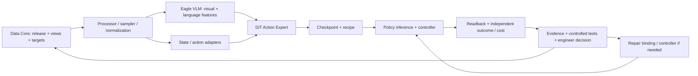

# 16 · Model AI × Data Core: solution đầy đủ

[Model Engine Core · FluxVLA](17-model-engine-core-fluxvla.md): lý do chọn framework là hỗ trợ training → evaluation → inference trên robot thật; policy và data flywheel được nối bằng artifacts, runners và robot operators.
_Bổ sung 06/10/2026. Đây là native architecture/training proposal; chưa checkpoint, gradients hoặc rollout GR1/A1 của project. Diagram dưới là reconstruction thiết kế của nhóm, không original paper figure._

## Hai phần cùng tạo solution

**Data Core** quyết định data nào đủ quyền/tín hiệu/quality/coverage, tạo release và batch/targets/masks. **Model AI** chuyển batch thành representations, tính loss, cập nhật weights và tạo robot actions. Runtime/evaluation cung cấp evidence để Data Core và kỹ sư quyết định lần học sau. Data flywheel có model như một thành phần cốt lõi, không chỉ là hệ thống thu/lưu dữ liệu.

Final độc lập ngoài vòng development feedback. Không tune trên final rồi vẫn gọi independent. Model training và runtime khác nhau, dù dùng cùng learned components.

## Model nền đã chọn và lý do

**GR00T N1.5 qua FluxVLA**, sau checkpoint/code/loader/GR1-profile compatibility. Model nền đã có robot-action pretraining và image-language priors; MVP tập trung task adaptation và extensions có kiểm chứng.

[Nguồn NVIDIA GR00T N1.5](https://research.nvidia.com/labs/gear/gr00t-n1_5/), Architecture / Improved VLM Grounding / Joint Objective: VLM dựa Eagle 2.5 được tăng cường grounding; embeddings được DiT cross-attend khi xử lý state/noised actions. Flow matching tạo action policy; FLARE là future-latent alignment auxiliary. Official recipe freeze VLM ở pretraining/finetuning. Đây là tiền lệ architecture, không nói selected Flux visual-tuning recipe giống official recipe.

Lựa chọn phù hợp candidate GR1, continuous action chunks và nguồn mô phỏng đang khảo sát. Chưa chứng minh đây là model tốt nhất cho công đoạn DENSO; latency, memory/config fit, action semantics và task feasibility phải kiểm. FluxVLA là engineering framework, GR00T N1.5 là policy/model; RoboCasa/MuJoCo là simulator, không AI model thay VLM.

## Model gồm gì, dữ liệu được tính toán ra sao?

| Thành phần | Input → xử lý → output | Kế thừa / xây thêm |
|---|---|---|
| Processor / sampler | MP4 hoặc camera frames + text → sync/sample/resize/normalize/tokenize → images/token IDs/masks | Pin native processor; Data Core adapter hợp schema, không tự lấy file MP4 làm tensor |
| Eagle VLM | Visual tokens + language tokens → learned multimodal representation → features/masks | Kế thừa pretrained VLM; feature layer/shape/dtype/processor phải pin |
| State / action adapters | Measured state + robot ID/profile; noisy action sequence/time trong flow → action-policy representation | Native robot modules kế thừa; human/common adapters là custom extension |
| Action Expert / DiT | State/noise/time + cross-attention tới VLM features → predicted flow velocity | Native action model; common-wrist head/shared route cần implement riêng |
| Flow integration | Sample noise → velocity evaluations qua flow time → normalized action chunk | Inference config/sampling steps và latency cần pin/measure |
| Binding / controller | Chunk → denormalize/order/units/rate/schedule → issued commands → measured response | Ngoài model; task-specific binding/verification của đội |

Config upstream tham chiếu có horizon16, padded action32 và original action29; đây chưa A1 profile đã kiểm. Robot fixed torso/one active arm cần semantics/binding đúng, không chỉ tensor shape đúng. Latent/features không command hoặc nhãn robot mới.

## Các giai đoạn training rõ

### Upstream đã nằm trong checkpoint

Image–language pretraining/grounding của VLM và robot-action foundation training tạo initialization kế thừa. Không tính là experiment data-efficiency của A1. Model N1.5 có FLARE upstream không bảo đảm loader/loss custom video branch trong Flux selected path đã được tích hợp.

### 0 · Compatibility và model receipts

Pin checkpoint/code/config → inspect public GR1 batch → processor/state/action semantics → per-loss gradients và frozen/update hashes → checkpoint reload → inference parity → controller/scorer → useful native baseline. Public bottle-to-cabinet không nhãn A1. Môi trường/checkpoint hiện chưa native-ready theo preflight đã lưu; tài liệu/UI không training execution.

### 1 · Robot baseline R_A1

Current RGB/text/state là conditioning. Future native actions là offline supervised data: normalize theo train stats, mask dimensions/timing, noise interpolation theo selected flow convention. Action Expert nhận noised actions/time trong training, dự đoán velocity; `L_action = masked MSE(vθ, actions − noise)` theo native convention đã pin. Training velocity không so trực tiếp với issued command.

Selected Flux config tham chiếu `tune_llm=False / tune_visual=True`; action expert/adapters và visual modules được mở cập nhật theo optimizer manifest. Đây khác official N1.5 frozen-VLM recipe. Verify requires_grad/per-loss update, không suy trainability từ tên model. R và R+S giữ recipe/scope thống nhất.

### 2 · R_A1 + S_exec + replay

Targeted variants execute simulator/controller → QA → cùng robot action view. Không thêm một input port “synthetic” vào model. Cùng model/init/recipe với R, thêm eligible data; replay tốt cũ để kiểm forgetting/regression. Mỗi run ghi root count, accepted/rejected variants, mixing/schedule, compute và quality. Basic augmentation / targeted correction là comparators phù hợp khi đánh giá data decision.

### 3a · Human shared motor trunk — custom candidate

State adapters riêng cho R/H; VLM frozen/detached trong R_common và R_common+H. Native robot head vẫn giữ, thêm common wrist18D encoder/head và explicit branch conditioning vào shared motor trunk. Native robot actions và common wrists không cùng semantics dù cùng chung trunk.

Robot common targets từ measured FK; human từ tracked poses/calibration. Hai tay × (xyz3 + rotation6D), camera frame/time/units/masks phải thống nhất. Robot wrist mục tiêu không lấy desired command làm measured outcome. Wrist-only không có finger/contact labels.

`L_total = L_robot_action + λRW L_robot_wrist + λH L_human_wrist`. H loss cập nhật human adapter/common modules/shared trunk, không native action decoder trực tiếp; R losses học robot native/common paths. Lambda/schedule chọn development, gradients/reload kiểm riêng. So R_common với R_common+H; architecture/objective robot ngang và extra compute/cost ghi rõ. Transfer là giả thuyết, không resolved chỉ vì có chung trunk.

### 3b · Action-free future learning — candidate khác

[FOCA v1 §3 / §5Q2](https://arxiv.org/html/2606.20867v1): current frames/text + learned conditioning tokens → projected representation; future region/goal frames → frozen target vision encoder → alignment target. Q2 video phase dùng implicit objective, robot phase action+implicit, explicit disabled. Missing actions không action loss và không fake-zero actions. Frozen target encoder khác frozen toàn VLM.

Port cần tokens/heads/region-time sampler/gradient routes/optimizer groups. Video phase cập nhật conditioning/VLM modules được mở; action expert học native targets ở robot phase. Inference chỉ current context tạo learned future-aware conditioning, không actual future images/boxes. Cần robot-control gains, không chỉ representation loss giảm.

H wrist và video alignment trả lời hai câu hỏi khác nhau. Không stack mọi branch ngay vòng đầu rồi quy gain cho một source. Một selected extension cần no-source/same-architecture control và cost receipts; source attribution có thể cần compute-matched control.

## World Models nằm ở đâu?

- **DreamGen offline generator:** tuned video model tạo videos từ initial frame + instruction; downstream có thể dùng future objective hoặc pseudo-actions có provenance. Generator không nhất thiết chạy lúc policy điều khiển. Sinh hình không tự có action labels.
- **FOCA / FLARE auxiliary future modeling:** học future representation phục vụ control; không đồng nghĩa full dynamics simulator. Targets và module connections khác nhau.
- **DreamZero / DreamerV3 alternative stack:** joint video-action policy hoặc latent dynamics + actor/critic thay data/training/runtime. Không cắm như một head phụ vào GR00T route và mặc định có tác dụng.

Versioned mechanism/eval sources của các model tại [15](15-dataset-training-blueprint.md). Đây là roles khảo sát, chưa toàn bộ được chọn/implemented ở A1.

## Evaluation và vòng feedback ở cả Data lẫn Model

Model checks: tensors/targets/masks, no future-observation leakage vào current conditioning, train/freeze gradient checks, reload/parity, latency/memory. Robot checks: full-task, language following/condition ID–OOD nếu có protocol, retention/transitions/intervention/collision, CI và regression. Offline loss không thay real outcome.

Flywheel không luôn thu thêm data: controlled evidence có thể chọn sửa processor/binding/controller, đổi allowed parameter scope/recipe có matched controls, thu correction, sim execution hoặc đủ điều kiện mở video/motion. Mỗi thay đổi recipe/architecture được version và tính cost, không nhận data-only gain nếu đồng thời đổi model.

Chỉ candidate hữu ích ở development được xét dùng; no-gain vẫn lưu. Freeze trước independent final. Giả thuyết giá trị: same-quality với ít robot roots hoặc tổng công có ích hơn; task2 đo reuse. Data Core và Model AI đều cần thiết để kiểm giả thuyết này.

## Hợp đồng bổ sung sau review 07/10/2026

[Decision/coverage/dedup/RunPlan và FOCA task-negative contract](../docs/implementation-plan/skill-a1/05-data-decision-and-run-contracts.md). Đây là đặc tả cần triển khai, không native receipts. QA pass chưa utility; source pilot chưa workflow advantage. Nhánh FOCA đơn task cần train-only task-mismatched negative pool hoặc adaptation công khai.
