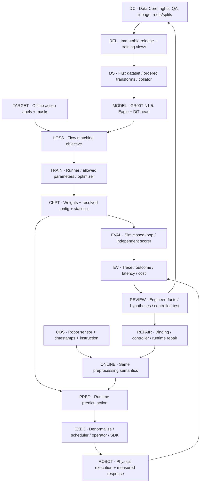
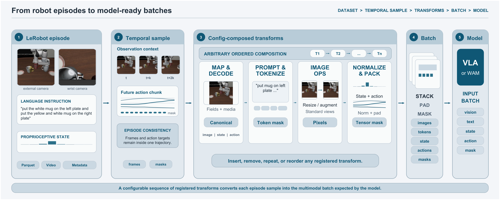
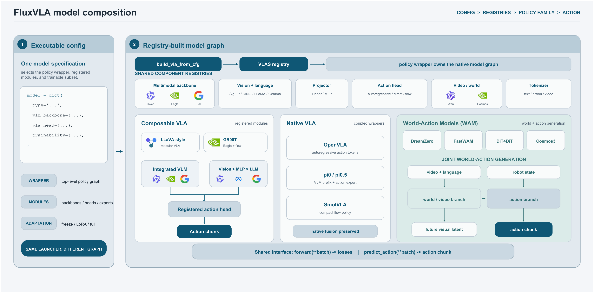
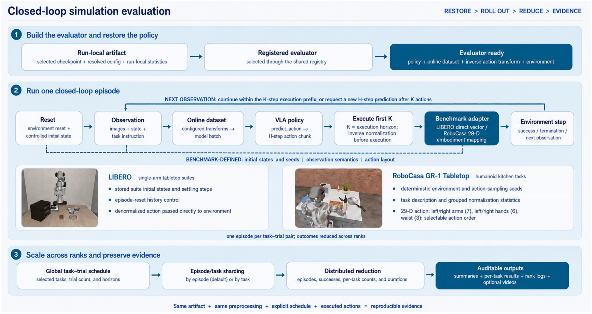
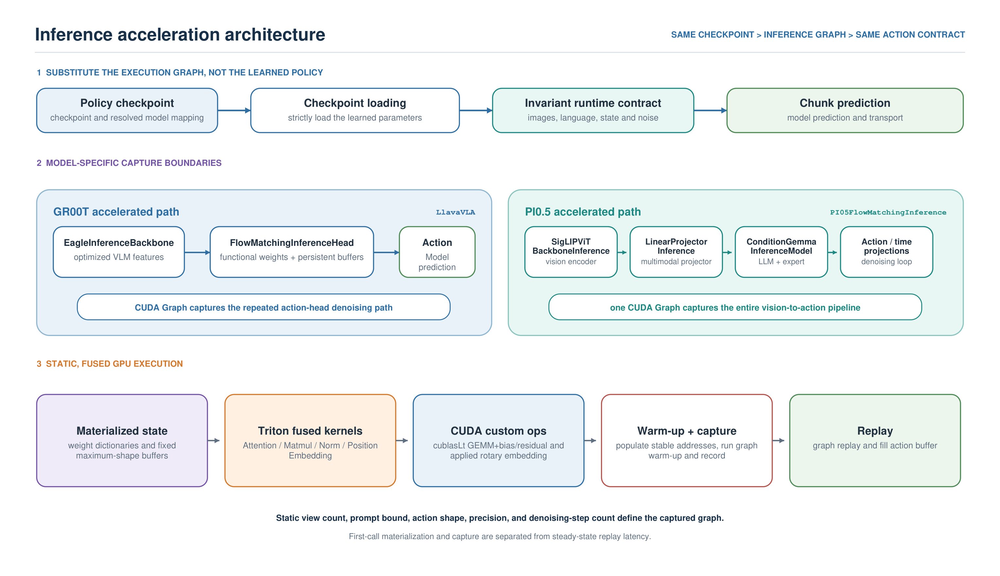

# Model Engine Core · FluxVLA từ training đến robot thật

**Cập nhật 06/10/2026.** Đây là thiết kế tích hợp A1 dựa trên nguồn upstream; chưa chạy FluxVLA/GR00T/GR1 native hoặc robot thật trong project. Website có trang riêng `#engine`; `#learning` giải thích cách model học, `#architecture` giải thích Data Core.

## 1. Vì sao chọn FluxVLA cho idea này?

**Lý do chính: FluxVLA hỗ trợ training → evaluation → inference trên robot thật.** Idea cần dùng dataset để tạo policy candidate, kiểm candidate, đưa policy tới robot và đưa bằng chứng vận hành về vòng dữ liệu tiếp theo. Chỉ trình bày VLM/Action Expert chưa diễn tả được hệ thống này.

FluxVLA là framework/engine engineering. GR00T N1.5 là policy nền đang đề xuất cho MVP; Eagle VLM và DiT Action Expert là các thành phần của policy đó. RoboCasa/MuJoCo là môi trường; operator/SDK/controller là ranh giới thực thi robot. Đội không sở hữu các đóng góp thuật toán/model/benchmark upstream này.

Technical report [arXiv:2609.17210v1](https://arxiv.org/html/2609.17210v1), §3–4, mô tả cấu hình chung, data/model interfaces, checkpoint, evaluator và real-robot runner/operator. Từ các cơ chế đó, lựa chọn engine này **phù hợp về phạm vi** với lifecycle của idea. Để kết luận phù hợp với A1 thực tế, vẫn cần compatibility và native run; hỗ trợ platform chưa chứng minh kết quả trên robot/task của đội.

### Kiến trúc gốc của FluxVLA

Li và cộng sự (2026), Figure 1, trang 2, [FluxVLA Engine, arXiv:2609.17210v1](https://arxiv.org/html/2609.17210v1), [CC BY 4.0](https://creativecommons.org/licenses/by/4.0/). Trích nguyên vùng figure từ PDF, không vẽ lại. Bảng kết quả bên phải là của tác giả, với ngân sách khác nhau giữa integrations; không phải benchmark của A1/đội.

Ưu tiên hình gốc từ paper/website tác giả khi giải thích phương pháp upstream. Sơ đồ tự dựng chỉ bổ sung phần mapping/đóng góp của idea, ghi rõ trạng thái thiết kế. Chú thích tiếng Việt đặt ngoài hình gốc.

## 2. Vị trí của Model Engine Core

Sơ đồ dưới là tái dựng của đội cho idea, không phải figure tác giả hoặc hệ thống đã triển khai. Training, eval và inference dùng các inputs khác nhau.

Target actions chỉ thuộc training. Runtime không có future ground-truth actions; observation/current state và noise/time tạo conditioning cho policy. Simulator state dùng để chấm outcome phải phân biệt với policy input, tránh đưa privilege ngầm vào model.

Data Core cung cấp dữ liệu đủ điều kiện, roots/splits và recipe inputs. Engine cung cấp quá trình tính toán và các artifacts. Review nối outcome với lựa chọn data/update/repair. Vì vậy Data Core và Model Engine Core là hai phần cần có của solution, không thay thế nhau.

## 3. Dataset đi qua engine như thế nào?

Hình gốc: Li và cộng sự (2026), Figure 2, trang 8, [paper v1](https://arxiv.org/pdf/2609.17210v1#page=8), CC BY 4.0. Mô tả upstream; không là thực nghiệm A1 của đội.

Đối chiếu [recipe public GR00T N1.5 / RoboCasa GR1](https://github.com/FluxVLA/FluxVLA/blob/main/configs/gr00tn15/gr00tn15_eagle_3b_robocasa_30_eps_full_finetune.py), các mục `train_dataloader`, `runner`, `eval`:

1. **Trên đĩa:** LeRobot-compatible episodes; video MP4, numeric rows Parquet, metadata/statistics. Container không thay thế action semantics, frame/time alignment hoặc quyền sử dụng.
2. **Lấy sample:** `ParquetDataset`, `action_window_size=16`, `window_start_idx=0`, `use_delta=False`; được bọc bởi `DistributedRepeatingDataset` trong recipe này. Pin sampling behavior/boundary masks trước chạy, không trộn cửa sổ giữa episodes.
3. **Đổi fields:** `ProcessParquetInputs`, `RobocasaGR1N15Bridge`, `ParquetPrompter`, `ProcessPromptsWithImage`; bridge và mapping phải phù hợp state/action order của embodiment.
4. **Ảnh:** train có random crop, resize224×224, color jitter, normalize. Eval có deterministic crop/resize và normalize; giữ camera/tokenizer/units contract nhưng không sao chép random augmentation vào inference.
5. **Numeric fields:** `NormalizeStatesAndActions` với `state_dim=64`, `action_dim=32`, min/max action normalization, `normalize_states=False`. Các padded dimensions phải có masks; actual joints/commands không suy ra từ padded widths.
6. **Batch:** `DictCollator` giữ images/img_masks, lang_tokens/lang_masks, states, actions/action_masks và embodiment_ids cùng metadata theo config.

Release A1 phải có own normalization/splits/profile đủ quyền; dùng public stats của recipe chỉ để compatibility đúng dataset public, không tự áp lên A1. MP4 generated video thiếu action labels không vào native action BC qua đường này. Synthetic là cách tạo: appearance augmentation, sim-executed trajectories và generated video có supervision khác nhau, có thể được version thành releases riêng.

Human wrist bridge và action-free video branch ở [blueprint15](15-dataset-training-blueprint.md) cần fields/objectives/loaders riêng. Không điền zero vào action labels đang thiếu để “dùng chung pipeline”.

## 4. Model, loss và phạm vi cập nhật

Hình gốc: Li và cộng sự (2026), Figure 3, trang 9, [paper v1](https://arxiv.org/pdf/2609.17210v1#page=9), CC BY 4.0. Mô tả upstream; không là thực nghiệm A1 của đội.

[LlavaVLA](https://github.com/FluxVLA/FluxVLA/blob/main/fluxvla/models/vlas/llava_vla.py) có hai contracts cần phân biệt:

| Contract | Conditioning | Output / ý nghĩa |
|---|---|---|
| `forward` | images + text → backbone hidden states/mask; state/embodiment/actions/masks → head | Loss dict; action-head output theo training semantics |
| `predict_action` | current images/text/state/embodiment; noise/time trong head; optional RTC prefix | Continuous normalized action chunk để runtime xử lý |

Trong [FlowMatchingHead](https://github.com/FluxVLA/FluxVLA/blob/main/fluxvla/models/heads/flow_matching_head.py), training dùng noisy trajectory `x_t=(1−t)ε+t·A`, velocity target `A−ε`, mask-aware MSE. Dự đoán training mang tên `pred_actions` ở dict là velocity trong loss path này; không lấy trực tiếp làm robot commands. Inference khởi tạo noise và tích phân velocity thành chunk.

Selected public config có `LlavaVLA`, `EagleBackbone`, `FlowMatchingHead`; `tune_llm=False`, `tune_visual=True`, `freeze_vlm_backbone=False`. Head dùng state64, action32 padded/29 active, horizon16, 4 inference integration steps, `input_embedding_dim=1536`. Text/image prompt cap900 và một ego image. Các dimensions là của selected integration, không đặc tính phổ quát của mọi VLA.

[GR00T N1.5 official](https://research.nvidia.com/labs/gear/gr00t-n1_5/) giữ VLM frozen và có FLARE trong upstream learning. **Không gọi selected Flux recipe là bản tái lập nguyên trạng official recipe**, hoặc mặc định tên N1.5 khiến mọi auxiliary losses tự chạy. Phải kiểm actual loss/gradient receipt. Foundation pretraining được kế thừa qua checkpoint; adaptation A1 không yêu cầu pretrain lại VLM từ đầu.

MVP: R_A1 → robot baseline; R_A1 + QA S_exec + replay → candidate với controlled contrast. Human common-wrist/shared-trunk và FOCA-style future alignment là candidates nghiên cứu riêng, không sẵn trong selected recipe. Xem [doc16](16-model-ai-va-data-flywheel.md) cho branches/losses/freeze scopes.

## 5. Trainer và checkpoint

Selected config khai `FSDPTrainRunner`, **`sharding_strategy='no-shard'`**, AdamW lr6e−5, weight decay1e−5, clip gradient1, 30.000 steps, bf16, warmup0,05 + cosine. Đây là public recipe, không tự là số bước/cost cap của A1. Repo có [DDP/FSDP/base train runner paths](https://github.com/FluxVLA/FluxVLA/tree/main/fluxvla/engines/runners).

Train runner quản lý execution/optimization/logging/checkpoint; **đội phải thêm** hoặc kiểm các receipts:

- Dataset release + parent checkpoint + code/config/processor digests.
- Trainable/frozen parameter manifest, loss masks, actual gradient/update scope.
- Roots/splits và đúng normalization statistics; actual compute/QA/capture costs.
- Reload parity, candidate checkpoint ID và lineage.

Technical report mô tả artifact gồm model state, resolved config và metadata phục vụ inference. Software environment, simulator assets, robot SDK và hardware vẫn phải khai riêng. Một weights file với camera/action/statistics khác chưa là skill bundle dùng được.

## 6. Evaluation: kiểm candidate trước triển khai

Hình gốc: Li và cộng sự (2026), Figure 4, trang 12, [paper v1](https://arxiv.org/pdf/2609.17210v1#page=12), CC BY 4.0. Mô tả upstream; không là thực nghiệm A1 của đội.

Selected `RobocasaEvalRunner` config:24 tasks,50 trials/task, seed7, max720steps, eval chunk16; action order`n15`. GR1 active29D chia left arm7, right arm7, left hand6, right hand6, waist3 theo config. Repo có `LiberoEvalRunner` riêng. Đây là protocol upstream để tham khảo, không benchmark A1 đã chạy.

Luồng: checkpoint/config/stats → online observation transforms → `predict_action` → denormalize → execute K-step prefix → observation mới → repeat → outcome. Model inference horizonH và executed horizonK là choices cần khai; không lẫn denoising steps với control steps.

A1 cần task/scorer/binding riêng và giữ development/final tách biệt. Report phải bao gồm failure, timeout, unknown/intervention, whole-task success + confidence interval, ID/OOD, regression, latency và total cost. MSE giảm hoặc một rollout đẹp chưa chứng minh policy tốt. Sim gain chưa là real-robot gain.

## 7. Inference trên robot thật: điểm quyết định khi chọn engine

Đối chiếu [real-robot runner/operator paths](https://github.com/FluxVLA/FluxVLA/tree/main/fluxvla/engines/runners), [Franka docs](https://github.com/FluxVLA/FluxVLA/blob/main/docs/franka.md), [remote serving docs](https://github.com/FluxVLA/FluxVLA/blob/main/docs/remote_inference_serving.md), [RTC docs](https://github.com/FluxVLA/FluxVLA/blob/main/docs/rtc.md):

| Lớp | Vai trò | Ví dụ / giới hạn |
|---|---|---|
| Inference runner | Preprocess, policy call, action postprocess, chunk scheduling/state | Base/Franka/UR/Aloha/Oli/Tron2 runner paths |
| Operator | Sensor acquisition/sync; command translation/transport | Operator cụ thể phải khớp SDK, action mode, active arms, gripper |
| Local model | Policy tại máy client | Cần hardware/runtime tương thích |
| GPU serving | Server preprocess→predict→denormalize, client gửi obs và execute actions | ZMQ/msgpack hoặc protobuf; đo transport/end-to-end latency; không denormalize lần hai |
| Fast inference | Inference-specific backbone/head, fused/static graph paths | Load weights tương thích; kiểm action parity/behavior; shape/hardware-dependent |
| RTC | Nối chunks khi prediction và execution bất đồng bộ | Training-time prefix hoặc test-time guidance; compatible head/runner/config riêng |
| Controller/SDK | Physical command execution và constraints | Workspace/collision/torque/E-stop phải xử lý ở lớp robot/cell phù hợp |

Franka docs minh họa π0.5 single/dual-arm, joint/Cartesian paths. Single-arm joint ví dụ action8; dual-arm examples16; đây không phải GR1 profile. RTC docs có GR00T–Aloha route. Các examples xác lập upstream real-robot integration paths, không chứng minh GR00T–GR1 A1 của đội đã chạy.

**A1 humanoid target:** public RoboCasa GR1 có waist; đề xuất task một tay/torso cố định chưa cùng binding. Cần xác minh/write operator và runner phù hợp robot đích, pin action frame/ordering/mode, calibration/camera/time, control rate, chunks/limits và outcome instrumentation. Model-only throughput không thay end-to-end control frequency.

Trace phải nối observation timestamp/version → normalized prediction → denormalized action → sent command → readback → independent outcome. Có thể chỉ lấy tensor samples/checksums thay full hidden tensors khi chi phí/log volume cao; debug receipts cần rights và storage caps.

## 8. Engine đóng góp gì cho data flywheel?

| Quan sát | Kiểm / can thiệp | Data và module liên quan | Đo lại |
|---|---|---|---|
| Prediction đúng nhưng command/readback lệch | Mapping/stats/time/operator/controller trước | Trace/calibration; repair runtime, chưa retrain | Parity + full task/regression |
| Binding đúng, yếu ở scene development mới | Coverage hypothesis; so reuse/augmentation/sim/correction | Eligible labels + prior replay; action-only vs visual/head scope khi có giả thuyết riêng | Matched parent/budget/protocol + ID/OOD + cost |
| Có human/generated video thiếu actions | Kiểm auxiliary objective/geometry bridge riêng | Future frames/embeddings hoặc wrist targets/masks; giữ robot action batches | Matched few-shot roots + downstream rollout + all costs |

Flow của idea: engine sinh trace/eval artifacts → EvidenceCard tách facts/hypotheses → kỹ sư chọn repair hoặc acquisition/update → Data Core QA immutable release → engine retrain/reload/eval → freeze và final → promote/no-gain. **Không có nhánh “fail → tự biết nguyên nhân → tự thu dữ liệu → tự deploy” trong thiết kế hiện tại.**

Giá trị cần chứng minh là dataset/update choice hữu ích hơn đối chứng ở cùng quality/budget, với lineage và tổng công rõ. Engine giúp triển khai lifecycle; selection/QA/utility/scale và acceptance là công việc tích hợp của đội. Ít dữ liệu chỉ có giá trị khi đủ coverage và downstream quality được kiểm.

## 9. Phạm vi nguồn và việc còn cần làm

Nguồn được đọc ngày06/10/2026: technical report **v1**, selected config và code/docs trên **main** theo URLs trong hồ sơ. Không khẳng định đây là immutable code snapshot hoặc HEAD mới nhất: web có thể dùng cached pages; chưa lấy được commit pin. Trước native run phải khóa commit/dependency versions, checkpoint/data revisions, config/processor digests và action profile, rồi đọc lại/kiểm behavior đúng revisions đó.

Chưa có native batch/loss/gradient/reload/rollout receipts, human transfer, few-shot gain hay cost saving của project. Reference [example10](10-example-chay-toan-he-thong.md) là MuJoCo/predictor4D nhỏ có simplifications; không thay evidence FluxVLA/GR00T/robot thật. Việc cập nhật website là trình bày và khảo sát nguồn, không triển khai engine.

## Hình gốc về tăng tốc inference

Li và cộng sự (2026), Figure 5, trang 14, [paper v1](https://arxiv.org/pdf/2609.17210v1#page=14), CC BY 4.0. Đây là kiến trúc thay inference modules và tối ưu execution; không phải sơ đồ hardware/controller. Figure được trích nguyên vùng ảnh từ PDF. Credit, page/crop, PDF/asset SHA-256 và nguồn nằm trong `presentation-site/content/research-and-media.json`.

## Hợp đồng bổ sung sau review 07/10/2026

[Decision/coverage/dedup/RunPlan và FOCA task-negative contract](../docs/implementation-plan/skill-a1/05-data-decision-and-run-contracts.md). Đây là đặc tả cần triển khai, không native receipts. QA pass chưa utility; source pilot chưa workflow advantage. Nhánh FOCA đơn task cần train-only task-mismatched negative pool hoặc adaptation công khai.
